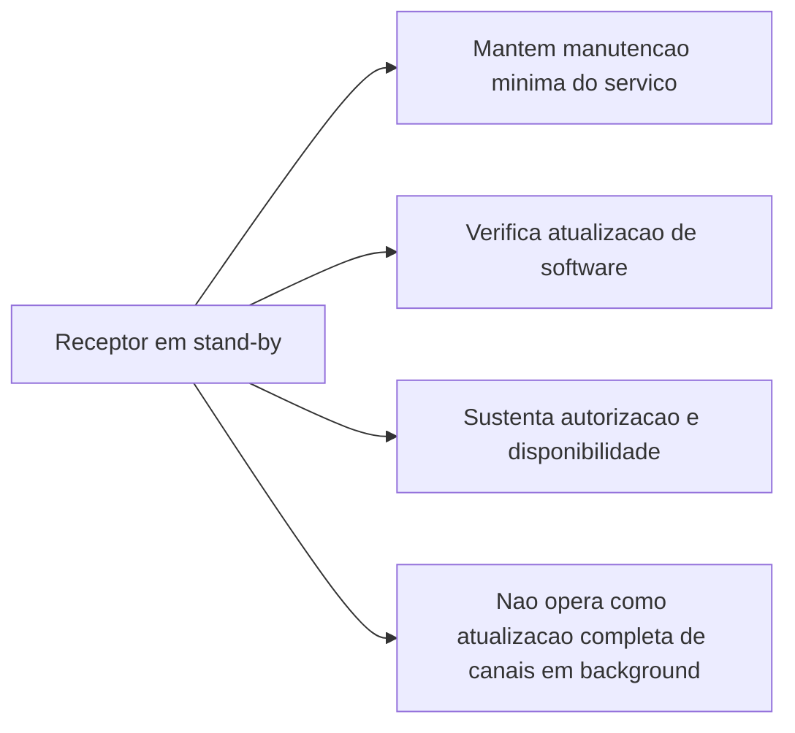
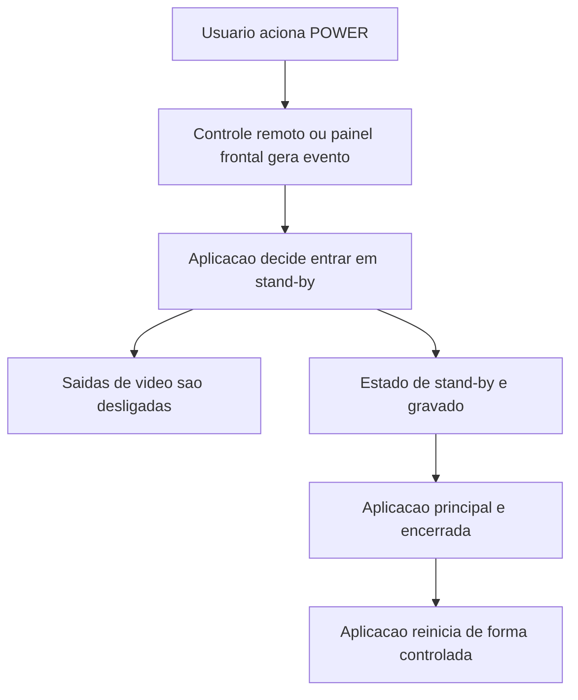
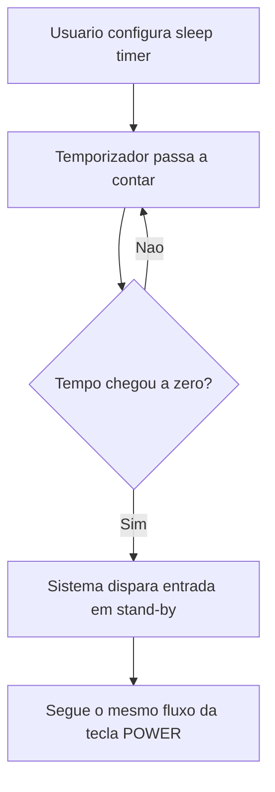
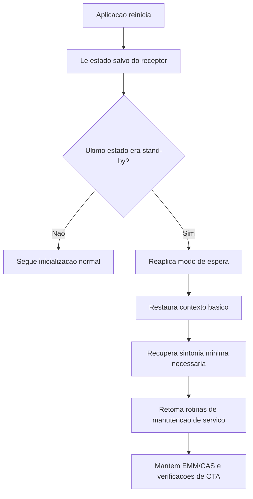
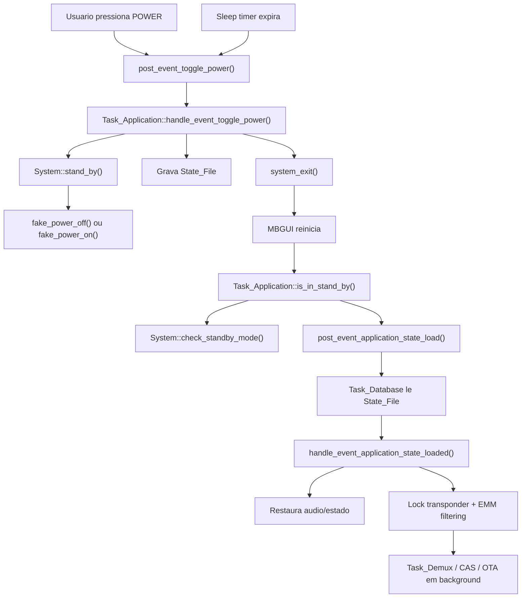

# 09 - Processo de Stand-By do Receptor

## Objetivo

Este documento mapeia o processo de stand-by do receptor no MBGUI em dois niveis:

- primeira parte: leitura macro e executiva, voltada para diretoria e gestao
- segunda parte: leitura tecnica, com fluxo e detalhamento funcao a funcao

O nome adotado aqui e:

> processo de stand-by do receptor

---

# Parte 1 - Visao Macro e Executiva

Esta primeira parte foi organizada para leitura de diretoria, gestao e liderancas de produto, operacao e suporte.

Objetivo desta parte:

- explicar o comportamento do produto sem depender de leitura de codigo
- separar claramente entrada em stand-by, operacao durante o stand-by e retorno
- destacar impactos operacionais, beneficios, limites e riscos

## Resumo Executivo

No fluxo principal do produto, o stand-by nao deve ser entendido como desligamento completo do receptor. Ele funciona como um **modo de espera controlada**, no qual o equipamento deixa de operar normalmente para o usuario, mas preserva condicoes internas para retornar com previsibilidade.

Na percepcao do cliente, o receptor entra em repouso. Na perspectiva do produto, ele continua em uma condicao organizada para:

- registrar que entrou em espera
- retornar com menor risco de inconsistencias
- manter algumas rotinas essenciais de sustentacao do servico

Esse modelo prioriza continuidade operacional, retomada consistente e maior confiabilidade em campo.

## Resumo Macro Para Gestao

### Quando entra em stand-by

Do ponto de vista de negocio e operacao, o receptor entra em um modo de **baixo impacto visual para o usuario**, mas **nao desliga completamente sua logica de software**.

Na pratica, o produto:

- apaga as saidas de video para a TV
- muda a sinalizacao visual de estado do equipamento
- grava que o ultimo estado do receptor era stand-by
- reinicia a aplicacao principal para voltar de forma controlada nesse mesmo contexto

Isso significa que o receptor aparenta estar "desligado" para o usuario, mas internamente o software continua estruturado para retomar operacoes com previsibilidade.

### Durante o stand-by

Durante o stand-by, o receptor **nao fica totalmente inativo**. Ele continua executando algumas rotinas de bastidor, principalmente ligadas a:

- manutencao minima do servico
- verificacao de atualizacao de software
- sustentacao de autorizacao e disponibilidade operacional

Por outro lado, a analise indica que o stand-by **nao foi desenhado como um modo de manutencao completa de canais em segundo plano**.

Em termos executivos, trata-se de uma espera com manutencao seletiva: o produto preserva funcoes consideradas criticas, sem se comportar como um modo de operacao plena em segundo plano.

### Quando retorna do stand-by

No retorno, o produto nao simplesmente "acorda" de onde estava em memoria. Ele faz uma nova subida controlada da aplicacao e consulta o estado salvo anteriormente.

Com isso, o receptor:

- reconhece que estava em stand-by
- restaura configuracoes basicas, como audio e contexto anterior
- tenta restabelecer a sintonia minima necessaria
- mantem rotinas de bastidor importantes, como verificacoes de atualizacao e filtragem de dados de acesso condicional

Em linguagem de produto, o retorno foi desenhado para privilegiar **consistencia operacional** em vez de um simples resume de interface.

### Objetivo funcional desse desenho

Esse modelo de stand-by parece ter sido adotado para atender quatro objetivos:

1. entregar ao usuario a percepcao de equipamento em espera
2. reduzir risco de inconsistencias ao voltar do stand-by
3. preservar capacidade de manutencao remota e atualizacao
4. manter o receptor apto a retomar o servico com menor chance de falha

### Beneficios para a operacao do produto

Sob a perspectiva de operacao e suporte, esse desenho traz ganhos relevantes:

- reduz dependencia de uma retomada "em memoria", que tende a ser mais fragil em sistemas embarcados
- permite que o receptor volte com estado conhecido e rastreavel
- ajuda a manter processos de atualizacao e autorizacao do servico mesmo durante stand-by
- favorece previsibilidade em campo, importante para suporte tecnico e homologacao

### Limitacoes e implicacoes executivas

Esse fluxo tambem traz implicacoes importantes para decisao de produto:

- o stand-by atual nao equivale a desligamento energetico completo
- existe atividade residual de software mesmo quando o receptor esta em espera
- o comportamento depende de persistencia correta do estado salvo
- a retomada depende da reexecucao organizada da aplicacao principal

Em outras palavras, o processo foi desenhado mais como **modo operacional de espera controlada** do que como **desligamento real do receptor**.

### Riscos que merecem acompanhamento

Para nivel de gestao, os principais pontos de atencao sao:

- falhas na gravacao do estado podem comprometer a volta correta do stand-by
- qualquer problema no fluxo de reinicio da aplicacao pode afetar a retomada
- diferencas entre "stand-by visual", "stand-by de hardware" e "poweroff real" podem gerar ruido entre times de produto, teste e suporte
- atividades de bastidor em stand-by precisam ser bem entendidas quando houver discussoes sobre consumo, homologacao ou comportamento em campo

### Leitura executiva em uma frase

Hoje, o processo de stand-by do receptor e um **modo de espera controlada por software**, com desligamento das saidas para o usuario, persistencia de estado e reentrada assistida da aplicacao para garantir retomada consistente.

## Detalhamento Executivo Por Etapa

### Durante o stand-by

Durante o stand-by, o receptor **nao fica totalmente inativo**. Ele continua executando algumas rotinas de bastidor, principalmente ligadas a:

- manutencao minima do servico
- verificacao de atualizacao de software
- sustentacao de autorizacao e disponibilidade operacional

Por outro lado, a analise indica que o stand-by **nao foi desenhado como um modo de manutencao completa de canais em segundo plano**.

### O que ha evidencia clara de que acontece

#### 1. Verificacao de atualizacao de software OTA

Ha evidencia explicita de que o receptor verifica atualizacao de software durante o stand-by.

Comportamento observado:

- durante o stand-by, o receptor entra em rotina periodica de verificacao de atualizacao
- a verificacao ocorre em ciclo de aproximadamente 60 segundos
- existem tratamentos especificos conforme a operadora
- se uma atualizacao for encontrada, o produto passa a tratar esse evento no fluxo normal de software

Em termos funcionais:

- sim, o receptor verifica se ha atualizacao de software enquanto esta em stand-by

#### 2. Filtragem CAS/EMM

Ha evidencia clara de que o receptor tenta manter rotinas de acesso condicional durante o stand-by.

Comportamento observado:

- no retorno em contexto de stand-by, o receptor tenta recuperar o ponto minimo de operacao do servico
- a partir disso, mantem o fluxo necessario para autorizacao e manutencao de acesso
- isso indica que o stand-by preserva funcoes relevantes para continuidade do servico

Em termos funcionais:

- sim, o receptor continua sustentando rotinas necessarias para autorizacao e manutencao CAS em stand-by

#### 3. Sintonia minima de manutencao

O receptor nao necessariamente volta a reproduzir a TV para o usuario, mas tenta restabelecer uma sintonia minima de backend.

Em termos funcionais:

- o stand-by mantem capacidade tecnica de travar transponder para operacoes de manutencao

### O que parece nao acontecer como rotina ampla de stand-by

#### 1. Atualizacao completa e continua da lista de canais

Pelo codigo analisado, nao ha evidencia de que o receptor faca, por permanecer em stand-by, uma rotina automatica geral de:

- varredura ampla de transponders
- reconstruir lineup completo
- atualizar toda a lista de canais de forma continua em background

Os fluxos de atualizacao de lista encontrados estao associados a gatilhos especificos, como:

- busca/scan de canais
- mudanca de `zone_id`
- fluxos de instalacao/ativacao
- operacoes explicitas de OSD

Leitura funcional:

- a lista de canais pode ser atualizada em cenarios especificos relacionados ao servico
- mas isso nao aparece no codigo como uma tarefa periodica geral apenas por estar em stand-by

#### 2. Atualizacao ampla de EPG em stand-by

Existe infraestrutura de EIT/EPG no produto, mas o comportamento em stand-by nao parece priorizar esse fluxo.

Como o stand-by usa justamente esse caminho de lock minimo para EMM, a leitura mais segura e:

- nao ha evidencia de que o stand-by execute um refresh amplo de EPG como objetivo principal

### Resposta direta para a pergunta

Durante o stand-by, o receptor faz sim algumas atividades de bastidor, principalmente:

- verifica atualizacao de software OTA
- mantem ou restabelece lock tecnico em transponder
- sustenta filtragem CAS/EMM

Sobre lista de canais:

- pode haver atualizacao em gatilhos especificos do produto
- mas nao encontrei evidencia de que ele faca uma atualizacao completa e periodica da lista de canais simplesmente por estar em stand-by

### Leitura executiva

O stand-by atual funciona como um modo de espera com manutencao tecnica seletiva:

- ele preserva funcoes de servico consideradas criticas
- nao se comporta, pelo menos no codigo analisado, como um modo de manutencao completa de lineup/EPG em segundo plano

---

# Parte 2 - Analise Tecnica

Esta segunda parte entra no comportamento de implementacao do produto.

Objetivo desta parte:

- identificar os componentes envolvidos
- mapear o fluxo tecnico nas tres etapas do stand-by
- detalhar a execucao funcao a funcao

## Parte Tecnica

## Componentes Envolvidos

### Orquestracao

- `src/tasks/mb_task_remote_control.cpp`
- `src/tasks/mb_task_application.cpp`
- `src/tasks/mb_task_database.cpp`
- `src/tasks/mb_task_demux.cpp`

### Hardware/HAL

- `src/hal/ALi/mb_system.cpp`
- `src/hal/ALi/mb_remote_control.cpp`
- `src/hal/Montage/mb_remote_control.cpp`

### UI / OSD

- `ui/lvgl/mb_osd_menu_plus_sleep.cpp`
- `ui/lvgl/mb_osd_sleep_timer.cpp`
- `src/tasks/mb_task_osd.cpp`

### Persistencia

- `src/common/mb_state_file.h`

### Fluxos de desligamento alternativos

- `src/tpm/tpm_api.c`
- `src/tpm/mb_tpm.cpp`

## Visao Macro Tecnica

## 1. Quando entra em stand-by

Ha dois gatilhos principais:

1. tecla `POWER`
2. expiracao do `sleep timer`

Nos dois casos, o destino converge para:

1. `Task::post_event_toggle_power()`
2. `Task_Application::handle_event_toggle_power()`
3. `System::stand_by(...)`
4. gravacao de flag no `State_File`
5. `Task_Application::system_exit()`
6. reinicio do app

### Efeito fisico do stand-by

No hardware ALi, o stand-by de app faz:

- `System::fake_power_off()`
- `HDMI::hdmi_output_off()`
- `Display::set_cvbs_off()`

E, no caminho complementar de retomada:

- `System::fake_power_on()`
- `HDMI::hdmi_output_on()`
- `Display::set_cvbs_on()`

### Persistencia do estado

O estado salvo em arquivo inclui:

- `stand_by`
- `stand_by_in_production_mode`
- `current_channel`
- `volume`
- `mute`
- `channel_list_type`
- `current_satellite_id`

Esse estado e armazenado em `State_File::App_State_File`.

## 2. Durante o stand-by

O comportamento observado durante o stand-by e de manutencao seletiva de backend, e nao de operacao completa.

O que ha evidencia clara de que acontece:

1. verificacao periodica de OTA
2. manutencao ou reativacao de lock tecnico minimo
3. sustentacao do fluxo CAS/EMM

O que nao apareceu como rotina ampla automatica apenas por estar em stand-by:

1. atualizacao completa e periodica da lista de canais
2. refresh amplo de EPG como objetivo principal

## 3. Quando retorna do stand-by

O retorno ocorre por religamento/novo ciclo do app:

1. o sistema sobe
2. `Task_Application` verifica se o arquivo indica stand-by
3. se sim, muda para `ST_STAND_BY_MODE`
4. o `System::check_standby_mode()` reaplica o fake standby logo na inicializacao
5. o app ainda carrega estado e lineup suficientes para:
   - restaurar contexto
   - iniciar filtros EMM
   - em alguns casos verificar OTA

Importante: o retorno nao e um simples "resume" em memoria. E um novo ciclo de inicializacao do app, guiado pelo estado persistido.

## Fluxo Macro Detalhado

## Fluxo A: quando entra em stand-by por tecla POWER

1. `Task_Remote_Control` recebe a tecla do controle remoto ou painel frontal.
2. Se nao houver media player/PVR ativo, ele chama `post_event_toggle_power()`.
3. `Task_Application::handle_event_toggle_power()` executa a troca de estado.
4. `System::stand_by()` consulta o estado anterior e alterna entre fake off/fake on.
5. `Task_Application` grava a flag de stand-by no arquivo de estado.
6. `Task_Application::system_exit()` pede encerramento do app.
7. O app reinicia.
8. No novo startup, o arquivo de estado decide se o sistema sobe em stand-by ou em operacao normal.

## Fluxo B: quando entra em stand-by por sleep timer

1. O usuario abre o menu de sleep.
2. A UI escolhe um valor em minutos.
3. Um `lv_timer` passa a contar esse tempo.
4. Quando o contador chega a zero, a UI chama `Task::post_event_toggle_power()`.
5. A partir daqui, o caminho e exatamente o mesmo da tecla `POWER`.

## Fluxo C: quando retorna do stand-by

1. O app inicia em `Task_Application::process()`, estado `ST_STARTING`.
2. `Task_Application::is_in_stand_by()` le `State_File::App_State_File`.
3. Se a flag estiver ligada, o estado vai para `ST_STAND_BY_MODE`.
4. Ainda no startup, `post_event_application_state_load()` carrega o ultimo estado salvo.
5. `Task_Application::handle_event_application_state_loaded()`:
   - restaura volume e mute
   - identifica o ultimo canal
   - se estava em stand-by, nao faz zapping normal
   - tenta travar o transponder do ultimo canal para EMM
6. `Task_Demux` usa esse contexto para manter:
   - filtragem EMM
   - verificacoes de OTA enquanto em stand-by

## Funcao a Funcao

## 1. Quando entra em stand-by

### 1.1. Captura do evento de power

### `Task_Remote_Control::Task_Remote_Control()`

Arquivo:

- `src/tasks/mb_task_remote_control.cpp`

Papel:

- registra o handler de tecla vindo do HAL
- decide se `KEY_POWER` vai direto para toggle de energia ou primeiro passa pela pilha normal de OSD

Regra:

- se media player ou PVR estiverem ativos, publica `Event_Remote_Control`
- caso contrario, chama `post_event_toggle_power()`

### `Remote_Control::read_keys()`

Arquivos:

- `src/hal/ALi/mb_remote_control.cpp`
- `src/hal/Montage/mb_remote_control.cpp`

Papel:

- converte evento de IR em `Remote_Control_Key`
- encaminha `KEY_POWER` para a camada de task

### `Remote_Control::read_keys_front_panel()`

Arquivo:

- `src/hal/ALi/mb_remote_control.cpp`

Papel:

- monitora botoes fisicos do painel frontal
- converte o botao de energia em `Remote_Control_Key::KEY_POWER`

### 1.2. Disparo do evento de stand-by

### `Task::post_event_toggle_power()`

Arquivo:

- `src/tasks/mb_task.cpp`

Papel:

- publica o evento global `handle_event_toggle_power` para as tasks interessadas

Na pratica:

- o handler relevante para este fluxo e o de `Task_Application`

### 1.3. Orquestracao principal do stand-by

### `Task_Application::handle_event_toggle_power()`

Arquivo:

- `src/tasks/mb_task_application.cpp`

Papel:

- ponto central do processo de stand-by

Sequencia:

1. chama `System::stand_by(g_production_final_test)`
2. recebe o novo estado booleano de stand-by
3. carrega `State_File::App_State_File`
4. grava:
   - `file.stand_by`, ou
   - `file.stand_by_in_production_mode`
5. faz `file.write()`
6. chama `system_exit()`

Observacao importante:

- a funcao nao apenas apaga a saida de video; ela tambem prepara o proximo boot do app persistindo o estado

### `Task_Application::system_exit()`

Arquivo:

- `src/tasks/mb_task_application.cpp`

Papel:

- encerra o MBGUI de forma controlada

Efeito:

- `g_mbgui_keep_running = false`
- `g_mbgui_restart_on_exit = true`
- o loop principal termina e o app volta a subir

### 1.4. Alternancia fisica de on/off

### `System::stand_by(bool)`

Arquivo:

- `src/hal/ALi/mb_system.cpp`

Papel:

- alterna o estado de fake standby

Logica:

- le `State_File::App_State_File`
- se o estado salvo indica "ligado", executa:
  - `fake_power_off()`
  - `s_fake_standby_mode = true`
- se o estado salvo indica "stand-by", executa:
  - `fake_power_on()`
  - `s_fake_standby_mode = false`

Observacao:

- a decisao usa o valor atual persistido em arquivo para definir a transicao

### `System::fake_power_off()`

Arquivo:

- `src/hal/ALi/mb_system.cpp`

Papel:

- desliga as saidas visiveis do receptor

Chamadas:

- `m_hdmi->hdmi_output_off()`
- `Display::set_cvbs_off()`

### `System::fake_power_on()`

Arquivo:

- `src/hal/ALi/mb_system.cpp`

Papel:

- reabilita as saidas visiveis do receptor

Chamadas:

- `m_hdmi->hdmi_output_on()`
- `Display::set_cvbs_on()`

## 2. Durante o stand-by

### 2.1. Verificacao periodica de OTA

### `Task_Demux::process()`

Arquivo:

- `src/tasks/mb_task_demux.cpp`

Papel durante stand-by:

- verifica periodicamente se o app esta em stand-by
- a cada 60 segundos pode chamar `check_for_otas()`

Isto mostra que o stand-by do produto nao e passivo. Ele mantem alguma atividade de backend para atualizacao e sinalizacao.

### `Task_Demux::check_for_ota_sky(uint32_t)`

Arquivo:

- `src/tasks/mb_task_demux.cpp`

Papel:

- quando detecta que o sistema esta em stand-by e a frequencia atual e zero, interpreta o retorno como "power on"
- tenta travar um transponder de referencia para leitura de NIT/OTA

Comentario importante do codigo:

- `If stb is in stand-by and frequency is 0, it means that we came from power on`

Esse comentario e uma pista importante para a analise funcional do retorno.

### 2.2. Entrada por sleep timer

### `Task_Application::handle_event_remote_control(KEY_SLEEP)`

Arquivo:

- `src/tasks/mb_task_application.cpp`

Papel:

- quando em `ST_IDLE`, abre o menu de sleep via `post_event_osd_menu_plus(false, true, ...)`

### `Task_OSD::handle_event_osd_menu_plus(...)`

Arquivo:

- `src/tasks/mb_task_osd.cpp`

Papel:

- instancia `OSD_Menu_Plus`
- o menu pode abrir a variante de sleep

### `OSD_Menu_Plus_Sleep::set_sleep_timer_value()`

Arquivo:

- `ui/lvgl/mb_osd_menu_plus_sleep.cpp`

Papel:

- arma ou cancela um `lv_timer` em minutos

### `OSD_Menu_Plus_Sleep::start_sleep_timer()`

Arquivo:

- `ui/lvgl/mb_osd_menu_plus_sleep.cpp`

Papel:

- cria o temporizador LVGL que decrementa o contador a cada minuto

### `OSD_Menu_Plus_Sleep::process_sleep_timer()`

Arquivo:

- `ui/lvgl/mb_osd_menu_plus_sleep.cpp`

Papel:

- decrementa `s_sleep_timer_value`
- quando chega em zero:
  - apaga o timer
  - chama `start_standby()`

### `OSD_Menu_Plus_Sleep::start_standby()`

Arquivo:

- `ui/lvgl/mb_osd_menu_plus_sleep.cpp`

Papel:

- chama `Task::post_event_toggle_power()`

Conclusao:

- o sleep timer nao tem um fluxo proprio de desligamento
- ele so agenda, no futuro, o mesmo evento de power do fluxo manual

## 3. Quando retorna do stand-by

### 3.1. Aplicacao do estado no startup

### `Task_Application::is_in_stand_by()`

Arquivo:

- `src/tasks/mb_task_application.cpp`

Papel:

- consulta o arquivo de estado no boot
- decide se o app deve iniciar em `ST_STAND_BY_MODE`

Logica:

- le `State_File::App_State_File`
- em modo normal usa `file.stand_by`
- em modo de producao usa `file.stand_by_in_production_mode`
- se a flag estiver ativa:
  - chama `change_state(ST_STAND_BY_MODE)`

### `System::check_standby_mode(bool)`

Arquivo:

- `src/hal/ALi/mb_system.cpp`

Papel:

- reaplica o estado de fake standby logo que a HAL sobe

Efeito:

- se o arquivo indicar stand-by:
  - `fake_power_off()`
  - LED vermelho
- senao:
  - `fake_power_on()`
  - LED verde

### `Task_Application::process()`

Arquivo:

- `src/tasks/mb_task_application.cpp`

Papel no startup:

- no estado `ST_STARTING`, decide o caminho inicial da aplicacao

Ramo relevante para stand-by:

- se `is_in_stand_by()` retornar `true`:
  - muda para `ST_WAITING_FOR_APP_STATE`
  - chama `post_event_application_state_load()`

Motivo:

- mesmo em stand-by, o app ainda precisa do ultimo estado salvo para restaurar contexto minimo

### 3.2. Persistencia e restauracao do ultimo estado

### `Task_Application::application_state_save()`

Arquivo:

- `src/tasks/mb_task_application.cpp`

Papel:

- monta um `Event_Save_Application_State` com o estado atual

Campos salvos:

- canal atual
- mute
- volume
- `stand_by = (m_state == ST_STAND_BY_MODE)`
- tipo de lista
- satelite atual

Observacao:

- esse metodo nao grava arquivo diretamente; ele publica um evento para `Task_Database`

### `Task_Database::handle_event_application_state_save(...)`

Arquivo:

- `src/tasks/mb_task_database.cpp`

Papel:

- grava em `State_File::App_State_File` os campos recebidos

Grava:

- `current_channel`
- `volume`
- `mute`
- `stand_by`
- `channel_list_type`
- `current_satellite_id`

### `Task_Database::handle_event_application_state_load()`

Arquivo:

- `src/tasks/mb_task_database.cpp`

Papel:

- le `State_File::App_State_File`
- monta `Event_Save_Application_State`
- publica `post_event_application_state_loaded(...)`

### `Task_Application::handle_event_application_state_loaded(...)`

Arquivo:

- `src/tasks/mb_task_application.cpp`

Papel:

- trata a restauracao apos leitura do arquivo de estado

Comportamento:

1. se estava aguardando app state, volta para `ST_IDLE`
2. restaura volume
3. restaura mute
4. publica `post_event_sound_changed(...)`
5. se `_event.stand_by` for `true`:
   - tenta achar o canal salvo
   - localiza o transponder desse canal
   - chama `post_event_cas_start_emm_filtering(tp)`
   - chama `post_event_transponder_lock(tp)`
6. se `_event.stand_by` for `false`:
   - agenda retorno ao canal salvo via `m_channel_after_process`

Leitura de produto:

- no retorno do stand-by o foco nao e voltar a reproduzir TV imediatamente
- o foco e restabelecer lock/transponder e filtragem necessaria em segundo plano

### 3.3. Participacao do demux no retorno do stand-by

### `Task_Demux::handle_event_cas_start_emm_filtering(const Transponder *)`

Arquivo:

- `src/tasks/mb_task_demux.cpp`

Papel:

- coloca o demux em `ST_START_EMM_FILTERING`
- pede lock do transponder para iniciar filtragem CAS

### `Task_Demux::handle_event_transponder_locked(const Event_Tuner_Lock&)`

Arquivo:

- `src/tasks/mb_task_demux.cpp`

Papel:

- quando o tuner trava em `ST_START_EMM_FILTERING` ou `ST_IDLE`, chama `cat_table_require()`

Resultado:

- o fluxo de CAS/EMM volta a receber tabelas necessarias

## 4. Fluxos alternativos que nao sao o stand-by normal do usuario

## `tpm_power_off()`

Arquivo:

- `src/tpm/tpm_api.c`

Papel:

- implementa um caminho de standby/power em baixo nivel com `aui_standby_set_state(setting)`

Caracteristicas:

- configura IRs de wakeup
- usa `AUI_POWER_PMU_STANDBY`
- faz mute antes de entrar

Observacao:

- este fluxo nao aparece como orquestrador do stand-by normal do MBGUI
- ele parece mais ligado a TPM/teste/baixo nivel

## `system_power_off(connection_context *)`

Arquivo:

- `src/tpm/mb_tpm.cpp`

Papel:

- endpoint HTTP `/system/power-off`

Comportamento:

- desmonta jffs2
- executa `poweroff`

Conclusao:

- este e um desligamento do sistema operacional
- nao e o mesmo processo usado pelo usuario comum no stand-by do receptor

## Diagrama Resumido

## O que o processo realmente faz

Em termos funcionais, o processo de stand-by do receptor faz quatro coisas:

1. alterna a exposicao fisica do receptor na TV
2. persiste que o ultimo estado era stand-by
3. reinicia o app para retornar consistente nesse estado
4. mantem backend minimo de sintonia/CAS/OTA no retorno

## Pontos de Atencao para futuras analises

- `State_File::App_State_File` define `stand_by` com default `true`; isso merece cuidado em cenarios de arquivo ausente/corrompido.
  Isso significa que, na falta de uma leitura valida do arquivo de estado, o objeto pode nascer em memoria assumindo que o receptor estava em stand-by. Na pratica, um primeiro boot, uma corrupcao de arquivo ou uma falha de persistencia pode ser interpretada como "deve iniciar em espera". Em investigacoes de campo, esse ponto e importante porque um comportamento aparentemente estranho de entrada em stand-by pode vir de estado default e nao necessariamente de uma decisao funcional explicita.
- `System::stand_by()` decide a transicao olhando o estado salvo em arquivo, nao apenas um estado RAM local.
  Isso torna a transicao dependente da persistencia, e nao apenas do estado momentaneo do processo atual. O lado positivo e que o comportamento sobrevive ao reinicio da aplicacao. O lado sensivel e que qualquer divergencia entre arquivo, hardware e expectativa do usuario pode fazer a alternancia parecer "invertida" ou inconsistente. Em resumo, a fonte de verdade para a transicao nao esta apenas na memoria viva do processo.
- O retorno do stand-by depende de `handle_event_application_state_loaded()` encontrar o canal e o transponder corretos.
  Esse ponto e central porque o retorno nao visa apenas reabrir interface; ele tenta restaurar um contexto minimo de servico. Se o canal salvo nao for localizado, se o lineup tiver mudado ou se o transponder nao puder ser resolvido corretamente, o retorno pode perder parte da capacidade de lock, EMM e manutencao de backend. Ou seja, o retorno pode acontecer visualmente, mas vir degradado do ponto de vista operacional.
- O fluxo mistura conceito de "retorno do stand-by" com "novo boot do app em estado persistido".
  Para o usuario, a experiencia se parece com "desligou e voltou". Para a arquitetura, porem, o comportamento se aproxima mais de um reinicio controlado da aplicacao com restauracao de estado salvo. Essa diferenca muda bastante a forma correta de testar e depurar. Muitos problemas de "volta do stand-by" podem, na verdade, ser problemas de inicializacao, restauracao de contexto ou reexecucao de componentes apos novo boot do app.
- Ha dois mundos de energia no repositorio:
  - fake standby do MBGUI
  - poweroff/standby de baixo nivel via TPM/AUI

## Sugestao de recorte para analise futura

Se quisermos aprofundar depois, o melhor proximo passo e quebrar o processo em quatro subdocumentos:

1. entrada por controle remoto e painel frontal
2. persistencia de estado e reinicio do app
3. retorno operacional em `Task_Application` + `Task_Demux`
4. diferenca entre fake standby, PMU standby e poweroff real
