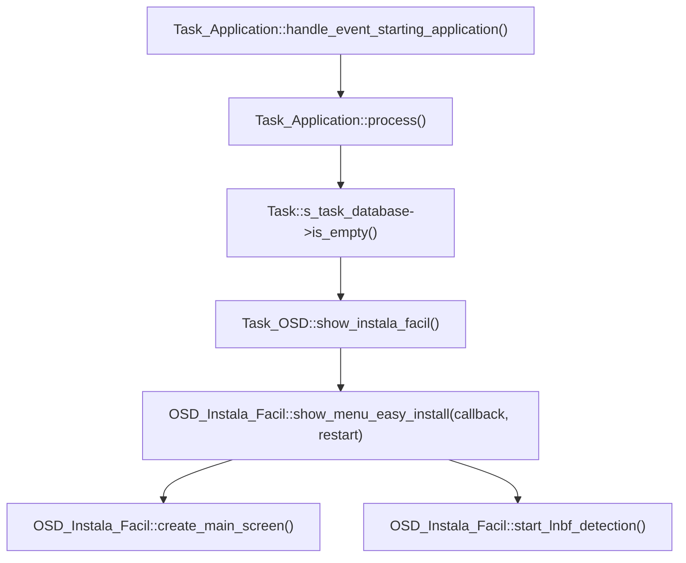
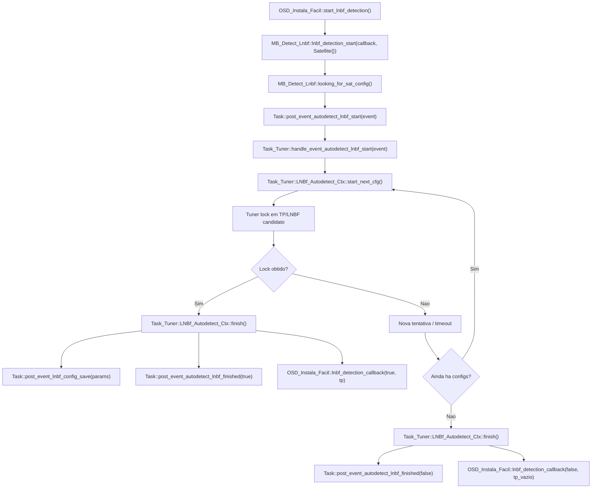
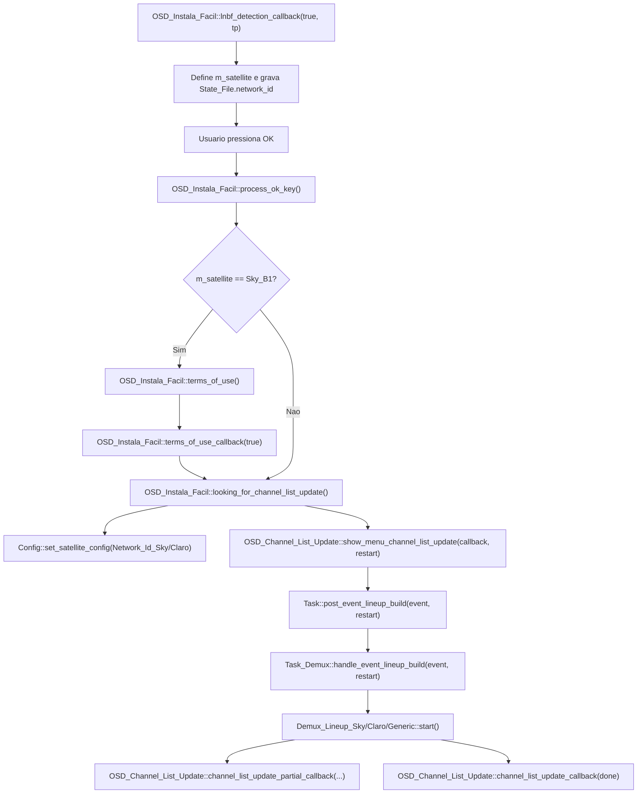
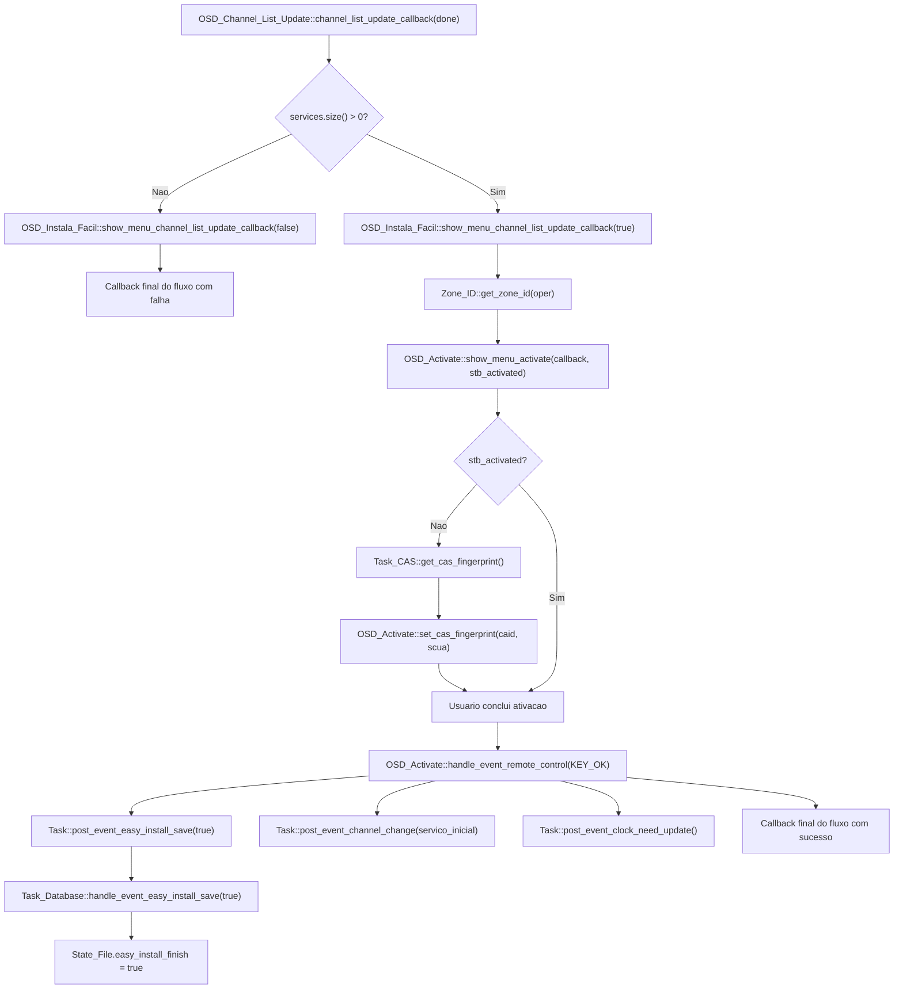

# 10 - Processo de Instala Facil do Receptor

## Objetivo

Este documento mapeia o processo chamado de:

> processo de instala facil do receptor

O objetivo e documentar esse fluxo em dois niveis:

- primeira parte: leitura macro e executiva, voltada para diretoria e gestao
- segunda parte: leitura tecnica, com fluxo e detalhamento funcao a funcao

O nome adotado aqui e:

> processo de instala facil do receptor

---

# Parte 1 - Visao Macro e Executiva

Esta primeira parte foi organizada para leitura de diretoria, gestao e liderancas de produto, operacao e suporte.

Objetivo desta parte:

- explicar o comportamento do produto sem depender de leitura de codigo
- separar claramente o momento de entrada no fluxo, a execucao da instalacao e a conclusao operacional
- destacar impactos operacionais, beneficios, limites e riscos

## Resumo Executivo

O Instala Facil e o fluxo guiado de primeira configuracao do receptor. Na pratica, ele automatiza a entrada operacional do equipamento, reduzindo a necessidade de configuracao manual pelo usuario ou instalador.

Em termos de produto, esse processo faz cinco coisas:

1. identifica o contexto inicial de recepcao
2. define qual ambiente operacional deve ser adotado
3. monta a base inicial de canais para uso
4. conduz a etapa de ativacao do equipamento
5. registra que a instalacao assistida foi concluida

Em outras palavras, o Instala Facil nao e apenas uma tela de boas-vindas. Ele e o processo que organiza a entrada do receptor em operacao, conectando configuracao inicial, disponibilizacao de canais, ativacao e conclusao do setup.

## Resumo Macro Para Gestao

### Quando o processo acontece

O processo entra em cena principalmente em dois contextos:

- primeira subida do produto, quando o banco local ainda esta vazio
- reconfiguracao manual iniciada a partir do menu de satelite

### O que o processo entrega para o negocio

Do ponto de vista executivo, o Instala Facil existe para garantir que o receptor saia de um estado "nao operacional" para um estado "pronto para uso" com o minimo de atrito.

Ele foi desenhado para:

- reduzir erros manuais de configuracao
- automatizar a identificacao do ambiente de recepcao
- montar a lista inicial de canais de forma controlada
- preparar a etapa de ativacao do receptor
- concluir a instalacao em estado persistido e rastreavel

### Leitura macro do fluxo

```mermaid
flowchart LR
    A["Sistema inicia ou usuario relanca o fluxo"] --> B["OSD abre Instala Facil"]
    B --> C["Produto reconhece automaticamente o cenario de recepcao"]
    C --> D["Produto define configuracao ativa"]
    D --> E["Produto atualiza a lista de canais via satelite"]
    E --> F["Produto verifica se o receptor ja esta ativado"]
    F --> G["Produto conduz ativacao ou conclui direto"]
    G --> H["Produto salva que a instalacao foi concluida"]
    H --> I["Produto entra em operacao com canal inicial"]
```

### Componentes participantes

Em nivel diretoria, os blocos funcionais envolvidos sao:

- inicializacao do produto: identifica quando o receptor precisa entrar no fluxo assistido
- experiencia guiada na tela: conduz o usuario pelas etapas da instalacao
- autodeteccao de recepcao: identifica automaticamente o cenario tecnico mais adequado
- atualizacao de canais: monta a base inicial de canais para operacao
- ativacao do receptor: conecta a instalacao com a habilitacao operacional/comercial
- persistencia de estado: registra que a instalacao foi concluida e guarda evidencias operacionais

### Beneficios do desenho atual

- primeira configuracao centralizada em um fluxo unico
- menor dependencia de conhecimento tecnico do usuario final
- convergencia entre configuracao tecnica e ativacao comercial
- persistencia de estado para diagnostico e continuidade operacional

### Limitacoes e pontos de atencao

- o fluxo depende de recepcao adequada de sinal
- se nao houver identificacao automatica bem-sucedida, a instalacao pode exigir apoio adicional
- sucesso da atualizacao de lista depende da correta montagem da base inicial de canais
- a conclusao visual nao equivale, sozinha, a garantia de ativacao comercial efetiva
- o processo depende de varias transicoes internas de sistema; falhas nessas passagens podem interromper a experiencia

### Leitura executiva em uma frase

Hoje, o Instala Facil do receptor e um fluxo assistido de entrada em operacao que conecta reconhecimento do cenario de recepcao, montagem inicial de canais, ativacao e registro de conclusao em uma mesma jornada.

## Gatilhos do Processo

### Gatilho 1. Primeira inicializacao com base vazia

Quando o receptor ainda nao possui a configuracao operacional minima para uso, o produto direciona automaticamente o usuario para o Instala Facil.

Leitura funcional:

- esse e o caminho padrao de entrada em operacao quando o equipamento ainda nao esta pronto para uso normal

### Gatilho 2. Reexecucao manual pelo menu

O fluxo tambem pode ser relancado manualmente quando se deseja refazer a configuracao principal do receptor.

Leitura funcional:

- nesse modo, o produto reutiliza o mesmo processo assistido para reconfigurar o equipamento

## Visao Executiva das Etapas

Em linguagem de negocio, o processo segue esta sequencia:

1. o produto identifica que precisa entrar em modo assistido de instalacao
2. o usuario e conduzido por uma experiencia guiada na tela
3. o receptor tenta reconhecer automaticamente o cenario de recepcao
4. o produto monta a configuracao inicial de canais
5. o fluxo verifica ou conduz a ativacao do equipamento
6. a instalacao e concluida e o receptor entra em operacao inicial

## Perguntas Que a Parte 1 Responde

Para leitura de diretoria, esta primeira parte responde principalmente:

- quando o Instala Facil acontece
- por que ele existe
- o que ele entrega para o negocio
- quais riscos e limitacoes merecem acompanhamento

Ela nao busca responder como o software implementa cada etapa internamente.

---

# Parte 2 - Leitura Tecnica e Fluxo Funcao a Funcao

Esta segunda parte foi escrita para desenvolvimento, QA, suporte tecnico avancado e analise de comportamento do produto.

Objetivo desta parte:

- mostrar o fluxo tecnico real executado pelo produto
- mapear as funcoes, classes e eventos envolvidos
- registrar pontos de persistencia, dependencia e risco tecnico

## Fluxo Macro Detalhado

### Etapa 1. Abertura do Instala Facil

Arquivos:

- `src/tasks/mb_task_osd.cpp`
- `ui/lvgl/mb_osd_instala_facil.cpp`

Resumo:

- `Task_OSD::show_instala_facil()` instancia `OSD_Instala_Facil`
- `OSD_Instala_Facil::show_menu_easy_install()` monta a tela principal
- o breadcrumb e iniciado
- a autodeteccao de LNBF/satelite comeca imediatamente

### Etapa 2. Autodeteccao tecnica de LNBF e satelite

Arquivos:

- `ui/lvgl/mb_lnbf_detection.cpp`
- `src/tasks/mb_task_tuner.cpp`
- `ui/lvgl/mb_osd_instala_facil.cpp`

Resumo:

- `OSD_Instala_Facil::start_lnbf_detection()` cria `MB_Detect_Lnbf`
- `MB_Detect_Lnbf::lnbf_detection_start()` arma timer e posta `post_event_autodetect_lnbf_start()`
- `Task_Tuner::handle_event_autodetect_lnbf_start()` entra em estado de autodeteccao
- `Task_Tuner::LNBf_Autodetect_Ctx` percorre configuracoes predefinidas de LNBF/transponder
- ao obter lock, o tuner salva configuracao, define satelite ativo e responde sucesso

Leitura funcional:

- essa etapa descobre automaticamente qual conjunto tecnico faz o receptor travar sinal

### Etapa 3. Consolidacao do satelite detectado

Arquivos:

- `ui/lvgl/mb_osd_instala_facil.cpp`
- `src/common/mb_config.cpp`
- `src/common/mb_state_file.h`

Resumo:

- `OSD_Instala_Facil::lnbf_detection_callback()` interpreta o transponder encontrado
- frequencia `12120000` e tratada como `Star One D2`
- demais casos seguem como `Sky B1`
- o `network_id` e gravado no `State_File`
- a UI mostra o satelite detectado com o tipo de LNBF

Leitura funcional:

- a etapa transforma um lock tecnico em contexto operacional de negocio

### Etapa 4. Tratamento de falha de deteccao

Arquivos:

- `ui/lvgl/mb_osd_instala_facil.cpp`
- `ui/lvgl/mb_osd_lnbf_snr.*`

Resumo:

- se a autodeteccao falha, `OSD_Instala_Facil::lnbf_detection_callback()` muda o status para falha
- a tela principal mostra que nenhum satelite foi encontrado
- `OSD_Instala_Facil::start_osd_lnbf_snr()` abre uma tela de apoio por sinal/SNR
- se o usuario conseguir sinal, `osd_lnbf_snr_callback(true)` reinicia a autodeteccao
- se nao conseguir, o fluxo e encerrado com callback `false`

Leitura funcional:

- existe uma segunda chance operacional antes de abandonar o processo

### Etapa 5. Termos de uso quando Sky B1

Arquivos:

- `ui/lvgl/mb_osd_instala_facil.cpp`
- `ui/lvgl/mb_osd_terms_of_use.*`
- `src/tasks/mb_task_application.cpp`

Resumo:

- ao confirmar avancar em `Status::Success`, `OSD_Instala_Facil::process_ok_key()` decide o proximo passo
- se o satelite detectado for `Sky_B1`, o arquivo `terms_conditions_date.txt` e apagado
- `OSD_Instala_Facil::terms_of_use()` abre a tela de termos
- se o usuario aceitar, `terms_of_use_callback(true)` segue para a atualizacao de canais

Leitura funcional:

- o produto introduz uma etapa juridico-operacional antes de continuar a instalacao em cenarios Sky

### Etapa 6. Definicao da configuracao ativa

Arquivos:

- `ui/lvgl/mb_osd_instala_facil.cpp`
- `src/common/mb_config.cpp`

Resumo:

- `OSD_Instala_Facil::looking_for_channel_list_update()` define qual configuracao de satelite fica ativa
- `Config::set_satellite_config(Network_Id_Sky)` para Sky
- `Config::set_satellite_config(Network_Id_Claro)` para Star One D2

Leitura funcional:

- a partir daqui, o restante do fluxo passa a operar sobre o satelite/operadora efetivamente selecionado

### Etapa 7. Atualizacao da lista de canais

Arquivos:

- `ui/lvgl/mb_osd_channel_list_update.cpp`
- `src/tasks/mb_task_demux.cpp`
- `src/mb_demux_lineup_*.cpp`
- `src/tasks/mb_task_application.cpp`

Resumo:

- `OSD_Channel_List_Update::show_menu_channel_list_update()` cria UI de progresso
- a tela monta um `Event_List_Update`
- `Task::post_event_lineup_build(..., restart)` inicia a reconstrucao da lineup
- `Task_Demux::handle_event_lineup_build()` escolhe o demux correto:
  - `Demux_Lineup_Sky`
  - `Demux_Lineup_Claro`
  - `Demux_Lineup_Generic`
- o lineup e limpo para o satelite corrente quando aplicavel
- a leitura das tabelas DVB recompõe transponders e servicos
- progresso parcial e devolvido para a UI
- ao final, `OSD_Channel_List_Update::channel_list_update_callback()` decide sucesso ou falha com base na quantidade de servicos encontrados

Leitura funcional:

- essa e a etapa que materializa a operacao comercial do receptor, porque cria a lista usavel de canais

### Etapa 8. Ativacao do receptor

Arquivos:

- `ui/lvgl/mb_osd_instala_facil.cpp`
- `ui/lvgl/mb_osd_activate.cpp`
- `src/tasks/mb_task_cas.*`
- `src/tasks/mb_task_application.cpp`

Resumo:

- se a atualizacao de lista retornar sucesso, `OSD_Instala_Facil::show_menu_channel_list_update_callback(true)` abre `OSD_Activate`
- antes, o produto verifica se o receptor ja esta ativado consultando `Zone_ID::get_zone_id()`
- `OSD_Activate::show_menu_activate()` exibe:
  - URL de ativacao
  - QR Code
  - CAID
  - SCUA
- `Task_CAS::get_cas_fingerprint()` abastece CAID/SCUA via callback
- se o receptor ja estiver ativado, a tela vai direto para sucesso

Leitura funcional:

- o produto conecta a instalacao tecnica com a ativacao operacional/comercial do equipamento

### Etapa 9. Conclusao da instalacao

Arquivos:

- `ui/lvgl/mb_osd_activate.cpp`
- `src/tasks/mb_task_database.cpp`
- `src/tasks/mb_task_application.cpp`

Resumo:

- no sucesso da ativacao, `OSD_Activate::handle_event_remote_control()` executa a finalizacao
- a rotina:
  - ajusta volume para 50
  - limpa display
  - posta `Task::post_event_easy_install_save(true)`
  - retorna `true` no callback do fluxo
  - muda para o primeiro servico da lineup, se existir
  - solicita atualizacao de relogio
- `Task_Database::handle_event_easy_install_save(true)` grava `easy_install_finish = true` no `State_File`

Leitura funcional:

- a conclusao do Instala Facil nao e apenas visual; ela deixa um marcador persistente de que o bootstrap assistido terminou

## Mapa Funcao a Funcao

Os diagramas abaixo representam a sequencia tecnica principal entre as funcoes mais relevantes do fluxo.

### Blocos Tecnicos Participantes

Nesta secao, os principais blocos tecnicos envolvidos no fluxo sao:

- `Task_Application`: decide quando o fluxo deve iniciar
- `Task_OSD`: abre e encerra a experiencia visual
- `OSD_Instala_Facil`: orquestra o passo a passo principal
- `MB_Detect_Lnbf` + `Task_Tuner`: executam a autodeteccao tecnica
- `Task_Demux`: reconstrui a lineup/lista de canais
- `OSD_Channel_List_Update`: acompanha progresso e resultado da atualizacao
- `OSD_Activate` + `Task_CAS`: suportam a ativacao do receptor
- `Task_Database`: grava que o processo foi concluido
- `State_File` e `Config`: persistem contexto operacional do receptor

### Fluxo Tecnico 1. Entrada no Instala Facil

### Fluxo Tecnico 2. Autodeteccao de LNBF e Satelite

### Fluxo Tecnico 3. Pos-deteccao e Atualizacao de Lista

### Fluxo Tecnico 4. Ativacao e Conclusao

## 1. `Task_Application`

Arquivo:

- `src/tasks/mb_task_application.cpp`

### `Task_Application::process()`

Papel:

- decide se o boot vai para operacao normal ou para o Instala Facil

Quando participa do fluxo:

- na inicializacao, ao verificar base vazia

Efeito no Instala Facil:

- chama `s_task_osd->show_instala_facil()` e muda o estado para `ST_EASY_INSTALL`

### `Task_Application::handle_event_lineup_ready(const Event_Lineup_Ready&)`

Papel:

- recebe a conclusao da montagem de lineup

Quando participa do fluxo:

- apos `Task_Demux` terminar a atualizacao de lista

Efeito no Instala Facil:

- move a aplicacao para `ST_IDLE`
- fora do fluxo de easy install, pode trocar automaticamente para o primeiro canal
- durante o Instala Facil, a continuidade visual fica mais sob controle da OSD

### `Task_Application::handle_event_zone_id_changed(Zone_ID_t, Zone_ID_t)`

Papel:

- reage a mudanca de regionalizacao/ativacao

Quando participa do fluxo:

- depois que o receptor e ativado e recebe novo `zone_id`

Efeito no Instala Facil:

- para Claro, pode recarregar lineup
- salva a data da ultima ativacao em `last_activation.txt`

## 2. `Task_OSD`

Arquivo:

- `src/tasks/mb_task_osd.cpp`

### `Task_OSD::show_instala_facil()`

Papel:

- ponto de entrada visual do fluxo

Efeito:

- instancia `OSD_Instala_Facil`
- registra callback de encerramento
- se o fluxo falhar ou for cancelado, retorna ao menu

## 3. `OSD_Instala_Facil`

Arquivos:

- `ui/lvgl/mb_osd_instala_facil.h`
- `ui/lvgl/mb_osd_instala_facil.cpp`

### `show_menu_easy_install(OSD_Instala_Facil_CB_t, bool restart)`

Papel:

- abre a tela principal do Instala Facil

Efeito:

- monta a tela
- desenha teclas
- inicializa breadcrumb
- dispara `start_lnbf_detection()`

### `create_main_screen()`

Papel:

- constroi os elementos graficos principais

Efeito:

- cria fundo
- cria titulo e subtitulo
- ativa animacao de busca de satelite quando disponivel

### `handle_event_remote_control(const Event_Remote_Control&)`

Papel:

- trata navegacao basica do fluxo principal

Efeito:

- `OK` em `Proximo` chama `process_ok_key()`
- `Voltar` ou selecao de saida encerra o fluxo com callback `false`

### `process_ok_key()`

Papel:

- decide o proximo passo apos deteccao bem-sucedida

Efeito:

- se o status for `Success`, limpa a tela principal
- se for Sky, entra em termos de uso
- caso contrario, segue para atualizacao de lista

### `start_lnbf_detection()`

Papel:

- inicia a fase tecnica de autodeteccao

Efeito:

- cria `MB_Detect_Lnbf`
- registra callback
- chama `lnbf_detection_start()`

### `lnbf_detection_callback(bool, Transponder_Id)`

Papel:

- recebe o resultado da autodeteccao

Efeito em caso de sucesso:

- define `m_satellite`
- grava `network_id` no `State_File`
- mostra satelite/tipo de LNBF na UI
- habilita o botao de avancar

Efeito em caso de falha:

- mostra falha
- abre fluxo de apoio por SNR

### `start_osd_lnbf_snr()`

Papel:

- abre a tela auxiliar para tentativa de recuperacao de sinal

### `osd_lnbf_snr_callback(bool)`

Papel:

- recebe retorno da tela de apoio por sinal

Efeito:

- se houver sinal, reinicia a autodeteccao
- se nao houver, encerra o Instala Facil com falha

### `terms_of_use()`

Papel:

- abre os termos de uso

### `terms_of_use_callback(bool)`

Papel:

- recebe aceite ou recusa dos termos

Efeito:

- em caso de aceite, segue para `looking_for_channel_list_update()`

### `looking_for_channel_list_update()`

Papel:

- prepara e chama a atualizacao de canais

Efeito:

- define o `satellite_config` ativo
- instancia `OSD_Channel_List_Update`
- chama `show_menu_channel_list_update()`

### `show_menu_channel_list_update_callback(bool)`

Papel:

- recebe o retorno da atualizacao de lista

Efeito:

- em sucesso, decide se o receptor ja esta ativado
- abre `OSD_Activate`
- em falha, encerra o fluxo retornando ao callback pai

### `show_menu_activate_callback(bool)`

Papel:

- recebe a conclusao da ativacao

Efeito:

- encerra a tela de ativacao
- conclui o fluxo principal

### `return_after_channel_list_screen(bool)`

Papel:

- normaliza a saida apos a etapa de lista

### `clear_screen()`

Papel:

- limpa elementos graficos da tela principal antes da proxima etapa

## 4. `MB_Detect_Lnbf`

Arquivos:

- `ui/lvgl/mb_lnbf_detection.h`
- `ui/lvgl/mb_lnbf_detection.cpp`

### `lnbf_detection_start(mb_detect_lnbf_cb_t, Satellite)`

Papel:

- inicializa a busca automatica

Efeito:

- guarda callback
- cria timer de timeout
- chama `looking_for_sat_config()`

### `looking_for_sat_config()`

Papel:

- encapsula a emissao do evento de autodeteccao

Efeito:

- cria `Event_Autodetect_LNBf`
- posta `Task::post_event_autodetect_lnbf_start()`

### `refresh_progress()`

Papel:

- controla timeout da deteccao

Efeito:

- se o tempo expirar, devolve falha para a OSD

## 5. `Task_Tuner`

Arquivo:

- `src/tasks/mb_task_tuner.cpp`

### `handle_event_autodetect_lnbf_start(std::weak_ptr<Event_Autodetect_LNBf>)`

Papel:

- entra em modo de autodeteccao e abre o tuner se necessario

### `LNBf_Autodetect_Ctx::start_next_cfg(Task_Tuner*)`

Papel:

- tenta a proxima combinacao de banda, LNBF e transponder

Efeito:

- aplica lock
- define deadline
- publica progresso

### `LNBf_Autodetect_Ctx::process(Task_Tuner*)`

Papel:

- monitora lock ou timeout de cada tentativa

### `LNBf_Autodetect_Ctx::finish(Task_Tuner*)`

Papel:

- conclui a autodeteccao

Efeito em caso de sucesso:

- salva parametros LNBF por `post_event_lnbf_config_save()`
- atualiza `Config` com tipo de LNBF e satelite
- informa sucesso para a OSD
- publica `post_event_transponder_locked()`
- publica `post_event_autodetect_lnbf_finished(true)`

Efeito em caso de falha:

- informa falha
- publica `post_event_autodetect_lnbf_finished(false)`

## 6. `Task_Demux`

Arquivo:

- `src/tasks/mb_task_demux.cpp`

### `handle_event_autodetect_lnbf_finished(bool)`

Papel:

- se houve sucesso na autodeteccao, passa a observar NIT

### `handle_event_lineup_build(std::weak_ptr<Event_List_Update>, bool restart)`

Papel:

- funcao central de reconstrucao da lineup

Efeito:

- escolhe a implementacao de demux conforme politica da operadora
- limpa estruturas antigas
- limpa servicos obsoletos do satelite corrente quando necessario
- popula lista inicial de transponders
- inicia a varredura e montagem da lista

### `handle_event_transponder_locked(const Event_Tuner_Lock&)`

Papel:

- entrega o lock para os fluxos de lineup ou parser de lista

## 7. `OSD_Channel_List_Update`

Arquivos:

- `ui/lvgl/mb_osd_channel_list_update.h`
- `ui/lvgl/mb_osd_channel_list_update.cpp`

### `show_menu_channel_list_update(channel_list_update_callback_t, bool restart)`

Papel:

- abre a tela de atualizacao da lista de canais

Efeito:

- cria barra de progresso
- monta callback parcial/final
- chama `Task::post_event_lineup_build()`
- entra em estado `Start`

### `channel_list_update_partial_callback(size_t, const std::vector<Service>&)`

Papel:

- recebe progresso parcial

Efeito:

- para Sky, atualiza percentual real da UI

### `channel_list_update_callback(bool)`

Papel:

- recebe fim da atualizacao

Efeito:

- fixa progresso em 100%
- consulta quantidade de servicos da lineup
- se houver servicos, muda para `Success`
- se nao houver, muda para `Fail`

### `refresh_progress()`

Papel:

- dirige a maquina de estados visual

### `start()`

Papel:

- avanca progresso sintetico quando nao ha parcial real disponivel

### `to_success()` e `to_fail()`

Papel:

- trocam a tela para sucesso ou falha e habilitam continuidade por `OK`

## 8. `OSD_Activate`

Arquivos:

- `ui/lvgl/mb_osd_activate.h`
- `ui/lvgl/mb_osd_activate.cpp`

### `show_menu_activate(Activate_CB_t, bool stb_activated)`

Papel:

- abre a etapa de ativacao

Efeito:

- monta instrucoes
- cria QR Code
- solicita `CAID` e `SCUA` ao CAS
- se o receptor ja estiver ativado, pula direto para sucesso

### `set_cas_fingerprint(NAGRA_CAID_t, NAGRA_SCUA_t)`

Papel:

- abastece a UI com identidade do receptor

Efeito:

- escreve `CAID`
- escreve `SCUA`
- atualiza QR Code de ativacao

### `handle_event_remote_control(const Event_Remote_Control&)`

Papel:

- trata continuidade da ativacao e finalizacao do processo

Efeito no sucesso:

- ajusta volume
- limpa display
- grava `easy_install_finish = true`
- muda para o primeiro canal da lineup, se existir
- solicita atualizacao de relogio

### `to_success()`

Papel:

- desenha a tela final de instalacao concluida

## 9. `Task_Database`

Arquivo:

- `src/tasks/mb_task_database.cpp`

### `handle_event_easy_install_save(bool)`

Papel:

- persiste a conclusao do processo

Efeito:

- grava `easy_install_finish` no `State_File`

Leitura funcional:

- este e o marcador persistente que sinaliza que o fluxo assistido foi concluido

## Dados Persistidos e Evidencias Operacionais

Durante o processo, o produto deixa evidencias importantes:

- `State_File.network_id`: contexto de satelite/operadora detectado
- `State_File.easy_install_finish`: marca de conclusao do fluxo
- `terms_conditions_date.txt`: data vinculada aos termos
- `last_activation.txt`: data da ultima ativacao observada

Esses pontos sao uteis para:

- suporte
- QA
- auditoria de fluxo
- investigacao de falhas em campo

## Riscos Tecnicos Relevantes

- dependencia de callbacks assincronos entre UI e tasks
- dependencia de lock real do tuner
- falha de lineup pode fazer o fluxo concluir sem canais uteis
- salto de ativacao baseado em `Zone_ID` pode mascarar estados intermediarios
- diferencas entre `restart = true` e `restart = false` precisam ser respeitadas em reexecucoes pelo menu

## Resposta Direta: o que o Instala Facil faz no receptor?

Em termos funcionais, o processo de Instala Facil do receptor faz cinco coisas:

1. detecta automaticamente o cenario tecnico de recepcao
2. define a operadora/satelite que passa a reger o produto
3. monta a lista operacional de canais via satelite
4. conduz ou valida a ativacao do receptor
5. grava que o processo foi concluido e coloca o equipamento em operacao inicial

## Arquivos Mais Importantes Para Leitura Tecnica

O mapeamento foi feito a partir do codigo atual do MBGUI, principalmente nos arquivos:

- `src/tasks/mb_task_application.cpp`
- `src/tasks/mb_task_osd.cpp`
- `ui/lvgl/mb_osd_instala_facil.cpp`
- `ui/lvgl/mb_lnbf_detection.cpp`
- `src/tasks/mb_task_tuner.cpp`
- `ui/lvgl/mb_osd_channel_list_update.cpp`
- `src/tasks/mb_task_demux.cpp`
- `ui/lvgl/mb_osd_activate.cpp`
- `src/tasks/mb_task_database.cpp`
