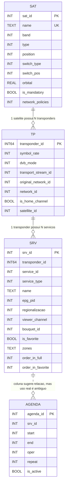
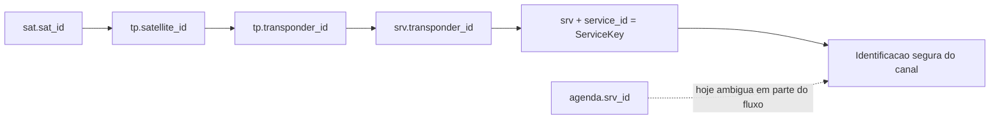
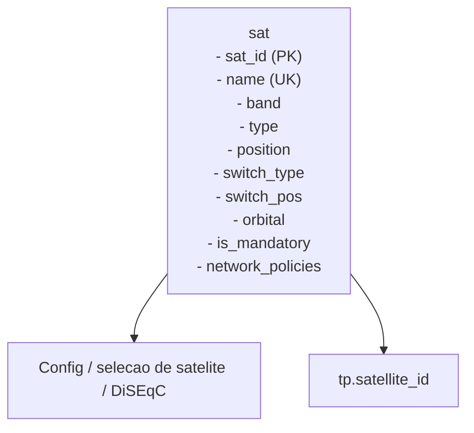
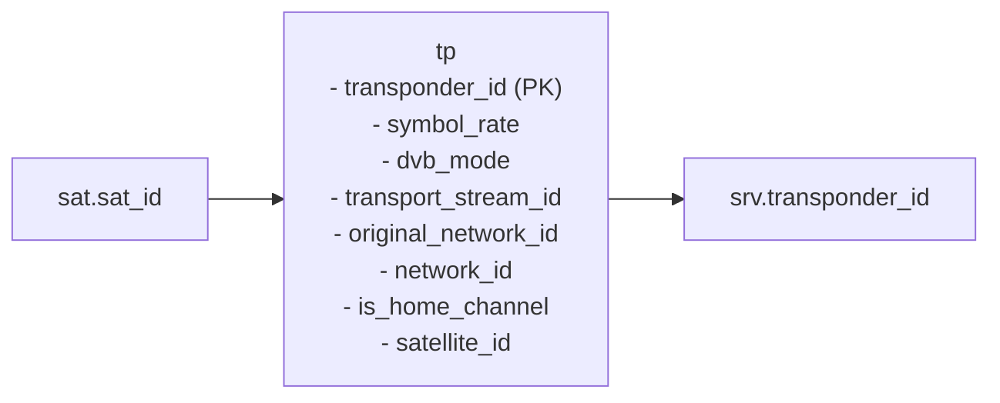
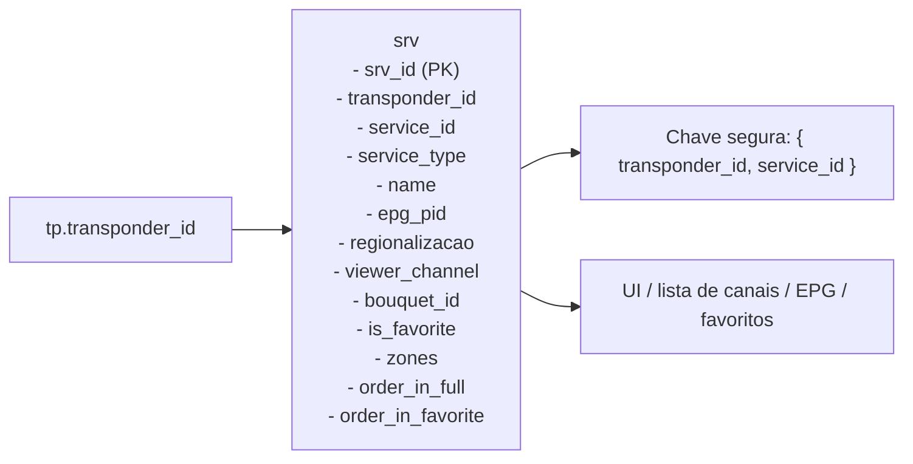
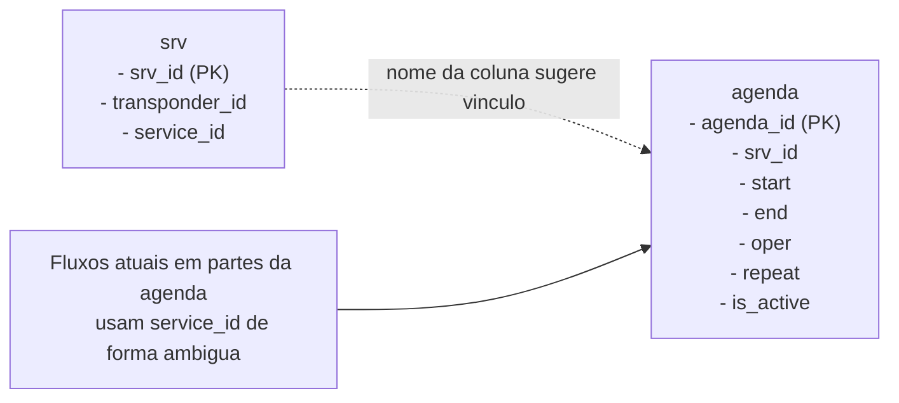
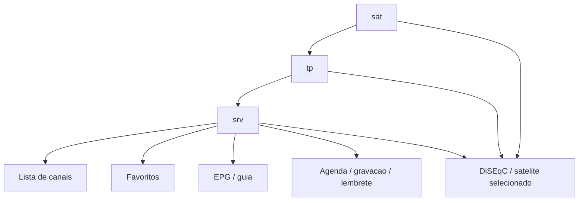

# Dominio de Dados e Banco SQLite

## Visao Geral

O MBGUI usa SQLite para persistir satelites, transponders, servicos/canais, agenda/PVR e configuracoes derivadas. A task responsavel por I/O e `Task_Database`, em `src/tasks/mb_task_database.cpp`.

O banco local e parte critica do suporte multi-satelite. A regra principal continua sendo:

> Nunca use somente `service_id` para identificar, atualizar, ordenar, favoritar, agendar ou sintonizar canais. Use `transponder_id + service_id` ou uma chave estavel equivalente.

## Mapa Geral do Banco

O schema principal criado em `Task_Database::open_local_db()` tem 4 tabelas de negocio:

- `sat`: satelites e configuracao de recepcao
- `tp`: transponders
- `srv`: servicos/canais
- `agenda`: eventos de agenda, lembrete e gravacao

### Diagrama geral



### Leitura correta do diagrama

- A relacao `sat -> tp` e logica e forte no codigo, embora o schema nao declare `foreign key`.
- A relacao `tp -> srv` tambem e logica e forte, sustentada por `transponder_id`.
- A relacao entre `srv` e `agenda` nao pode ser tratada hoje como relacao forte:
  - o nome da coluna em `agenda` e `srv_id`
  - mas o fluxo atual grava e le esse campo de forma ambigua em alguns pontos
  - na pratica, parte do comportamento ainda se aproxima de uso por `service_id` isolado

## Identidade Atual de Canal

O codigo atual define `Transponder_Id` em `src/common/mb_types.h`.

`Transponder_Id::set_frequency()` monta um valor de 64 bits contendo:

- frequencia
- polaridade
- `satellite_id` deslocado para os bits altos

Portanto, a identidade pratica de um servico e:

```text
ServiceKey = { transponder_id, service_id }
```

Importante: documentos antigos mencionavam `unique_id = (transponder_id << 16) | service_id`. Essa formulacao nao deve ser usada cegamente porque `transponder_id` ja e 64-bit no codigo atual. Para novas analises e correcoes, prefira falar em `ServiceKey` ou em `srv.srv_id` se for adotada uma chave relacional real ponta a ponta.

## Diagrama das Relacoes de Identidade



## Tabela `sat`

Criada em `Task_Database::open_local_db()`.

Campos principais:

- `sat_id`: chave primaria do satelite.
- `name`: nome exibido na UI. Existe indice unico `idx_sat_name`.
- `band`: banda C/Ku.
- `type`: tipo de LNBF.
- `position`: posicao/inversao de LNBF.
- `switch_type`: tipo de chave, por exemplo `None`, `DiseqC_1_0`, `DiseqC_1_1`.
- `switch_pos`: porta da chave DiSEqC.
- `orbital`: posicao orbital.
- `is_mandatory`: satelite obrigatorio.
- `network_policies`: politica da rede/operadora, usada para comportamento Sky, TVRO/Claro ou Generic.

O cadastro inicial e feito por `Task_Database::populate_satellite()`.

### Diagrama da tabela `sat`



Pontos atuais de atencao:

- A insercao de novo satelite pela UI usa `insert into sat (...)` sem devolver imediatamente o `sat_id` gerado para a tela de edicao.
- Isso e relevante para bugs ao criar satelite novo e editar chave/DiSEqC repetidas vezes.

## Tabela `tp`

Armazena transponders.

Campos relevantes:

- `transponder_id`: identificador de 64 bits.
- `symbol_rate`
- `dvb_mode`
- `transport_stream_id`
- `original_network_id`
- `network_id`
- `is_home_channel`
- `satellite_id`

Mesmo havendo coluna `satellite_id`, o `transponder_id` tambem carrega `satellite_id` no tipo `Transponder_Id`. Ao inserir ou carregar transponders, esses dois dados devem permanecer coerentes.

### Diagrama da tabela `tp`



## Tabela `srv`

Armazena servicos/canais.

Campos relevantes:

- `srv_id`: chave primaria relacional.
- `transponder_id`
- `service_id`
- `service_type`
- `name`
- `epg_pid`
- `regionalizacao`
- `viewer_channel`
- `bouquet_id`
- `is_favorite`
- `zones`
- `order_in_full`
- `order_in_favorite`

O schema atual possui constraint unica:

```sql
unique (transponder_id, service_id)
```

Essa constraint confirma que `service_id` sozinho nao identifica canal no sistema.

### Diagrama da tabela `srv`



## Tabela `agenda`

Usada para agenda, PVR e lembretes.

Campos principais:

- `agenda_id`: chave primaria.
- `srv_id`
- `start`
- `end`
- `oper`
- `repeat`
- `is_active`

### Diagrama da tabela `agenda`



Pontos de atencao atuais:

- O schema chama a coluna de `srv_id`, mas o codigo atual grava e carrega `ScheduleEntry::service_id` nessa coluna em partes do fluxo.
- A UI de agenda, lembrete e gravacao ainda resolve canal agendado por `service_id` isolado em alguns pontos.
- Isso e risco real em multi-satelite quando dois canais de satelites/transponders diferentes compartilham o mesmo `service_id`.
- A documentacao antiga tratava agenda como se guardasse `unique_id`; isso tambem nao representa o codigo atual.
- Em cenarios multi-satelite, agenda deve migrar para `srv_id` relacional real de ponta a ponta ou para `ServiceKey = { transponder_id, service_id }`.

Arquivos que exigem cuidado antes de mexer em agenda:

- `src/tasks/mb_task_database.cpp`
- `ui/lvgl/mb_osd_scheduled_edit.cpp`
- `ui/lvgl/mb_osd_scheduled_list.cpp`
- `ui/lvgl/mb_osd_program_reminder.cpp`
- `ui/lvgl/mb_osd_guide_channel.cpp`

## Relacoes Operacionais Mais Importantes



## Configuracao em Arquivo de Estado

`State_File::App_State_File` armazena dados como:

- `network_id`
- `current_satellite_id`
- `band`
- `lnbf_type`
- `lnbf_inverted`
- flags de standby, producao e configuracao

Esse estado interage com `Config::set_config()`, `Config::select_satellite_by_id()` e carregamento de lista de satelites.

Importante: isso nao substitui o banco, mas influencia como satelites, lineup e contexto operacional sao reinterpretados na subida do app.

## Fluxos de Persistencia Criticos

### Criar satelite

Fluxo UI atual:

1. `OSD_Edit_Satellite::save_changes()`
2. se `m_current_satellite.id == 0`, chama `Task::post_event_add_satellite(m_current_satellite)`
3. `Task_Database::handle_event_add_satellite()` insere no banco
4. UI chama `Config::load_satellite_list()`

Risco conhecido:

- O ID gerado no banco nao volta imediatamente para `m_current_satellite`.

### Editar satelite/chave

Fluxo:

1. UI altera `switch_type` ou `switch_pos`
2. `save_changes()` chama `update_satellite()` se o ID for diferente de zero
3. `Task_Database::handle_event_update_satellite()` executa `update sat ... where sat_id = :id`

Recomendacao:

- Verificar `sqlite3_changes()` apos update.
- Nunca assumir que o update afetou uma linha se o ID veio de estado recem-criado.

### Salvar lineup

`Task_Database::save_lineup()` grava transponders e servicos encontrados.

Pontos importantes:

- `tp` faz `upsert` por `transponder_id`
- `srv` faz `upsert` por `(transponder_id, service_id)`
- tabelas temporarias `current_tp_ids` e `current_srv_ids` controlam limpeza do que nao pertence mais ao lineup atual

### Reordenar lista de canais

`Task_Database::handle_event_update_channel_list()` atualiza `srv` usando `service_id`, `is_favorite` e `viewer_channel`, sem filtrar por `transponder_id`.

Risco atual:

- Em multi-satelite, essa query pode afetar o canal errado se houver `service_id` ou `viewer_channel` repetidos entre satelites.
- Correcoes nessa area devem levar `transponder_id` junto com os dados da lista ou usar `srv_id`.

## Checklist para Mudancas no Banco

- Preservar constraint `(transponder_id, service_id)`.
- Nao criar queries de `update` ou `delete` por `service_id` isolado.
- Revisar queries existentes que ainda usam `service_id` isolado, especialmente agenda, lembrete, gravacao e ordenacao de lista.
- Ao mexer em `agenda`, decidir explicitamente entre `srv_id` relacional real ou `ServiceKey`.
- Ao adicionar satelites default, pensar em migracao para bancos existentes.
- Ao trocar operadora ou satelite, invalidar ou recarregar estado derivado.
- Validar listas vazias antes de acessar `[0]`.
- Logar `satellite_id`, `transponder_id`, `service_id`, `network_policies`, `switch_type` e `switch_pos` em bugs de sintonia ou regionalizacao.
