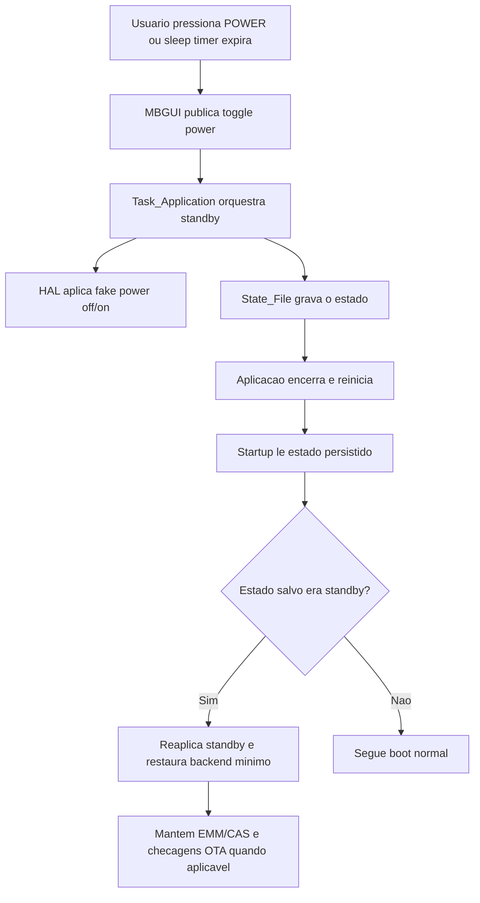

# Standby do Receptor

## Objetivo

Este documento e a porta de entrada para a analise do processo de standby do receptor no MBGUI.

O standby atual nao deve ser lido como desligamento completo. Ele funciona como um modo de espera controlada por software: o receptor reduz a exposicao visual para o usuario, persiste estado, reinicia a aplicacao de forma controlada e mantem rotinas minimas de backend para retomada consistente.

## Como navegar

A documentacao foi dividida em subitens para separar publico, profundidade tecnica e uso pratico:

| Subitem | Quando usar |
|---|---|
| [Visao executiva](standby/01-VISAO-EXECUTIVA.md) | Para diretoria, produto, suporte e gestao entenderem comportamento, beneficios, limites e riscos. |
| [Fluxo tecnico](standby/02-FLUXO-TECNICO.md) | Para entender os caminhos de entrada, persistencia, reinicio, retorno, EMM/CAS e OTA. |
| [Funcao a funcao](standby/03-FUNCAO-A-FUNCAO.md) | Para desenvolvedores localizarem arquivos, metodos e responsabilidades no codigo. |
| [Riscos e checklist](standby/04-RISCOS-E-CHECKLIST.md) | Para investigacao de campo, QA, homologacao e analise de regressao. |

## Leitura rapida

Em uma frase:

> O standby do receptor e um modo de espera controlada por software, com desligamento visual das saidas, persistencia de estado e reentrada assistida da aplicacao para garantir retomada consistente.

## Macrofluxo

## Conclusoes principais

- O standby atual e mais proximo de "espera operacional controlada" do que de poweroff real.
- A entrada em standby persiste estado e reinicia o app, em vez de apenas suspender a interface.
- Durante standby ha manutencao seletiva, especialmente relacionada a OTA, lock tecnico minimo e CAS/EMM.
- Nao ha evidencia de rotina ampla e periodica de atualizacao completa de lineup ou EPG apenas por estar em standby.
- O retorno depende fortemente de `State_File::App_State_File`, do ultimo canal salvo e da capacidade de resolver o transponder correspondente.

## Arquivos mais importantes

- `src/tasks/mb_task_application.cpp`
- `src/tasks/mb_task_remote_control.cpp`
- `src/tasks/mb_task_database.cpp`
- `src/tasks/mb_task_demux.cpp`
- `src/hal/ALi/mb_system.cpp`
- `src/common/mb_state_file.h`
- `ui/lvgl/mb_osd_menu_plus_sleep.cpp`
- `src/tpm/tpm_api.c`
- `src/tpm/mb_tpm.cpp`

