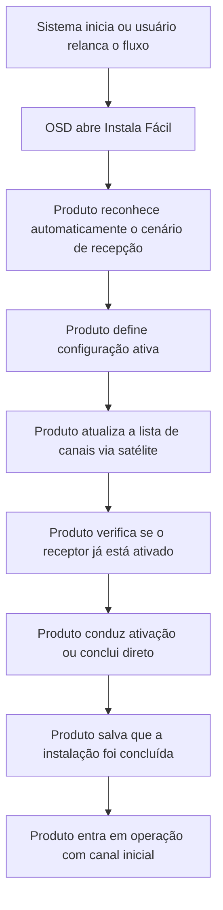
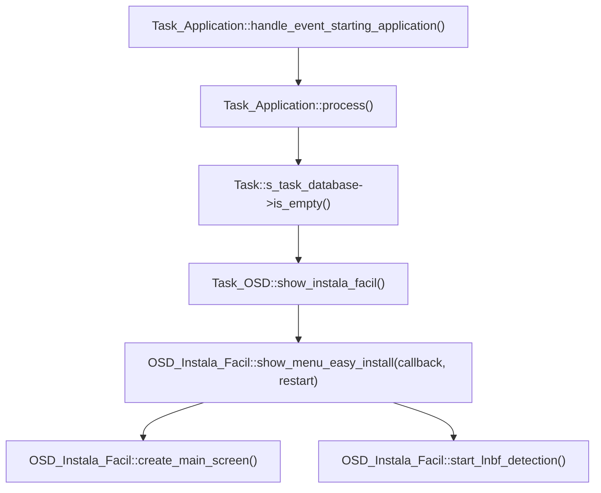
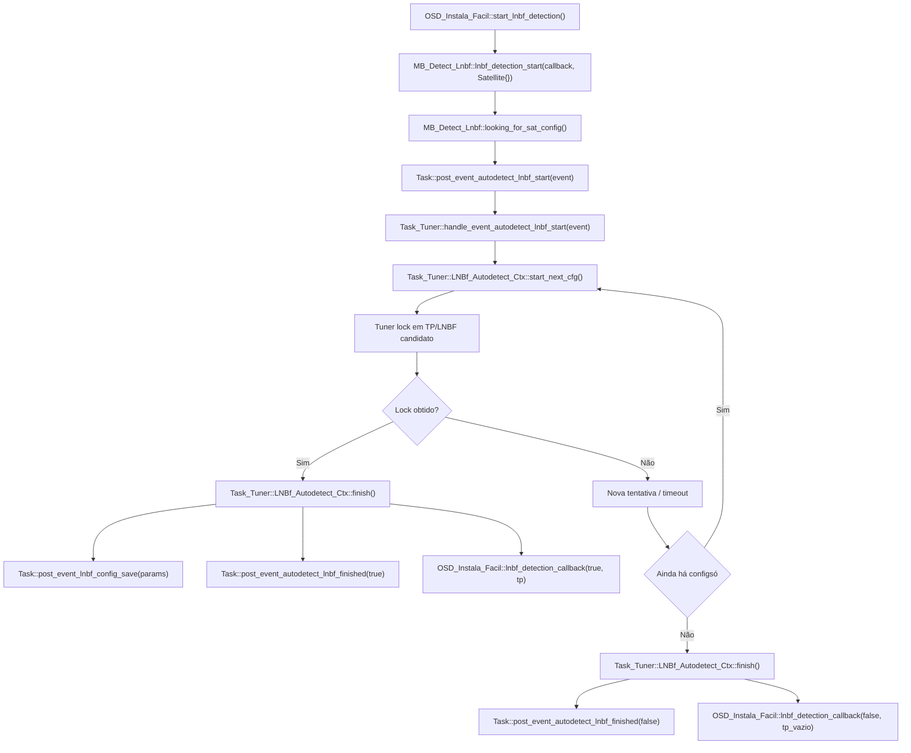
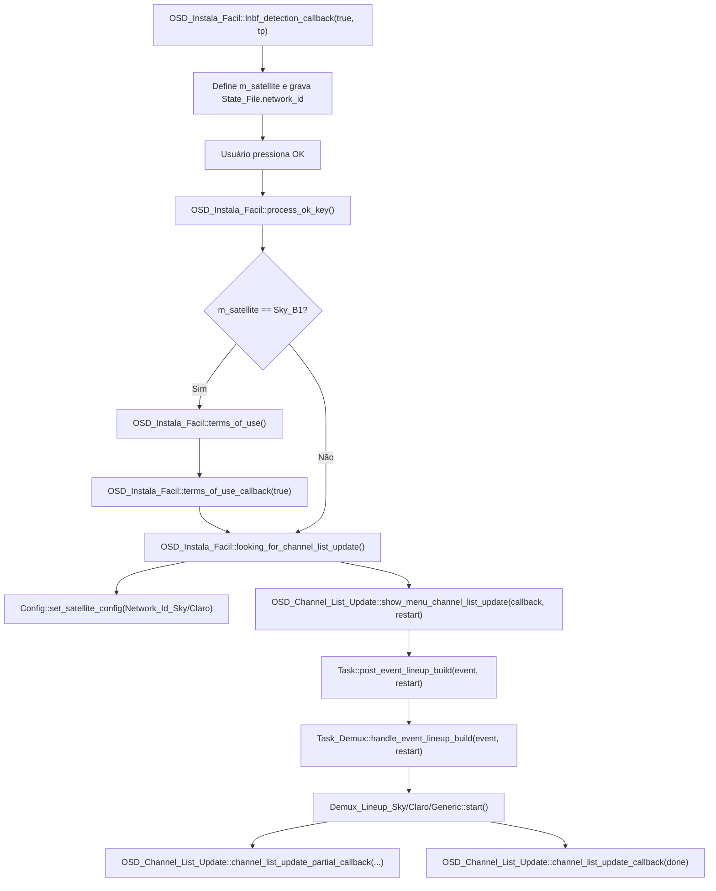
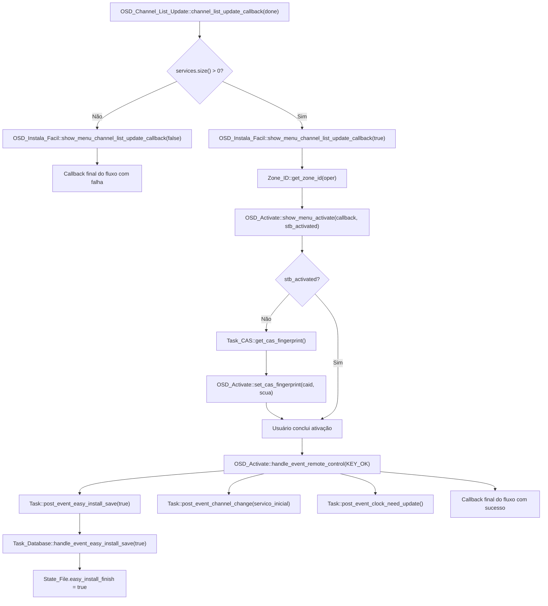

# Processo de Instala Fácil

## Objetivo

Este documento mapeia o processo chamado de:

> processo de instala fácil do receptor

O objetivo ? documentar esse fluxo em dois níveis:

- primeira parte: leitura macro e executiva, voltada para diretoria e gestão
- segunda parte: leitura técnica, com fluxo e detalhamento função a função

O nome adotado aqui ?:

> processo de instala fácil do receptor

---

## Parte 1 - Visão Macro e Executiva

Esta primeira parte foi organizada para leitura de diretoria, gestão e lideranças de produto, operação e suporte.

Objetivo desta parte:

- explicar o comportamento do produto sem depender de leitura de código
- separar claramente o momento de entrada no fluxo, a execução da instalação e a conclusão operacional
- destacar impactos operacionais, benefícios, limites e riscos

### Resumo Executivo

O Instala Fácil ? o fluxo guiado de primeira configuração do receptor. Na prática, ele automatiza a entrada operacional do equipamento, reduzindo a necessidade de configuração manual pelo usuário ou instalador.

Em termos de produto, esse processo faz cinco coisas:

1. identifica o contexto inicial de recepção
2. define qual ambiente operacional deve ser adotado
3. monta a base inicial de canais para uso
4. conduz a etapa de ativação do equipamento
5. registra que a instalação assistida foi concluída

Em outras palavras, o Instala Fácil não ? apenas uma tela de boas-vindas. Ele ? o processo que organiza a entrada do receptor em operação, conectando configuração inicial, disponibilização de canais, ativação e conclusão do setup.

### Resumo Macro Para Gestão

### Quando o processo acontece

O processo entra em cena principalmente em dois contextos:

- primeira subida do produto, quando o banco local ainda está vazio
- reconfiguracao manual iniciada a partir do menu de satélite

### O que o processo entrega para o negócio

Do ponto de vista executivo, o Instala Fácil existe para garantir que o receptor saia de um estado "não operacional" para um estado "pronto para uso" com o mínimo de atrito.

Ele foi desenhado para:

- reduzir erros manuais de configuração
- automatizar a identificação do ambiente de recepção
- montar a lista inicial de canais de forma controlada
- preparar a etapa de ativação do receptor
- concluir a instalação em estado persistido e rastreável

### Leitura macro do fluxo

### Componentes participantes

Em nível diretoria, os blocos funcionais envolvidos são:

- inicialização do produto: identifica quando o receptor precisa entrar no fluxo assistido
- experiência guiada na tela: conduz o usuário pelas etapas da instalação
- autodetecção de recepção: identifica automaticamente o cenário técnico mais adequado
- atualização de canais: monta a base inicial de canais para operação
- ativação do receptor: conecta a instalação com a habilitacao operacional/comercial
- persistência de estado: registra que a instalação foi concluída e guarda evidências operacionais

### Benefícios do desenho atual

- primeira configuração centralizada em um fluxo ?nico
- menor dependência de conhecimento técnico do usuário final
- convergencia entre configuração técnica e ativação comercial
- persistência de estado para diagnóstico e continuidade operacional

### Limitações e pontos de atenção

- o fluxo depende de recepção adequada de sinal
- se não houver identificação automática bem-sucedida, a instalação pode exigir apoio adicional
- sucesso da atualização de lista depende da correta montagem da base inicial de canais
- a conclusão visual não equivale, sozinha, a garantia de ativação comercial efetiva
- o processo depende de várias transicoes internas de sistema; falhas nessas passagens podem interromper a experiência

### Leitura executiva em uma frase

Hoje, o Instala Fácil do receptor ? um fluxo assistido de entrada em operação que conecta reconhecimento do cenário de recepção, montagem inicial de canais, ativação e registro de conclusão em uma mesma jornada.

### Gatilhos do Processo

### Gatilho 1. Primeira inicialização com base vazia

Quando o receptor ainda não possui a configuração operacional mínima para uso, o produto direciona automaticamente o usuário para o Instala Fácil.

Leitura funcional:

- esse ? o caminho padrão de entrada em operação quando o equipamento ainda não está pronto para uso normal

### Gatilho 2. Reexecução manual pelo menu

O fluxo também pode ser relancado manualmente quando se deseja refazer a configuração principal do receptor.

Leitura funcional:

- nesse modo, o produto reutiliza o mesmo processo assistido para reconfigurar o equipamento

### Visão Executiva das Etapas

Em linguagem de negócio, o processo segue esta sequência:

1. o produto identifica que precisa entrar em modo assistido de instalação
2. o usuário e conduzido por uma experiência guiada na tela
3. o receptor tenta reconhecer automaticamente o cenário de recepção
4. o produto monta a configuração inicial de canais
5. o fluxo verifica ou conduz a ativação do equipamento
6. a instalação ? concluída e o receptor entra em operação inicial

### Perguntas Que a Parte 1 Responde

Para leitura de diretoria, esta primeira parte responde principalmente:

- quando o Instala Fácil acontece
- por que ele existe
- o que ele entrega para o negócio
- quais riscos e limitações merecem acompanhamento

Ela não busca responder como o software implementa cada etapa internamente.

---

## Parte 2 - Leitura Técnica e Fluxo Função a Função

Esta segunda parte foi escrita para desenvolvimento, QA, suporte técnico avançado e análise de comportamento do produto.

Objetivo desta parte:

- mostrar o fluxo técnico real executado pelo produto
- mapear as funções, classes e eventos envolvidos
- registrar pontos de persistência, dependência ? risco técnico

### Fluxo Macro Detalhado

### Etapa 1. Abertura do Instala Fácil

Arquivos:

- `src/tasks/mb_task_osd.cpp`
- `ui/lvgl/mb_osd_instala_facil.cpp`

Resumo:

- `Task_OSD::show_instala_facil()` instancia `OSD_Instala_Facil`
- `OSD_Instala_Facil::show_menu_easy_install()` monta a tela principal
- o breadcrumb ? iniciado
- a autodetecção de LNBF/satélite comeca imediatamente

### Etapa 2. Autodetecção técnica de LNBF e satélite

Arquivos:

- `ui/lvgl/mb_lnbf_detection.cpp`
- `src/tasks/mb_task_tuner.cpp`
- `ui/lvgl/mb_osd_instala_facil.cpp`

Resumo:

- `OSD_Instala_Facil::start_lnbf_detection()` cria `MB_Detect_Lnbf`
- `MB_Detect_Lnbf::lnbf_detection_start()` arma timer e posta `post_event_autodetect_lnbf_start()`
- `Task_Tuner::handle_event_autodetect_lnbf_start()` entra em estado de autodetecção
- `Task_Tuner::LNBf_Autodetect_Ctx` percorre configurações predefinidas de LNBF/transponder
- ao obter lock, o tuner salva configuração, define satélite ativo e responde sucesso

Leitura funcional:

- essa etapa descobre automaticamente qual conjunto técnico faz o receptor travar sinal

### Etapa 3. Consolidação do satélite detectado

Arquivos:

- `ui/lvgl/mb_osd_instala_facil.cpp`
- `src/common/mb_config.cpp`
- `src/common/mb_state_file.h`

Resumo:

- `OSD_Instala_Facil::lnbf_detection_callback()` interpreta o transponder encontrado
- frequência `12120000` ? tratada como `Star One D2`
- demais casos seguem como `Sky B1`
- o `network_id` ? gravado no `State_File`
- a UI mostra o satélite detectado com o tipo de LNBF

Leitura funcional:

- a etapa transforma um lock técnico em contexto operacional de negócio

### Etapa 4. Tratamento de falha de detecção

Arquivos:

- `ui/lvgl/mb_osd_instala_facil.cpp`
- `ui/lvgl/mb_osd_lnbf_snr.*`

Resumo:

- se a autodetecção falha, `OSD_Instala_Facil::lnbf_detection_callback()` muda o status para falha
- a tela principal mostra que nenhum satélite foi encontrado
- `OSD_Instala_Facil::start_osd_lnbf_snr()` abre uma tela de apoio por sinal/SNR
- se o usuário conseguir sinal, `osd_lnbf_snr_callback(true)` reinicia a autodetecção
- se não conseguir, o fluxo ? encerrado com callback `false`

Leitura funcional:

- existe uma segunda chance operacional antes de abandonar o processo

### Etapa 5. Termos de uso quando Sky B1

Arquivos:

- `ui/lvgl/mb_osd_instala_facil.cpp`
- `ui/lvgl/mb_osd_terms_of_use.*`
- `src/tasks/mb_task_application.cpp`

Resumo:

- ao confirmar avançar em `Status::Success`, `OSD_Instala_Facil::process_ok_key()` decide o próximo passo
- se o satélite detectado for `Sky_B1`, o arquivo `terms_conditions_date.txt` ? apagado
- `OSD_Instala_Facil::terms_of_use()` abre a tela de termos
- se o usuário aceitar, `terms_of_use_callback(true)` segue para a atualização de canais

Leitura funcional:

- o produto introduz uma etapa jurídico-operacional antes de continuar a instalação em cenários Sky

### Etapa 6. Definicao da configuração ativa

Arquivos:

- `ui/lvgl/mb_osd_instala_facil.cpp`
- `src/common/mb_config.cpp`

Resumo:

- `OSD_Instala_Facil::looking_for_channel_list_update()` define qual configuração de satélite fica ativa
- `Config::set_satellite_config(Network_Id_Sky)` para Sky
- `Config::set_satellite_config(Network_Id_Claro)` para Star One D2

Leitura funcional:

- a partir daqui, o restante do fluxo passa a operar sobre o satélite/operadora efetivamente selecionado

### Etapa 7. Atualização da lista de canais

Arquivos:

- `ui/lvgl/mb_osd_channel_list_update.cpp`
- `src/tasks/mb_task_demux.cpp`
- `src/mb_demux_lineup_*.cpp`
- `src/tasks/mb_task_application.cpp`

Resumo:

- `OSD_Channel_List_Update::show_menu_channel_list_update()` cria UI de progresso
- a tela monta um `Event_List_Update`
- `Task::post_event_lineup_build(..., restart)` inicia a reconstrução da lineup
- `Task_Demux::handle_event_lineup_build()` escolhe o demux correto:
  - `Demux_Lineup_Sky`
  - `Demux_Lineup_Claro`
  - `Demux_Lineup_Generic`
- o lineup ? limpo para o satélite corrente quando aplicável
- a leitura das tabelas DVB recompõe transponders e serviços
- progresso parcial ? devolvido para a UI
- ao final, `OSD_Channel_List_Update::channel_list_update_callback()` decide sucesso ou falha com base na quantidade de serviços encontrados

Leitura funcional:

- essa ? a etapa que materializa a operação comercial do receptor, porque cria a lista usável de canais

### Etapa 8. Ativação do receptor

Arquivos:

- `ui/lvgl/mb_osd_instala_facil.cpp`
- `ui/lvgl/mb_osd_activate.cpp`
- `src/tasks/mb_task_cas.*`
- `src/tasks/mb_task_application.cpp`

Resumo:

- se a atualização de lista retornar sucesso, `OSD_Instala_Facil::show_menu_channel_list_update_callback(true)` abre `OSD_Activate`
- antes, o produto verifica se o receptor já está ativado consultando `Zone_ID::get_zone_id()`
- `OSD_Activate::show_menu_activate()` exibe:
  - URL de ativação
  - QR Code
  - CAID
  - SCUA
- `Task_CAS::get_cas_fingerprint()` abastece CAID/SCUA via callback
- se o receptor já estiver ativado, a tela vai direto para sucesso

Leitura funcional:

- o produto conecta a instalação técnica com a ativação operacional/comercial do equipamento

### Etapa 9. Conclusão da instalação

Arquivos:

- `ui/lvgl/mb_osd_activate.cpp`
- `src/tasks/mb_task_database.cpp`
- `src/tasks/mb_task_application.cpp`

Resumo:

- no sucesso da ativação, `OSD_Activate::handle_event_remote_control()` executa a finalização
- a rotina:
  - ajusta volume para 50
  - limpa display
  - posta `Task::post_event_easy_install_save(true)`
  - retorna `true` no callback do fluxo
  - muda para o primeiro serviço da lineup, se existir
  - solicita atualização de relogio
- `Task_Database::handle_event_easy_install_save(true)` grava `easy_install_finish = true` no `State_File`

Leitura funcional:

- a conclusão do Instala Fácil não ? apenas visual; ela deixa um marcador persistente de que o bootstrap assistido terminou

### Mapa Função a Função

Os diagramas abaixo representam a sequência técnica principal entre as funções mais relevantes do fluxo.

### Blocos Técnicos Participantes

Nesta seção, os principais blocos técnicos envolvidos no fluxo são:

- `Task_Application`: decide quando o fluxo deve iniciar
- `Task_OSD`: abre e encerra a experiência visual
- `OSD_Instala_Facil`: orquestra o passo a passo principal
- `MB_Detect_Lnbf` + `Task_Tuner`: executam a autodetecção técnica
- `Task_Demux`: reconstrui a lineup/lista de canais
- `OSD_Channel_List_Update`: acompanha progresso e resultado da atualização
- `OSD_Activate` + `Task_CAS`: suportam a ativação do receptor
- `Task_Database`: grava que o processo foi concluído
- `State_File` e `Config`: persistem contexto operacional do receptor

### Fluxo Técnico 1. Entrada no Instala Fácil

### Fluxo Técnico 2. Autodetecção de LNBF e Satélite

### Fluxo Técnico 3. Pós-detecção e Atualização de Lista

### Fluxo Técnico 4. Ativação e Conclusão

### 1. `Task_Application`

Arquivo:

- `src/tasks/mb_task_application.cpp`

### `Task_Application::process()`

Papel:

- decide se o boot vai para operação normal ou para o Instala Fácil

Quando participa do fluxo:

- na inicialização, ao verificar base vazia

Efeito no Instala Fácil:

- chama `s_task_osd->show_instala_facil()` e muda o estado para `ST_EASY_INSTALL`

### `Task_Application::handle_event_lineup_ready(const Event_Lineup_Ready&)`

Papel:

- recebe a conclusão da montagem de lineup

Quando participa do fluxo:

- após `Task_Demux` terminar a atualização de lista

Efeito no Instala Fácil:

- move a aplicação para `ST_IDLE`
- fora do fluxo de easy install, pode trocar automaticamente para o primeiro canal
- durante o Instala Fácil, a continuidade visual fica mais sob controle da OSD

### `Task_Application::handle_event_zone_id_changed(Zone_ID_t, Zone_ID_t)`

Papel:

- reage a mudança de regionalização/ativação

Quando participa do fluxo:

- depois que o receptor ? ativado e recebe novo `zone_id`

Efeito no Instala Fácil:

- para Claro, pode recarregar lineup
- salva a data da ultima ativação em `last_activation.txt`

### 2. `Task_OSD`

Arquivo:

- `src/tasks/mb_task_osd.cpp`

### `Task_OSD::show_instala_facil()`

Papel:

- ponto de entrada visual do fluxo

Efeito:

- instancia `OSD_Instala_Facil`
- registra callback de encerramento
- se o fluxo falhar ou for cancelado, retorna ao menu

### 3. `OSD_Instala_Facil`

Arquivos:

- `ui/lvgl/mb_osd_instala_facil.h`
- `ui/lvgl/mb_osd_instala_facil.cpp`

### `show_menu_easy_install(OSD_Instala_Facil_CB_t, bool restart)`

Papel:

- abre a tela principal do Instala Fácil

Efeito:

- monta a tela
- desenha teclas
- inicializa breadcrumb
- dispara `start_lnbf_detection()`

### `create_main_screen()`

Papel:

- constroi os elementos gráficos principais

Efeito:

- cria fundo
- cria título e subtítulo
- ativa animacao de busca de satélite quando disponível

### `handle_event_remote_control(const Event_Remote_Control&)`

Papel:

- trata navegação básica do fluxo principal

Efeito:

- `OK` em `Proximo` chama `process_ok_key()`
- `Voltar` ou seleção de saída encerra o fluxo com callback `false`

### `process_ok_key()`

Papel:

- decide o próximo passo após detecção bem-sucedida

Efeito:

- se o status for `Success`, limpa a tela principal
- se for Sky, entra em termos de uso
- caso contrario, segue para atualização de lista

### `start_lnbf_detection()`

Papel:

- inicia a fase técnica de autodetecção

Efeito:

- cria `MB_Detect_Lnbf`
- registra callback
- chama `lnbf_detection_start()`

### `lnbf_detection_callback(bool, Transponder_Id)`

Papel:

- recebe o resultado da autodetecção

Efeito em caso de sucesso:

- define `m_satellite`
- grava `network_id` no `State_File`
- mostra satélite/tipo de LNBF na UI
- habilita o botão de avançar

Efeito em caso de falha:

- mostra falha
- abre fluxo de apoio por SNR

### `start_osd_lnbf_snr()`

Papel:

- abre a tela auxiliar para tentativa de recuperacao de sinal

### `osd_lnbf_snr_callback(bool)`

Papel:

- recebe retorno da tela de apoio por sinal

Efeito:

- se houver sinal, reinicia a autodetecção
- se não houver, encerra o Instala Fácil com falha

### `terms_of_use()`

Papel:

- abre os termos de uso

### `terms_of_use_callback(bool)`

Papel:

- recebe aceite ou recusa dos termos

Efeito:

- em caso de aceite, segue para `looking_for_channel_list_update()`

### `looking_for_channel_list_update()`

Papel:

- prepara e chama a atualização de canais

Efeito:

- define o `satellite_config` ativo
- instancia `OSD_Channel_List_Update`
- chama `show_menu_channel_list_update()`

### `show_menu_channel_list_update_callback(bool)`

Papel:

- recebe o retorno da atualização de lista

Efeito:

- em sucesso, decide se o receptor já está ativado
- abre `OSD_Activate`
- em falha, encerra o fluxo retornando ao callback pai

### `show_menu_activate_callback(bool)`

Papel:

- recebe a conclusão da ativação

Efeito:

- encerra a tela de ativação
- conclui o fluxo principal

### `return_after_channel_list_screen(bool)`

Papel:

- normaliza a saída após a etapa de lista

### `clear_screen()`

Papel:

- limpa elementos gráficos da tela principal antes da próxima etapa

### 4. `MB_Detect_Lnbf`

Arquivos:

- `ui/lvgl/mb_lnbf_detection.h`
- `ui/lvgl/mb_lnbf_detection.cpp`

### `lnbf_detection_start(mb_detect_lnbf_cb_t, Satellite)`

Papel:

- inicializa a busca automática

Efeito:

- guarda callback
- cria timer de timeout
- chama `looking_for_sat_config()`

### `looking_for_sat_config()`

Papel:

- encapsula a emissao do evento de autodetecção

Efeito:

- cria `Event_Autodetect_LNBf`
- posta `Task::post_event_autodetect_lnbf_start()`

### `refresh_progress()`

Papel:

- controla timeout da detecção

Efeito:

- se o tempo expirar, devolve falha para a OSD

### 5. `Task_Tuner`

Arquivo:

- `src/tasks/mb_task_tuner.cpp`

### `handle_event_autodetect_lnbf_start(std::weak_ptr<Event_Autodetect_LNBf>)`

Papel:

- entra em modo de autodetecção e abre o tuner se necessário

### `LNBf_Autodetect_Ctx::start_next_cfg(Task_Tuner*)`

Papel:

- tenta a próxima combinação de banda, LNBF e transponder

Efeito:

- aplica lock
- define deadline
- publica progresso

### `LNBf_Autodetect_Ctx::process(Task_Tuner*)`

Papel:

- monitora lock ou timeout de cada tentativa

### `LNBf_Autodetect_Ctx::finish(Task_Tuner*)`

Papel:

- conclui a autodetecção

Efeito em caso de sucesso:

- salva parâmetros LNBF por `post_event_lnbf_config_save()`
- atualiza `Config` com tipo de LNBF e satélite
- informa sucesso para a OSD
- publica `post_event_transponder_locked()`
- publica `post_event_autodetect_lnbf_finished(true)`

Efeito em caso de falha:

- informa falha
- publica `post_event_autodetect_lnbf_finished(false)`

### 6. `Task_Demux`

Arquivo:

- `src/tasks/mb_task_demux.cpp`

### `handle_event_autodetect_lnbf_finished(bool)`

Papel:

- se houve sucesso na autodetecção, passa a observar NIT

### `handle_event_lineup_build(std::weak_ptr<Event_List_Update>, bool restart)`

Papel:

- função central de reconstrução da lineup

Efeito:

- escolhe a implementação de demux conforme política da operadora
- limpa estruturas antigas
- limpa serviços obsoletos do satélite corrente quando necessário
- popula lista inicial de transponders
- inicia a varredura e montagem da lista

### `handle_event_transponder_locked(const Event_Tuner_Lock&)`

Papel:

- entrega o lock para os fluxos de lineup ou parser de lista

### 7. `OSD_Channel_List_Update`

Arquivos:

- `ui/lvgl/mb_osd_channel_list_update.h`
- `ui/lvgl/mb_osd_channel_list_update.cpp`

### `show_menu_channel_list_update(channel_list_update_callback_t, bool restart)`

Papel:

- abre a tela de atualização da lista de canais

Efeito:

- cria barra de progresso
- monta callback parcial/final
- chama `Task::post_event_lineup_build()`
- entra em estado `Start`

### `channel_list_update_partial_callback(size_t, const std::vector<Service>&)`

Papel:

- recebe progresso parcial

Efeito:

- para Sky, atualiza percentual real da UI

### `channel_list_update_callback(bool)`

Papel:

- recebe fim da atualização

Efeito:

- fixa progresso em 100%
- consulta quantidade de serviços da lineup
- se houver serviços, muda para `Success`
- se não houver, muda para `Fail`

### `refresh_progress()`

Papel:

- dirige a máquina de estados visual

### `start()`

Papel:

- avança progresso sintético quando não há parcial real disponível

### `to_success()` e `to_fail()`

Papel:

- trocam a tela para sucesso ou falha e habilitam continuidade por `OK`

### 8. `OSD_Activate`

Arquivos:

- `ui/lvgl/mb_osd_activate.h`
- `ui/lvgl/mb_osd_activate.cpp`

### `show_menu_activate(Activate_CB_t, bool stb_activated)`

Papel:

- abre a etapa de ativação

Efeito:

- monta instrucoes
- cria QR Code
- solicita `CAID` e `SCUA` ao CAS
- se o receptor já estiver ativado, pula direto para sucesso

### `set_cas_fingerprint(NAGRA_CAID_t, NAGRA_SCUA_t)`

Papel:

- abastece a UI com identidade do receptor

Efeito:

- escreve `CAID`
- escreve `SCUA`
- atualiza QR Code de ativação

### `handle_event_remote_control(const Event_Remote_Control&)`

Papel:

- trata continuidade da ativação e finalização do processo

Efeito no sucesso:

- ajusta volume
- limpa display
- grava `easy_install_finish = true`
- muda para o primeiro canal da lineup, se existir
- solicita atualização de relogio

### `to_success()`

Papel:

- desenha a tela final de instalação concluída

### 9. `Task_Database`

Arquivo:

- `src/tasks/mb_task_database.cpp`

### `handle_event_easy_install_save(bool)`

Papel:

- persiste a conclusão do processo

Efeito:

- grava `easy_install_finish` no `State_File`

Leitura funcional:

- este ? o marcador persistente que sinaliza que o fluxo assistido foi concluído

### Dados Persistidos e Evidências Operacionais

Durante o processo, o produto deixa evidências importantes:

- `State_File.network_id`: contexto de satélite/operadora detectado
- `State_File.easy_install_finish`: marca de conclusão do fluxo
- `terms_conditions_date.txt`: data vinculada aos termos
- `last_activation.txt`: data da ultima ativação observada

Esses pontos são ?teis para:

- suporte
- QA
- auditoria de fluxo
- investigação de falhas em campo

### Riscos Técnicos Relevantes

- dependência de callbacks assíncronos entre UI e tasks
- dependência de lock real do tuner
- falha de lineup pode fazer o fluxo concluir sem canais ?teis
- salto de ativação baseado em `Zone_ID` pode mascarar estados intermediarios
- diferenças entre `restart = true` e `restart = false` precisam ser respeitadas em reexecuções pelo menu

### Resposta Direta: o que o Instala Fácil faz no receptor?

Em termos funcionais, o processo de Instala Fácil do receptor faz cinco coisas:

1. detecta automaticamente o cenário técnico de recepção
2. define a operadora/satélite que passa a reger o produto
3. monta a lista operacional de canais via satélite
4. conduz ou válida a ativação do receptor
5. grava que o processo foi concluído e coloca o equipamento em operação inicial

### Arquivos Mais Importantes Para Leitura Técnica

O mapeamento foi feito a partir do código atual do MBGUI, principalmente nos arquivos:

- `src/tasks/mb_task_application.cpp`
- `src/tasks/mb_task_osd.cpp`
- `ui/lvgl/mb_osd_instala_facil.cpp`
- `ui/lvgl/mb_lnbf_detection.cpp`
- `src/tasks/mb_task_tuner.cpp`
- `ui/lvgl/mb_osd_channel_list_update.cpp`
- `src/tasks/mb_task_demux.cpp`
- `ui/lvgl/mb_osd_activate.cpp`
- `src/tasks/mb_task_database.cpp`
