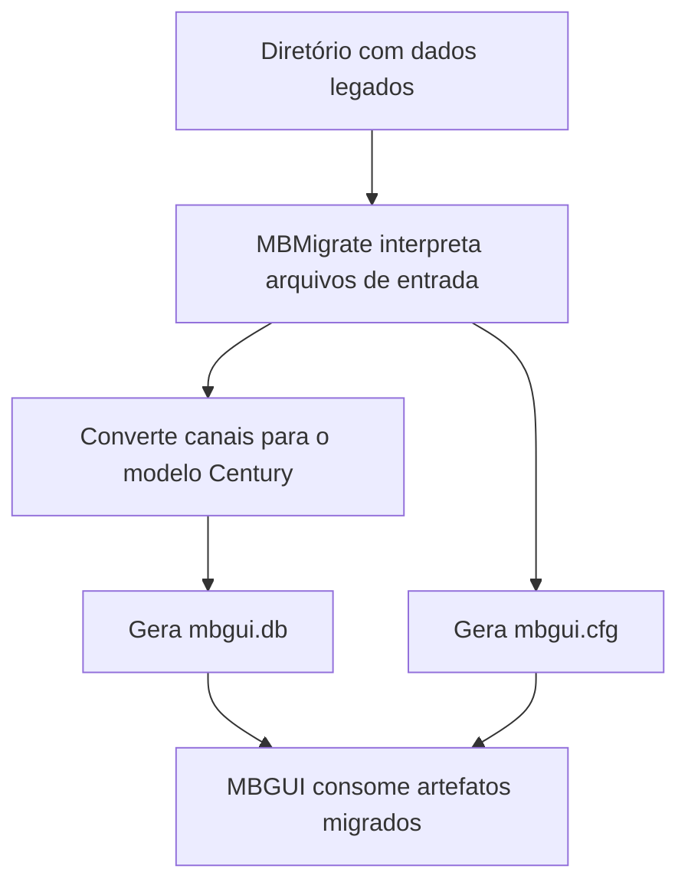
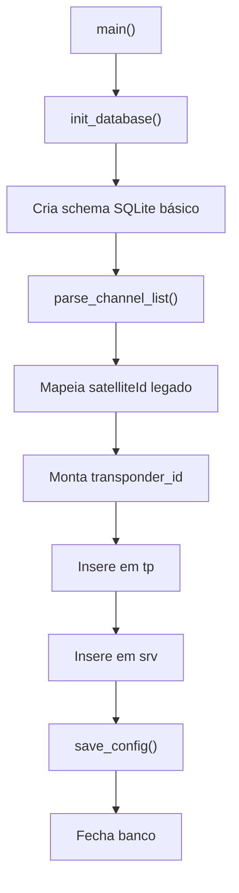

# Processo de Migração via MBMigrate

## Objetivo

Este documento mapeia o processo chamado de:

> processo de migração via mbmigrate

O objetivo ? documentar esse fluxo em dois níveis:

- primeira parte: leitura macro e executiva, voltada para diretoria e gestão
- segunda parte: leitura técnica, com fluxo e detalhamento do utilitário

O nome adotado aqui ?:

> processo de migração via mbmigrate

---

## Parte 1 - Visão Macro e Executiva

Esta primeira parte foi organizada para leitura de diretoria, gestão e lideranças de produto, operação e suporte.

Objetivo desta parte:

- explicar o papel do `mbmigrate` sem depender de leitura de código
- separar claramente origem dos dados, conversão e artefatos gerados
- destacar limites atuais, riscos e impacto operacional

### Resumo Executivo

O `mbmigrate` ? um utilitário auxiliar do MBGUI criado para converter dados legados de um ambiente anterior para o formato de persistência esperado pela plataforma atual da Century.

Na prática, ele tenta transformar arquivos antigos em dois artefatos principais:

- `mbgui.db`, que representa o banco local usado pelo produto
- `mbgui.cfg`, que representa o arquivo de estado/configuração da aplicação

Em termos de processo, o `mbmigrate` faz quatro coisas:

1. recebe um diretório base com arquivos legados
2. cria a estrutura mínima do banco SQLite compativel com o MBGUI
3. converte os canais disponiveis para o modelo atual
4. grava um arquivo de configuração final no formato esperado pela aplicação

Em outras palavras, ele não ? o produto final nem faz a experiência de uso do receptor. Ele funciona como uma ponte técnica para reaproveitar dados antigos na plataforma nova.

### Quando esse processo entra em cena

O processo de migração via `mbmigrate` faz sentido quando existe necessidade de reaproveitar dados de uma base anterior, evitando que o receptor precise reconstruir tudo do zero.

Os contextos mais prováveis são:

- transição entre plataformas ou releases com formato de dados diferente
- reaproveitamento de lista legada de canais
- recuperacao controlada de dados em bancada ou laboratório
- validação técnica de compatibilidade entre ambiente antigo e banco atual

### O que esse processo entrega para o negócio

Do ponto de vista executivo, o valor do `mbmigrate` está em reduzir retrabalho operacional durante uma transição tecnologica.

Ele foi desenhado para:

- reaproveitar dados legados relevantes
- acelerar inicialização de ambiente migrado
- reduzir dependência de configuração manual completa
- gerar artefatos já próximos do formato consumido pelo MBGUI

### Limite atual do processo

A análise do código mostra que o processo ainda está parcial.

Hoje o utilitário entrega principalmente:

- criacao do banco local com tabelas esperadas pelo MBGUI
- leitura de `channelList.json`
- gravação de canais convertidos nas tabelas `tp` e `srv`
- geração de `mbgui.cfg` com valores default

Por outro lado, o processo ainda não entrega de forma completa:

- migração de preferencias antigas
- migração de favoritos
- migração de agenda
- migração completa de satélites a partir dos arquivos legados
- limpeza final dos arquivos antigos

### Impacto operacional

Na visão de processo, isso significa que o `mbmigrate` hoje deve ser tratado mais como uma ferramenta técnica de apoio do que como um fluxo totalmente fechado de migração em produção.

Ele pode acelerar parte importante da transição, mas ainda depende de complementos ou validacoes adicionais para cobrir todo o estado do receptor.

---

## Parte 2 - Visão Técnica

## Localizacao no código

Os arquivos principais do processo estão em:

- `src/migrate/CMakeLists.txt`
- `src/migrate/mb_main_migrate.cpp`
- `src/migrate/mb_main_migrate.h`
- `src/migrate/readme.md`

O subdiretório `migrate` ? incorporado ao build em `src/CMakeLists.txt`, e o executável `mbmigrate` ? criado quando `libcjson` está disponível.

## Fluxo técnico atual

O fluxo real implementado hoje e:

1. iniciar o programa
2. definir `g_base_path`
3. abrir ou criar `mbgui.db`
4. criar tabelas `tp`, `srv`, `sat` e `agenda`
5. ler `channelList.json`
6. converter satélite legado para satélite Century
7. montar `transponder_id`
8. inserir registros nas tabelas `tp` e `srv`
9. gravar `mbgui.cfg`
10. fechar banco e encerrar

## Estruturas e convenções relevantes

### Arquivo de configuração

O programa replica localmente uma struct `App_State_File` para produzir `mbgui.cfg`.

Ela define defaults como:

- `file_version = 2`
- volume inicial
- idioma
- timezone
- resolucao
- `network_id`
- banda e tipo de LNBF
- `current_satellite_id`

Ponto de atenção:

- essa struct foi copiada para dentro do utilitário, em vez de reutilizar diretamente a definicao oficial de `src/common/mb_state_file.h`

### Banco de dados

O utilitário monta um schema alinhado ao esperado pelo `Task_Database` do MBGUI:

- `tp`
- `srv`
- `sat`
- `agenda`

O objetivo ? fazer com que o banco gerado já esteja em um formato reconhecível pelo produto principal.

### Mapeamento de satélites

Existe um mapa fixo de conversão:

- `10 -> 1`
- `11 -> 2`

Interpretacao técnica:

- IDs do ambiente EITV são convertidos para IDs da plataforma Century
- qualquer satélite fora do mapa cai num fallback `eitv_sat_id + 100`

## O que o parser de canais faz

O parser atual lê `channelList.json` e, para cada canal:

- extrai identificadores e metadados principais
- resolve o `satelliteId` para o espaco de IDs da Century
- monta `transponder_id` com frequência, polaridade e satélite
- grava transponder em `tp`
- grava serviço em `srv`

Esse ? hoje o núcleo funcional da migração.

## O que ainda está incompleto

O código deixa claro que o programa ainda está em fase intermediaria.

Itens não concluidos ou desativados:

- parser de `satList.xml`
- parser de `preferences.xml`
- parser de `favoriteChannels.json`
- parser de agenda
- remocao dos arquivos antigos
- descoberta real dos arquivos legados via `find_eitv_files()`

Também há comentários indicando que parte do código XML foi desligada com `#if 0`.

## Riscos técnicos observados

- a struct `App_State_File` duplicada pode divergir da implementação oficial do MBGUI
- o schema SQL também está replicado manualmente, criando risco de drift com `Task_Database`
- o parser JSON assume que vários campos existem e estão válidos
- a tabela `sat` ? criada, mas hoje não e efetivamente populada pela migração ativa
- o `mbgui.cfg` salvo hoje tende a refletir mais valores default do que preferencias reais do ambiente antigo

## Leitura final do processo

Hoje o `mbmigrate` deve ser entendido como um utilitário de transição entre a base legada EITV e o modelo de persistência do MBGUI.

Ele já demonstra a direção arquitetural correta:

- converter dados antigos
- gerar banco no formato do produto atual
- preservar compatibilidade com o estado esperado pelo MBGUI

Mas, no estado atual, ele ainda se comporta como uma migração parcial, centrada principalmente em canais, e não como um pipeline completo de restauração do ambiente legada.
