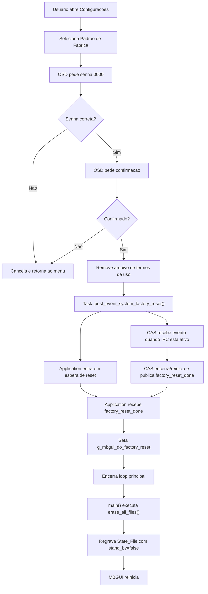

# Processo de Padrao de Fabrica

## Objetivo

Este documento mapeia o processo chamado de:

> processo de padrao de fabrica do receptor

O objetivo e explicar o comportamento do produto quando o usuario, a producao ou o proprio fluxo de atualizacao solicita restauracao do estado de fabrica.

O levantamento foi feito a partir do codigo atual do MBGUI, principalmente nos arquivos:

- `ui/lvgl/mb_osd_menu_config.cpp`
- `src/tasks/mb_task.cpp`
- `src/tasks/mb_task_application.cpp`
- `src/tasks/mb_task_cas.cpp`
- `src/tasks/mb_task_osd.cpp`
- `src/mb_main.cpp`
- `src/common/mb_state_file.h`
- `src/common/mb_globals.h`

---

## Parte 1 - Visao Macro e Executiva

### Resumo executivo

O padrao de fabrica do MBGUI e um fluxo de restauracao controlada do estado operacional do receptor. Ele remove dados persistidos da aplicacao, encerra/reinicia o MBGUI e forca a recriacao de um estado minimo de configuracao.

Na pratica, o processo faz quatro coisas:

1. confirma com o usuario que canais e configuracoes serao perdidos
2. remove evidencias de aceite de termos quando iniciado pelo menu de configuracao
3. sinaliza todas as tasks, e tambem o processo CAS quando existe IPC
4. ao sair do loop principal, limpa arquivos regulares do cache e regrava o arquivo de estado

Esse fluxo nao deve ser lido como apagamento completo de todas as particoes do receptor. Pelo codigo atual, a limpeza direta feita pelo MBGUI e focada em arquivos regulares dentro de `MBGUI_CACHE_PATH`.

### Quando o processo acontece

O processo pode ser disparado por caminhos diferentes:

- menu de configuracoes do receptor
- tela de confirmacao de padrao de fabrica em modo de producao/final test
- fluxo de atualizacao quando compilado com `MBGUI_FORCED_UPDATE`
- evento IPC vindo do processo CAS/GUI, quando `MBGUI_HAS_IPC` esta ativo

### Macrofluxo



---

## Parte 2 - Leitura Tecnica

## Gatilho 1 - Menu de configuracao

Arquivo:

- `ui/lvgl/mb_osd_menu_config.cpp`

O menu de configuracao chama `draw_factory_default()` quando o item de padrao de fabrica e selecionado.

### Senha

`OSD_Menu_Config::draw_factory_default()`:

- cria uma tela sobreposta
- instancia `OSD_Password`
- chama `show_password(...)`
- usa `"0000"` como senha esperada
- registra `factory_default_password_callback(bool)`

### Confirmacao

`OSD_Menu_Config::factory_default_password_callback(bool)` monta uma tela de confirmacao se a senha for aceita. A mensagem informa que todos os canais e configuracoes serao perdidos e pergunta se o usuario deseja confirmar.

Em caso positivo, `OSD_Menu_Config::factory_default_confirm_callback(bool)`:

1. remove `MBGUI_TERMS_CONDITIONS_DATE_FILE`
2. chama `Task::post_event_system_factory_reset()`
3. encerra a UI de confirmacao
4. chama o callback pai com resultado positivo

Leitura funcional:

- a tela nao apaga os dados diretamente
- ela apenas remove o arquivo de termos e publica o evento global de reset

## Gatilho 2 - Modo de producao/final test

Arquivos:

- `src/tasks/mb_task_application.cpp`
- `src/tasks/mb_task_osd.cpp`

No modo `g_production_final_test`, a tecla `KEY_MUTE` publica `post_event_osd_factory_reset()`.

`Task_OSD::handle_event_osd_factory_reset()` exibe uma mensagem sim/nao. Se o usuario confirma, `Task_OSD::factory_reset_callback(true)` chama:

```cpp
Task::post_event_system_factory_reset_done();
```

Esse caminho pula a etapa de senha do menu de configuracao e trata o reset como uma confirmacao operacional de producao.

## Gatilho 3 - Atualizacao forcada

Arquivo:

- `ui/lvgl/mb_osd_software_update.cpp`

Em build com `MBGUI_FORCED_UPDATE`, `OSD_Software_Update::force_sw_update_cb()` chama:

```cpp
Task::post_event_system_factory_reset();
```

antes de chamar `Watchdog::system_reset()`.

Leitura funcional:

- a atualizacao forcada pode combinar reboot/update com limpeza de estado
- esse caminho deve ser validado com cuidado porque mistura dois processos destrutivos

## Propagacao do evento

Arquivo:

- `src/tasks/mb_task.cpp`

`Task::post_event_system_factory_reset()`:

- se `MBGUI_HAS_IPC` esta ativo, envia `ipc_cmd_cas_system_factory_reset` para o CAS
- publica `handle_event_system_factory_reset` para todas as tasks locais

`Task::post_event_system_factory_reset_done()`:

- se `MBGUI_HAS_IPC` esta ativo, envia `ipc_cmd_cas_system_factory_reset_done` para a GUI
- publica `handle_event_system_factory_reset_done` para todas as tasks locais

## Orquestracao pela aplicacao

Arquivo:

- `src/tasks/mb_task_application.cpp`

`Task_Application::handle_event_system_factory_reset()`:

- muda o estado para `ST_WAINTING_FOR_FACTORY_RESET_DONE`
- seta `g_factory_reset_enabled = true`
- registra `m_wait_for_reset`

No estado `ST_WAINTING_FOR_FACTORY_RESET_DONE`, `Task_Application::process()` verifica se o timeout expirou. Se passar do limite, publica novamente `post_event_system_factory_reset_done()`.

`Task_Application::handle_event_system_factory_reset_done()`:

- seta `g_mbgui_do_factory_reset = true`
- chama `system_exit()`

`Task_Application::system_exit()`:

- `g_mbgui_reboot_after_exit = false`
- `g_mbgui_keep_running = false`
- `g_mbgui_restart_on_exit = true`

Leitura funcional:

- o MBGUI sai do loop principal
- nao solicita reboot do container/STB por essa flag
- reinicia a propria aplicacao via `execve("/proc/self/exe", argv, nullptr)`

## Participacao do CAS/Nagra

Arquivo:

- `src/tasks/mb_task_cas.cpp`

`Task_CAS::handle_event_system_factory_reset()`:

- seta `g_mbcas_keep_running = false`
- seta `g_mbcas_container_restart = true`
- publica `post_event_system_factory_reset_done()`
- executa algumas iteracoes de `Task::run_processes()` para escoar eventos

Existe um bloco antigo desativado por `#if 0` que removia arquivos em `MBGUI_NAGRA_STORAGE_PATH`. Como esta desativado, nao deve ser considerado comportamento ativo sem validacao.

## Limpeza final no main

Arquivo:

- `src/mb_main.cpp`

Quando o loop principal termina, `main()` verifica `g_mbgui_do_factory_reset`.

Se verdadeiro, executa:

1. `erase_all_files()`
2. cria `State_File::App_State_File file`
3. seta `file.stand_by = false`
4. grava `file.write()`

### `erase_all_files()`

Comportamento:

- abre `MBGUI_CACHE_PATH`
- percorre entradas do diretorio
- remove apenas entradas que sao `regular_file`
- nao chama `remove_all`
- nao remove subdiretorios

Leitura funcional:

- banco, configuracoes e caches que sejam arquivos regulares diretos em `MBGUI_CACHE_PATH` devem ser apagados
- diretorios e arquivos fora desse caminho podem sobreviver

## Diferencas Claro e Sky

O codigo de padrao de fabrica nao possui uma ramificacao explicita "Claro" versus "Sky" dentro da rotina de limpeza.

A diferenca pratica aparece na proxima subida:

- se o estado/banco foi limpo, `Task_Application::process()` pode detectar banco vazio e abrir Instala Facil
- o Instala Facil/autodeteccao decide novamente o contexto Claro ou Sky
- arquivos como termos, zone id, lineup e dados de CAS podem influenciar o comportamento conforme o que realmente foi removido

Portanto, para homologacao, Claro e Sky devem ser testados separadamente, mas o ponto de divergencia e mais a reentrada pos-reset do que a funcao `erase_all_files()` em si.

## Dados e evidencias envolvidas

- `MBGUI_CACHE_PATH`
- `MBGUI_CONFIG_FILE`
- `MBGUI_TERMS_CONDITIONS_DATE_FILE`
- `g_mbgui_do_factory_reset`
- `g_factory_reset_enabled`
- `g_mbgui_restart_on_exit`
- `g_mbgui_reboot_after_exit`
- `State_File::App_State_File`

## Riscos tecnicos

- `erase_all_files()` remove apenas arquivos regulares diretos; subdiretorios e storages externos podem permanecer.
- O bloco de limpeza de `MBGUI_NAGRA_STORAGE_PATH` esta desativado, entao persistencias Nagra podem nao ser apagadas por esse fluxo.
- Se o CAS nao responder, o timeout da aplicacao forca conclusao; isso evita travamento, mas pode mascarar reset parcial.
- O fluxo de producao chama `factory_reset_done` diretamente, sem passar pelo mesmo caminho de senha do menu.
- O fluxo com `MBGUI_FORCED_UPDATE` combina reset de fabrica e reset por watchdog.
- Se o `State_File` for recriado mas outros arquivos sobreviverem, a proxima subida pode ficar em estado misto.

## Checklist de QA

Validar no menu de configuracao:

- senha incorreta cancela o processo
- senha `0000` abre confirmacao
- cancelar confirmacao nao apaga estado
- confirmar apaga arquivo de termos
- app reinicia
- receptor volta fora de standby
- banco/lista de canais ficam vazios ou coerentes com o esperado
- Instala Facil abre quando aplicavel

Validar por operadora:

- Claro antes do reset
- Sky antes do reset
- receptor ativado antes do reset
- receptor nao ativado antes do reset
- com canais e favoritos
- com agenda/PVR configurados
- com termos aceitos previamente

Validar persistencia:

- `MBGUI_CACHE_PATH` antes/depois
- `MBGUI_CONFIG_FILE` antes/depois
- termos de uso antes/depois
- zone id antes/depois
- dados de CAS/Nagra antes/depois

## Resposta direta

O padrao de fabrica do MBGUI, no codigo atual, e um processo de restauracao de estado da aplicacao. Ele confirma a acao, publica um evento global, encerra/reinicia GUI e CAS, remove arquivos regulares do cache do MBGUI e recria o arquivo de estado com `stand_by=false`. Ele nao deve ser tratado como limpeza completa garantida de todo armazenamento do receptor sem validacao adicional.
