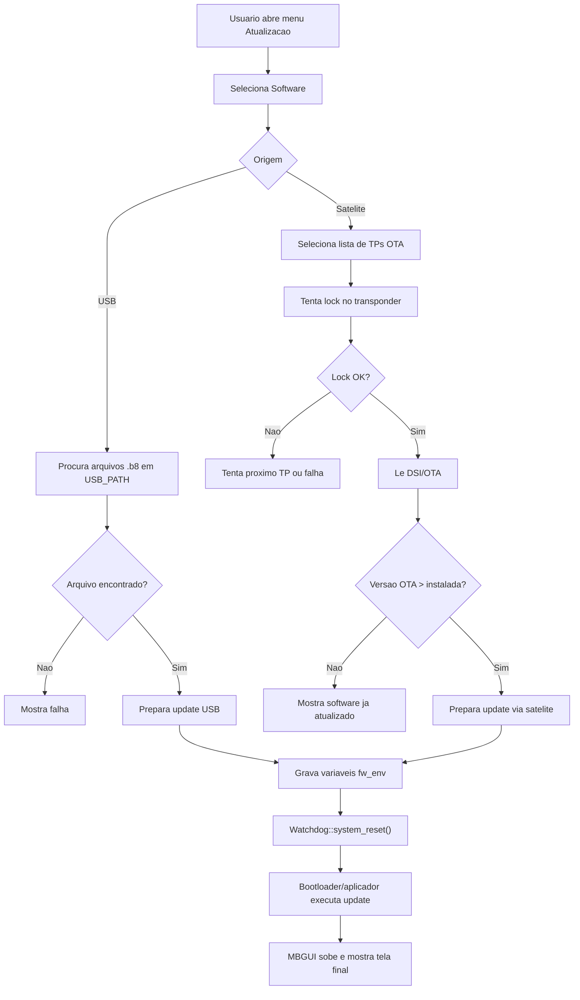
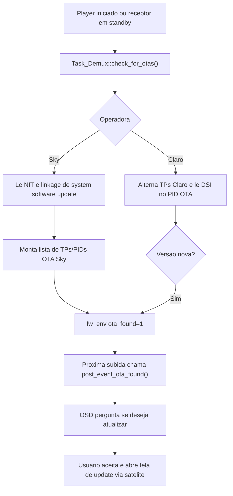

# Processo de Atualizacao de Software

## Objetivo

Este documento mapeia o processo chamado de:

> processo de atualizacao de software do receptor

O processo cobre os caminhos observados no codigo atual:

- atualizacao manual via USB
- atualizacao manual via satelite
- deteccao/aviso de OTA
- atualizacao compulsoria/forcada em build com `MBGUI_FORCED_UPDATE`
- tela de finalizacao pos-update
- geracao de pacotes `.b8` e TS de OTA nos scripts auxiliares

Arquivos principais:

- `ui/lvgl/mb_osd_menu_update.cpp`
- `ui/lvgl/mb_osd_menu_update_usb_satellite.cpp`
- `ui/lvgl/mb_osd_software_update.cpp`
- `ui/lvgl/mb_osd_software_update_forced.cpp`
- `ui/lvgl/mb_osd_software_update_finish.cpp`
- `src/tasks/mb_task_application.cpp`
- `src/tasks/mb_task_osd.cpp`
- `src/tasks/mb_task_demux.cpp`
- `src/dvb/mb_dvb_century.cpp`
- `src/common/mb_satellites.cpp`
- `src/mb_main.cpp`
- `extra/signed/prepare_files_to_signed.sh`
- `extra/signed/gpg_decrypt.sh`
- `extra/signed/Readme.md`

---

## Parte 1 - Visao Macro e Executiva

### Resumo executivo

A atualizacao de software do B8 e o processo que detecta, seleciona e prepara uma nova versao para ser aplicada pelo mecanismo de boot/update do receptor.

O MBGUI nao grava diretamente todas as particoes da atualizacao durante a tela. Em vez disso, ele:

1. identifica uma atualizacao disponivel por USB ou satelite
2. valida se a versao encontrada e mais nova que a instalada
3. grava variaveis de ambiente do bootloader com tipo/caminho/parametros da atualizacao
4. reinicia o receptor via watchdog
5. na proxima subida, exibe uma tela de sucesso/falha com base em flags de ambiente

### Modalidades

| Modalidade | Entrada | Artefato/Fonte | Resultado esperado |
|---|---|---|---|
| USB | Menu Atualizacao > Software > USB | arquivo `.b8` em `USB_PATH` | grava `otatype=usb` e `usbotapath` |
| Satelite Claro | Menu Atualizacao > Software > Satelite ou deteccao standby | DSI/DSM-CC no PID Claro | grava parametros do TP e PID |
| Satelite Sky | Menu Atualizacao > Software > Satelite ou NIT com linkage de update | NIT aponta PID/TP de OTA Sky | usa lista OTA aprendida via NIT |
| Compulsoria | build `MBGUI_FORCED_UPDATE` ou flags de ambiente | fluxo forcado | impede uso normal ate tratar update |
| Pos-update | boot seguinte | `upg_status` e `sw_updt_status_flag` | mostra sucesso/falha e retoma app |

### Macrofluxo manual



### Macrofluxo automatico/OTA



---

## Parte 2 - Leitura Tecnica

## Entrada pelo menu

Arquivos:

- `ui/lvgl/mb_osd_menu_update.cpp`
- `ui/lvgl/mb_osd_menu_update_usb_satellite.cpp`

O menu de atualizacao possui o item `Software`. Ao pressionar OK, abre `OSD_Menu_Update_Usb_Satellite`, que separa a origem da atualizacao entre USB e satelite.

Depois da escolha, o fluxo cria `OSD_Software_Update` e chama:

```cpp
show_menu_software_update(callback, satellite, is_easy_install)
```

Parametros importantes:

- `satellite = true`: atualizacao via satelite
- `satellite = false`: atualizacao via USB
- `is_easy_install`: altera o valor salvo em `sw_updt_status_flag`

## Atualizacao via USB

Arquivo:

- `ui/lvgl/mb_osd_software_update.cpp`

### Abertura

Quando `satellite == false`, `show_menu_software_update()`:

- adiciona breadcrumb de atualizacao via USB
- muda status para `Status::USB`

### Procura do arquivo

`OSD_Software_Update::to_usb()`:

1. verifica se ha pendrive montado com `is_pendrive_mounted()`
2. valida se `USB_PATH` e diretorio
3. lista arquivos recursivamente com `list_usb_files(USB_PATH)`
4. filtra arquivos que contenham `.b8`
5. se nao encontrar, mostra falha
6. se encontrar, seleciona arquivo para update

No codigo atual, o filtro de arquivo usa:

```cpp
static constexpr auto filter_updates = { ".b8" };
```

Leitura funcional:

- o fluxo manual via menu espera pacote `.b8`
- arquivos `.bin` aparecem no processo de release/boot automatico, mas a tela de USB do MBGUI filtra `.b8`

### Preparacao para aplicar update USB

`OSD_Software_Update::force_sw_update_cb(lv_timer_t*)` grava:

```cpp
fw_env_write("otatype", "usb");
fw_env_write("usbotapath", thiz->m_strFile.c_str());
```

Em seguida chama:

```cpp
Watchdog::system_reset();
```

Leitura funcional:

- o MBGUI entrega ao boot/update handler o caminho do pacote
- o reboot e obrigatorio para o mecanismo externo aplicar a atualizacao

## Atualizacao via satelite - Claro

Arquivos:

- `ui/lvgl/mb_osd_software_update.cpp`
- `src/common/mb_satellites.cpp`
- `src/tasks/mb_task_demux.cpp`
- `src/dvb/mb_dvb_century.cpp`

### Lista de transponders

Para Claro, `MB_Satellites::get_transponder_list_for_ota(Satellite_Operator::Claro)` retorna lista fixa baseada em `g_tp_data_list`.

Transponders observados no codigo:

- 12120 MHz vertical, SR 29892, PID OTA `CLARO_OTA_TSPID`
- 11740 MHz horizontal, SR 29892, PID OTA `CLARO_OTA_TSPID`

### Fluxo da tela

Quando o update via satelite e aberto em rede diferente de Sky, `show_menu_software_update()`:

- carrega `m_tp_params` com a lista OTA da Claro
- muda status para `Status::TP_Init`

`tp_init()`:

- pega o proximo TP da lista
- chama `Task::post_event_transponder_lock(&tp.transponder)`
- muda para `Status::TP_Lock`

`tp_lock()`:

- consulta `Task_Tuner::is_locked()`
- se travou, muda para `Status::TP_Locked`
- se atingir timeout, muda para `Status::TP_Lock_Fail`

`tp_locked()`:

- cria `Event_OTA_DSI`
- registra callback `process_ota_cb`
- chama `Task::post_event_ota_update_get(tp.pid, m_ota_callback)`
- muda para `Status::OTA_Detect`

### Leitura da DSI/DSM-CC

`Task_Demux::handle_event_ota_update_get()`:

- guarda callback fraco em `m_ota_event_callback`
- chama `ota_table_require(pid)`

`Task_Demux::ota_callback()`:

- recebe `OTA`
- extrai arquivos OTA
- chama callback com `product_id`, `sw_current` e `sw_min`

`src/dvb/mb_dvb_century.cpp`:

- processa mensagem DSM-CC DSI (`OTA_DSMCC_MSGID_DSI = 0x1006`)
- extrai product id, versao minima e versao atual

### Comparacao de versao

`OSD_Software_Update::process_ota(...)`:

- le versao instalada com `MB_OSD_Version::get_major_minor_version_str()`
- converte para inteiro
- se `software_installed >= _software_ota`, mostra `Status::Updated`
- se `_software_ota` e maior, agenda reboot/update

## Atualizacao via satelite - Sky

Arquivos:

- `src/tasks/mb_task_demux.cpp`
- `src/common/mb_satellites.cpp`
- `ui/lvgl/mb_osd_software_update.cpp`

### Descoberta da OTA Sky

Sky nao usa apenas lista fixa no fluxo final. O codigo procura linkage descriptor de `system_software_update_service` na NIT.

Em `Task_Demux::nit_callback()`, quando encontra `ota_swdl_descriptor()`:

- percorre entradas OTA
- valida `OUI == MBGUI_SKY_OTA_OUI`
- valida `hardware_code == MBGUI_SKY_OTA_HW_CODE`
- valida `model_code == MBGUI_SKY_OTA_MODEL`
- cruza `tsid` do descriptor com transponders da lineup
- monta `OTA_TS_PID` com transponder, PID, software version, download mode e factory reset flag
- salva em `MB_Satellites::set_transponder_list_for_ota(Satellite_Operator::Sky, ...)`
- grava `fw_env_write("ota_found", "1")`

### Uso pela tela

Na tela de update via satelite, quando a operadora e Sky:

- `show_menu_software_update()` inicia em `Status::Sky_Init`
- `process_ota_sky()` busca `MB_Satellites::get_transponder_list_for_ota(Satellite_Operator::Sky)`
- se nao houver lista, mostra falha
- se houver, usa `software_version` ja vindo do descriptor
- compara com a versao instalada
- se a OTA for mais nova, agenda reboot/update

Leitura funcional:

- para Sky, a tela depende de uma lista OTA previamente aprendida pela NIT
- se a lista nao foi populada, o fluxo manual via satelite pode falhar mesmo com sinal

## Deteccao automatica de OTA

Arquivo:

- `src/tasks/mb_task_demux.cpp`

`Task_Demux::handle_event_player_started()` chama:

```cpp
check_for_otas();
```

Durante standby, `Task_Demux::process()` chama `check_for_otas()` aproximadamente a cada 60 segundos.

`Task_Demux::check_for_otas()` consulta `Config::selected_satellite_config().network_policies`:

- Sky: `check_for_ota_sky(frequency)`
- TVRO/Claro: `check_for_ota_claro(frequency)`
- Generic: nao suporta check OTA

### Claro automatico

`check_for_ota_claro()`:

- roda apenas em standby
- alterna entre TPs conhecidos se ainda nao encontrou OTA
- chama `post_event_ota_update_get(CLARO_OTA_TSPID, callback)`
- `process_ota_callback_claro()` compara versao instalada com `sw_current`
- se existe versao mais nova, grava `ota_found=1`

### Sky automatico

`check_for_ota_sky()`:

- se estiver em standby e frequencia for zero, tenta lock em TP de SNR apenas para disparar leitura de NIT
- se ainda nao ha lista OTA Sky, registra callback de NIT e pede tabela NIT
- quando a NIT traz descriptor valido, o codigo grava `ota_found=1`

### Aviso ao usuario

Arquivo:

- `src/tasks/mb_task_application.cpp`

Na inicializacao, `Task_Application::verify_production_update_status()` le `ota_found`.

Se `ota_found == "1"`:

- publica `post_event_ota_found()`
- zera `ota_found` para `"0"`

Arquivo:

- `src/tasks/mb_task_osd.cpp`

`Task_OSD::handle_event_ota_found()`:

- exibe mensagem perguntando se deseja atualizar o receptor
- se usuario aceita, abre `OSD_Software_Update` via satelite

## Aplicacao do update

Arquivo:

- `ui/lvgl/mb_osd_software_update.cpp`

`OSD_Software_Update::force_sw_update_cb(lv_timer_t*)` grava flags gerais:

Se o fluxo veio do Instala Facil:

```cpp
fw_env_write("sw_updt_status_flag", "3");
```

Caso contrario:

```cpp
fw_env_write("sw_updt_status_flag", "1");
```

Quando `m_updt_sattelite` e verdadeiro, o codigo grava parametros do TP selecionado, incluindo frequencia, symbol rate, polaridade e PID.

Quando `m_updt_sattelite` e falso:

- `otatype=usb`
- `usbotapath=<arquivo .b8 encontrado>`

Depois de gravar ambiente, chama:

```cpp
Watchdog::system_reset();
```

Leitura funcional:

- a tela nao fica aplicando o update em tempo real
- ela prepara o ambiente e reinicia o equipamento

## Atualizacao compulsoria/forcada

Arquivos:

- `src/tasks/mb_task_application.cpp`
- `ui/lvgl/mb_osd_software_update_forced.cpp`

Em build com `MBGUI_FORCED_UPDATE`, `verify_production_update_status()` consulta `upg_status`.

Se `upg_status` indicar status final conhecido, abre tela de finalizacao. Caso contrario, chama:

```cpp
s_task_osd->software_updated_forced();
```

`OSD_Software_Update_Forced` mostra uma tela dedicada e permite:

- mostrar informacoes do receptor
- abrir deteccao LNBF
- procurar atualizacao de software por satelite ou USB

Leitura funcional:

- no modo forcado, a aplicacao fica no estado `ST_FORCED_UPDATE`
- o fluxo normal do produto nao segue enquanto a atualizacao obrigatoria nao for tratada

## Tela pos-update

Arquivo:

- `ui/lvgl/mb_osd_software_update_finish.cpp`

`Task_Application::verify_production_update_status()` abre `software_updated_finish()` quando:

- `sw_updt_status_flag == "1"` ou `"3"` no caminho normal
- `upg_status` indica status relevante no caminho forcado

`OSD_Software_Update_finish::show_menu_software_update_finish()` le `upg_status`.

Interpreta:

- `upg_status == "2"`: software atualizado com sucesso
- `upg_status == "1"` ou `"3"`: falha na atualizacao

Depois zera:

```cpp
fw_env_write("upg_status", "0");
```

Ao pressionar OK:

- le `sw_updt_status_flag`
- se for `"3"`, chama callback com `true`
- se nao for `"3"` e lineup estiver vazia, publica `post_event_lineup_load()`
- chama callback com `false`
- zera `sw_updt_status_flag`

Leitura funcional:

- flag `"3"` diferencia update associado ao Instala Facil
- em outros casos, o sistema tenta retomar lineup/aplicacao normal

## Geracao dos pacotes de release

Arquivos:

- `extra/signed/prepare_files_to_signed.sh`
- `extra/signed/gpg_decrypt.sh`
- `extra/signed/Readme.md`

`prepare_files_to_signed.sh`:

- copia imagens UBO obrigatorias
- alinha cada imagem em blocos de 16 bytes
- cifra com GPG para a chave `NASC_signing@nagra.com`
- prepara arquivos para assinatura no fluxo Nagra

`gpg_decrypt.sh`:

- recebe arquivos assinados/cifrados `.lbs.pgp`
- decifra imagens obrigatorias
- monta `Update_B8`
- inclui `main.ubo`, `roothash.ubo`, `rootfs.squashfs`
- gera `sha256sum.txt`
- empacota em squashfs como `.b8`
- cifra o `.b8` com AES-xts
- insere bytes de versao
- chama `mkts` para gerar TS final de OTA

Saidas documentadas:

- `B8_<data>_update_enc_v<versao>.b8`
- `<data>_ota_century_b8_v<versao>_pid_6041_ClaroKu.ts`

## Regras importantes por origem

### USB

- precisa de pendrive montado
- o caminho base e `USB_PATH`
- a UI filtra `.b8`
- falha se nao encontrar arquivo compativel
- grava `otatype=usb` e `usbotapath`

### Satelite Claro

- usa lista fixa de TPs OTA
- usa `CLARO_OTA_TSPID`
- depende de lock de transponder
- depende de DSI/DSM-CC valida
- compara versao antes de reiniciar

### Satelite Sky

- depende de descriptor OTA na NIT
- valida OUI, hardware code e model code
- monta lista dinamica de TP/PID OTA
- usa `software_version` vindo do descriptor
- grava `ota_found=1` quando encontra OTA aplicavel

### Compulsorio

- depende de macro de build e flags de ambiente
- pode bloquear fluxo normal
- em build forcado, pode disparar tambem padrao de fabrica antes do reset

## Riscos tecnicos

- A tela USB filtra apenas `.b8`; qualquer expectativa de `.bin` pelo menu precisa ser revisada.
- Sky depende de NIT/linkage ja aprendido; sem isso, update manual via satelite pode falhar.
- Claro automatico roda apenas em standby; fora dele o check automatico retorna sem procurar.
- `ota_found` e uma flag simples de ambiente; se ficar stale, pode gerar aviso indevido.
- Comparacao de versao usa major/minor convertido para inteiro; formatos de versao fora do padrao podem quebrar a decisao.
- O processo depende de variaveis `fw_env`; falha ao gravar ambiente pode impedir update mesmo com OTA encontrada.
- O reboot via watchdog precisa ser validado com bootloader/aplicador real.
- Em build `MBGUI_FORCED_UPDATE`, o fluxo pode combinar update e factory reset.
- A lista de TPs OTA precisa estar alinhada com a transmissao real.

## Checklist de QA

Validar USB:

- pendrive ausente
- pendrive presente sem `.b8`
- pendrive presente com um `.b8`
- pendrive presente com multiplos `.b8`
- arquivo em subdiretorio
- grava correta de `otatype` e `usbotapath`
- reboot apos confirmacao

Validar satelite Claro:

- lock no TP 12120 V
- lock no TP 11740 H
- falha de lock
- DSI ausente
- versao igual/menor
- versao maior
- `ota_found` em standby
- tela de confirmacao de OTA ao subir

Validar satelite Sky:

- NIT sem descriptor OTA
- NIT com descriptor OTA de outro OUI/modelo
- NIT com descriptor valido
- lista OTA Sky populada
- falha se lista OTA nao estiver populada
- versao igual/menor
- versao maior
- `ota_found` na proxima subida

Validar pos-update:

- `upg_status=2`
- `upg_status=1`
- `upg_status=3`
- `sw_updt_status_flag=1`
- `sw_updt_status_flag=3`
- lineup vazia apos update
- retomada apos OK

Validar release:

- pacote `.b8` gerado
- pacote TS gerado com PID correto
- versao minima embutida
- versao atual embutida
- assinatura Nagra aplicada
- hash `sha256sum.txt` coerente

## Resposta direta

A atualizacao de software do MBGUI e um fluxo de preparacao e controle. A UI localiza uma atualizacao por USB ou satelite, compara versoes, grava variaveis de ambiente para o mecanismo de update e reinicia o receptor via watchdog. A aplicacao efetiva da imagem acontece fora da tela, no ciclo de boot/update, e o MBGUI exibe o resultado na proxima inicializacao usando `upg_status` e `sw_updt_status_flag`.
