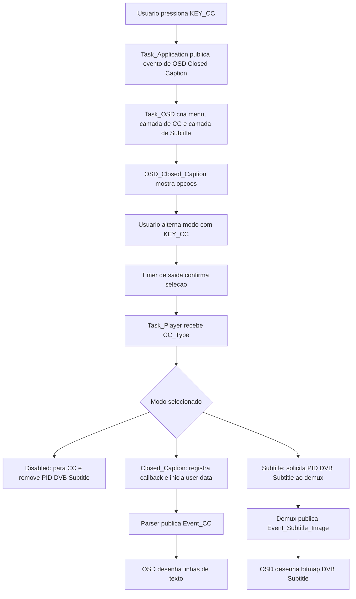

# Processo: Closed Caption e Legendas

## Objetivo

Documentar o fluxo de Closed Caption do MBGUI a partir do codigo fonte, incluindo a selecao pelo controle remoto, a ativacao no player, o parsing de Closed Caption digital, o caminho de DVB Subtitle e os principais pontos de validacao.

## Escopo observado

O codigo trata o recurso como uma selecao unica de tipo de exibicao:

- `Disabled`: desativa Closed Caption e remove PID de legenda DVB.
- `Closed_Caption`: habilita captura de user data de video e parser EIA/CEA no player.
- `Subtitle`: solicita ao demux o PID de DVB Subtitle do servico atual.

Referencias principais:

- `src/common/mb_types.h`: enum `CC_Type`.
- `src/tasks/mb_task_application.cpp`: abertura do menu pelo `KEY_CC`.
- `src/tasks/mb_task_osd.cpp`: criacao do menu e encaminhamento dos eventos de exibicao.
- `ui/lvgl/mb_osd_closed_caption.cpp`: menu de escolha do modo.
- `ui/lvgl/mb_osd_draw_closed_caption.cpp`: desenho das linhas de texto.
- `ui/lvgl/mb_osd_draw_subtitle.cpp`: desenho de DVB Subtitle bitmap.
- `src/tasks/mb_task_player.cpp`: ativacao/desativacao do recurso no player.
- `src/hal/mb_player_cc.cpp`: parser de Closed Caption.
- `src/hal/ALi/mb_player.cpp`: registro do callback de user data do decoder.
- `src/tasks/mb_task_demux.cpp` e `src/hal/ALi/mb_demux.cpp`: captura de PES de DVB Subtitle.
- `src/dvb/mb_dvb_pmt.cpp` e `src/mb_demux_lineup.cpp`: deteccao de subtitle no PMT e associacao ao servico.

## Visao executiva

O usuario aciona o botao `CC` no controle remoto. O MBGUI abre um seletor visual com os modos disponiveis. Ao sair do seletor, o OSD publica o modo escolhido para a task de player.

Quando o modo escolhido e `Closed_Caption`, o player registra um callback no decoder para receber user data do video. O parser interpreta os dados de Closed Caption e publica eventos `Event_CC`, que o OSD transforma em ate quatro linhas de texto na tela.

Quando o modo escolhido e `Subtitle`, o sistema usa o PID de DVB Subtitle identificado no PMT do servico atual. O demux captura PES de legenda, extrai PTS e payload, publica `Event_Subtitle_Image`, e o OSD interpreta segmentos DVB para desenhar uma imagem bitmap sobre o video.

## Fluxo macro



## Acionamento pelo controle remoto

### Entrada do usuario

O ponto de entrada e o tratamento de `KEY_CC` na task de aplicacao. O menu e aberto somente quando a aplicacao esta em estado de operacao normal (`ST_IDLE`).

Fluxo:

1. Usuario pressiona `KEY_CC`.
2. `Task_Application::handle_event_remote_control()` identifica a tecla.
3. A aplicacao chama `Task::post_event_osd_closed_caption()`.
4. `Task_OSD::handle_event_osd_closed_caption()` monta os objetos de OSD necessarios.

Objetos criados pelo OSD:

- `OSD_Draw_Closed_Caption`: camada de texto para Closed Caption.
- `OSD_Closed_Caption`: menu de selecao.
- `OSD_Draw_Subtitle`: camada de imagem para DVB Subtitle.

## Menu de selecao

O menu fica em `ui/lvgl/mb_osd_closed_caption.cpp`.

Comportamento observado:

- O servico atual e lido por `Task::s_task_player->current_srv()`.
- A selecao inicia em `Disabled`.
- O botao `KEY_CC` alterna para o proximo modo.
- `KEY_VOLTAR` fecha o menu.
- Um timer de 5 segundos confirma a selecao automaticamente.

Regras de exibicao:

- `Disabled` aparece como `Desativado`.
- `Closed_Caption` aparece como `Digital`.
- `Subtitle` aparece como `Subtitle`.
- `Subtitle` so entra no ciclo quando o servico atual informa `has_dvb_subtitle()`.

Regra pratica:

```text
Sem DVB Subtitle no servico:
Disabled -> Closed_Caption -> Disabled

Com DVB Subtitle no servico:
Disabled -> Closed_Caption -> Subtitle -> Disabled
```

Ao confirmar a selecao, o OSD publica `Task::post_event_cc_enable(m_selected)`.

## Ativacao e desativacao no player

O evento chega em `Task_Player::handle_event_cc_enable()` e e tratado por `Task_Player::set_cc_enabled(CC_Type)`.

### Modo Closed Caption

Quando `CC_Type::Closed_Caption` e selecionado:

1. A task de player registra callback com `m_player->set_cc_callback(...)`.
2. O callback aponta para `Task::post_event_cc`.
3. O player chama `m_player->start_closed_caption()`.
4. No HAL ALi, `start_closed_caption()` registra o callback `AUI_DECV_CB_USER_DATA_PARSED`.
5. O decoder passa user data de video para `MB_Player::parse_cc()`.

No HAL ALi, tambem e configurado o tipo de user data como `AUI_DECV_USER_DATA_ALL`, permitindo que o parser receba os blocos enviados pelo decoder.

### Modo Subtitle

Quando `CC_Type::Subtitle` e selecionado:

1. A task verifica o servico atual.
2. Publica `Task::post_event_dvb_subtitle_get(m_current_srv->subtitle_pid())`.
3. A task de demux solicita a captura do PID como PES.
4. O payload de legenda e enviado ao parser/renderer DVB Subtitle.

### Modo Disabled

Quando `CC_Type::Disabled` e selecionado:

1. O player chama `m_player->stop_closed_caption()`.
2. O callback de Closed Caption e removido com `m_player->set_cc_callback({})`.
3. Se o servico atual tiver PID de subtitle valido, a task publica `Task::post_event_dvb_subtitle_del(pid)`.
4. O OSD limpa as camadas de Closed Caption e Subtitle.

## Closed Caption digital

### Captura de user data

No caminho ALi, `src/hal/ALi/mb_player.cpp` registra o callback de user data do decoder. Quando o decoder entrega dados, `aui_decv_callback_user_data()` chama:

```cpp
thiz->parse_cc(data, length);
```

Esse parser fica em `src/hal/mb_player_cc.cpp`.

### Parser

O parser tem estrutura baseada em EIA/CEA:

- `CC_Standard::EIA608`
- `CC_Standard::CEA708`

O fluxo ativo observado interpreta principalmente EIA-608. O parser:

1. Valida o pacote de user data.
2. Procura assinatura `GA94`.
3. Percorre blocos de 3 bytes.
4. Verifica bit de validade do bloco.
5. Interpreta pares de bytes como comandos/caracteres EIA-608.
6. Atualiza a tela interna de captions.
7. Publica o resultado por callback quando ha alteracao.

O parser mantem uma tela interna com 15 linhas por 32 colunas, coerente com a organizacao classica de EIA-608.

Modos internos previstos:

- `PopUp`
- `RollUp2`
- `RollUp3`
- `RollUp4`
- `PaintOn`
- `Text`

O codigo tambem possui conversao de caracteres especiais para UTF-8, incluindo caracteres acentuados usados em portugues.

### Publicacao para o OSD

Quando ha conteudo para mostrar, `publish()` monta um `Event_CC`.

Limite observado:

- `MBGUI_CC_MAX_LINES = 4`

Ou seja, mesmo que a tela interna do parser tenha mais linhas, o evento publicado para o OSD carrega ate quatro linhas.

Cada linha publicada contem:

- `x`: posicao horizontal em unidades de caption.
- `y`: posicao vertical em unidades de caption.
- `text`: texto convertido para exibicao.

## Desenho do Closed Caption

O desenho textual fica em `ui/lvgl/mb_osd_draw_closed_caption.cpp`.

Na criacao:

- Uma camada transparente de tela cheia e criada no `CLOSED_CAPTION_LAYER`.
- Quatro labels sao criadas, uma para cada linha maxima.
- Fonte usada: `font_mono_34`.
- Texto branco.
- Fundo preto opaco.
- Padding de 4 pixels.

Na exibicao:

- Linhas vazias sao ocultadas.
- Linhas com texto sao exibidas e posicionadas.
- O posicionamento observado e:

```text
x = (caption_x * 10) + 40
y = (caption_y * 43) + 5
```

Um timer de 6 segundos oculta as linhas caso nenhum novo evento seja recebido.

## DVB Subtitle

### Deteccao no PMT

O suporte a DVB Subtitle comeca na leitura de descritores do PMT.

Arquivos envolvidos:

- `src/dvb/mb_dvb_idescriptor_interface.cpp`
- `src/dvb/mb_dvb_pmt.cpp`
- `src/mb_demux_lineup.cpp`
- `src/mb_demux_channel_list.cpp`

O descritor `Subtitling_Descriptor` interpreta entradas com:

- idioma ISO-639;
- tipo de subtitling;
- `composition_page_id`;
- `ancillary_page_id`.

Quando uma stream do PMT tem descritor de subtitle, o servico recebe:

- `subtitle_pid`;
- flag de DVB Subtitle presente;
- lista de informacoes de subtitle.

Essa informacao e depois usada pelo menu para decidir se a opcao `Subtitle` deve aparecer.

### Captura do PES

Quando o usuario seleciona `Subtitle`, `Task_Demux::handle_event_dvb_subtitle_get(PID_t)` solicita ao demux a captura do PID como `Demux::Data_Type::PES`.

No caminho ALi, `src/hal/ALi/mb_demux.cpp` registra callback de PES. O callback:

1. Verifica se o pacote e private stream PES (`00 00 01 BD`).
2. Extrai o PTS.
3. Envia payload e PTS para `m_subtitle_parser.parse_subtitle_segment(...)`.

O parser em `src/hal/mb_dvb_subtitle_parser.cpp` encapsula os dados em `Event_Subtitle_Image` e publica `Task::post_event_subtitle(evt)`.

### Renderizacao no OSD

O desenho de DVB Subtitle fica em `ui/lvgl/mb_osd_draw_subtitle.cpp`.

O fluxo de renderizacao:

1. `Task_OSD::handle_event_subtitle()` recebe `Event_Subtitle_Image`.
2. `OSD_Draw_Subtitle::show_subtitle()` valida os dados.
3. O renderer espera `data_identifier = 0x20`.
4. O renderer percorre segmentos iniciados por sync byte `0x0F`.
5. Os segmentos DVB sao decodificados.
6. A imagem e montada em buffer RGBA.
7. Um `lv_img` exibe a legenda na camada de subtitle.

Segmentos DVB tratados:

- `0x10`: page composition.
- `0x11`: region composition.
- `0x12`: CLUT definition.
- `0x13`: object data.
- `0x14`: display definition.
- `0x80`: end of display.
- `0xff`: stuffing.

Formatos de pixel previstos:

- 2 bpp.
- 4 bpp.
- 8 bpp.

O renderer usa CLUT do stream quando disponivel e possui CLUT padrao como fallback.

## Limpeza por troca de canal

Quando o canal muda, `Task_OSD::handle_event_channel_change(Service*)` chama `reset()` nas camadas de Closed Caption e Subtitle.

Efeito esperado:

- captions textuais somem;
- imagens de DVB Subtitle somem;
- evita que legenda/caption do canal anterior permaneça na tela.

## Relacao com CAS

Ao enviar informacoes do servico atual para o CAS, `Task_Player::post_current_service_to_cas()` inclui o `subtitle_pid` em `Event_CAS_Request_Descramble`.

Isso indica que, em canais protegidos, o PID de subtitle tambem entra no contexto de descrambling enviado ao CAS.

## Tela de configuracao de legenda

Ha uma tela separada em `ui/lvgl/mb_osd_subtitle_configuration.cpp` para configurar:

- tamanho da fonte;
- cor da fonte;
- cor de fundo.

Esses valores sao persistidos no `State_File`:

- `subtitle_font_size`;
- `subtitle_font_color`;
- `subtitle_background_color`.

Observacao importante: no caminho ativo de DVB Subtitle observado, a legenda e desenhada como bitmap/CLUT vindo do stream DVB. Nao foi encontrado, nesse fluxo, uso direto dessas configuracoes de fonte/cor para alterar o bitmap DVB recebido. A tela parece mais ligada a uma conversao/renderizacao textual de subtitle do que ao caminho bitmap DVB principal.

## Situacao dos padroes

### EIA-608

Ha implementacao ativa de parsing EIA-608 em `src/hal/mb_player_cc.cpp`.

Evidencias:

- tela interna 15 x 32;
- modos roll-up/pop-up/paint-on;
- mapeamento de caracteres especiais;
- publicacao de `Event_CC` para o OSD.

### CEA-708

O codigo possui enum e alguns tipos ligados a CEA-708, mas o caminho ativo observado apenas registra debug quando o standard e `CEA708`.

Nao foi encontrada implementacao funcional completa de demux/decodificacao CEA-708 no caminho ativo.

### Caption Service Descriptor

Existe classe para `Caption_Service_Descriptor`, mas o metodo padrao `set_caption_service_descriptor()` apenas registra que o descritor nao e tratado.

Isso reforca que servicos CEA-708 anunciados por descritor ainda precisam de validacao/implementacao.

### ARIB

Nao foi encontrada implementacao ativa de Closed Caption ARIB no fluxo analisado.

## Pontos de atencao

- Ao selecionar `Subtitle`, `Task_Player::set_cc_enabled()` solicita o PID DVB Subtitle, mas nao chama explicitamente `stop_closed_caption()` antes. Se `Closed_Caption` estava ativo antes, e necessario validar se o callback textual continua recebendo dados em paralelo.
- O renderer DVB Subtitle possui aviso no codigo sobre rever o calculo de PTS. A comparacao fina com STC esta comentada, entao a apresentacao pode ocorrer imediatamente em vez de sincronizar precisamente pelo PTS.
- O renderer DVB Subtitle filtra `page_id` com uma condicao que compara duas vezes o mesmo valor (`page_id != 0x02 && page_id != 0x02`). Isso deve ser revisado, pois pode limitar indevidamente subtitles com outro page id.
- O limite de exibicao textual e de quatro linhas (`MBGUI_CC_MAX_LINES`). Streams com mais conteudo podem ser truncados no OSD.
- O caminho de Closed Caption foi identificado claramente no HAL ALi. Caso a build use outro HAL, como Montage, e necessario validar se `start_closed_caption()` e `stop_closed_caption()` estao implementados de forma equivalente.
- A opcao `Subtitle` depende de `has_dvb_subtitle()` no servico atual. Se o PMT nao for processado corretamente, a opcao nao aparece no menu.

## Checklist de validacao

### Menu

- Pressionar `KEY_CC` em canal sem DVB Subtitle e confirmar ciclo `Desativado -> Digital -> Desativado`.
- Pressionar `KEY_CC` em canal com DVB Subtitle e confirmar ciclo `Desativado -> Digital -> Subtitle -> Desativado`.
- Validar fechamento automatico do menu apos 5 segundos.
- Validar fechamento manual com `KEY_VOLTAR`.

### Closed Caption digital

- Usar stream com EIA-608 conhecido.
- Confirmar que o decoder entrega user data.
- Confirmar chamada de `MB_Player::parse_cc()`.
- Confirmar publicacao de `Event_CC`.
- Confirmar ate quatro linhas renderizadas no OSD.
- Confirmar caracteres acentuados em portugues.
- Confirmar ocultacao automatica apos 6 segundos sem novos eventos.

### DVB Subtitle

- Usar canal cujo PMT contenha `Subtitling_Descriptor`.
- Confirmar `subtitle_pid` no servico.
- Confirmar aparicao da opcao `Subtitle` no menu.
- Confirmar solicitacao do PID ao demux.
- Confirmar captura de PES private stream.
- Confirmar extracao de PTS.
- Confirmar publicacao de `Event_Subtitle_Image`.
- Confirmar exibicao correta do bitmap no OSD.
- Confirmar remocao da legenda ao desativar ou trocar de canal.

### Regressao

- Trocar de canal com Closed Caption ativo e validar limpeza da camada.
- Trocar de canal com DVB Subtitle ativo e validar limpeza da camada.
- Ativar `Closed_Caption`, depois selecionar `Subtitle`, e validar se as duas camadas nao ficam ativas indevidamente.
- Desativar o recurso e validar remocao de callback e do PID DVB Subtitle.

## Resumo tecnico por modulo

| Modulo | Responsabilidade |
| --- | --- |
| `Task_Application` | Recebe `KEY_CC` e solicita abertura do menu. |
| `Task_OSD` | Cria menu/camadas, encaminha eventos de CC e Subtitle para desenho. |
| `OSD_Closed_Caption` | Exibe seletor e publica `CC_Type` escolhido. |
| `Task_Player` | Ativa/desativa Closed Caption ou solicita PID DVB Subtitle. |
| `MB_Player` | Recebe user data, interpreta Closed Caption e publica eventos. |
| `Task_Demux` | Solicita/remover captura de PES para DVB Subtitle. |
| `MB_Demux` | Captura PES, extrai PTS e payload. |
| `OSD_Draw_Closed_Caption` | Desenha texto do Closed Caption. |
| `OSD_Draw_Subtitle` | Decodifica segmentos DVB Subtitle e desenha bitmap. |

