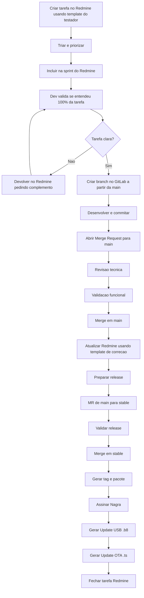
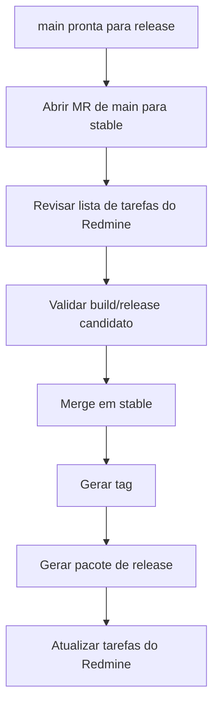
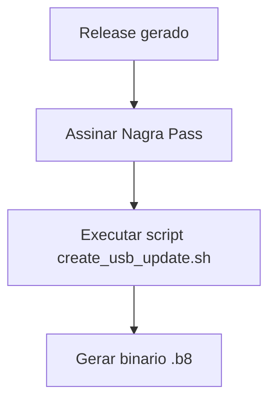
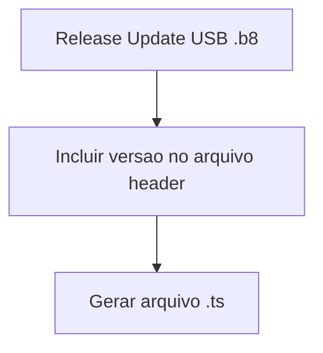

# Processo:  Fluxo de Desenvolvimento Redmine, GitLab e Release

## Objetivo

Padronizar o ciclo completo de desenvolvimento, desde a criação da demanda no Redmine ate a entrega do release e atualização final da tarefa.

## 1. Quando usar esta página

- Para abrir e acompanhar tarefas de desenvolvimento ou bug
- Para montar uma sprint no Redmine
- Para criar branch, commit e merge request no GitLab
- Para revisar, testar e aprovar alterações
- Para promover release e registrar a entrega no Redmine

## 2. Visao geral

O fluxo do projeto existe para garantir rastreabilidade, revisão obrigatória, teste controlado e histórico claro de release.

Toda mudança deve nascer em uma tarefa do Redmine, ser planejada em uma sprint, implementada em uma branch no GitLab, revisada por Merge Request e entregue em release controlado.

O desenvolvimento acontece em `main`. A promoção de versões acontece em `stable`.

## 3. Fluxo completo



## 4. Redmine

### 4.1 Criação da tarefa

Toda demanda deve ter uma tarefa no Redmine antes do desenvolvimento.

Para bug de novo release, o testador deve preencher no mínimo:

- Release/build testado
- Ambiente de teste
- Equipamento ou chipset
- Passos para reproduzir
- Resultado atual
- Resultado esperado
- Frequencia do problema
- Evidencias, como video, foto, log ou banco/lista usada
- Comparacao com release anterior, quando possivel

Template recomendado:

- [Template Redmine - Bug do Testador](TEMPLATE-REDMINE-BUG-TESTADOR.md)

Esse template e a entrada do fluxo. Ele deve fornecer as informações mínimas para que o desenvolvedor consiga entender o problema antes de iniciar a correção.

### 4.2 Triagem

Antes de entrar na sprint, a tarefa deve ser revisada para confirmar:

- Escopo claro
- Prioridade
- Severidade, quando for bug
- Release afetado
- Versão alvo
- Responsável
- Critério mínimo de aceite

Se a tarefa não tiver informação suficiente, ela deve voltar para complemento antes de entrar em desenvolvimento.

### 4.3 Validação de entendimento pelo desenvolvedor

Ao receber a tarefa, o desenvolvedor deve verificar se entendeu 100% do problema antes de criar branch ou iniciar alteracao no codigo.

Checklist minimo:

- Entendi qual e o problema reportado.
- Entendi em qual release/build o problema aconteceu.
- Entendi o ambiente onde o problema foi reproduzido.
- Entendi os passos para reproduzir ou sei exatamente o que falta.
- Entendi o resultado atual e o resultado esperado.
- Entendi a frequência do problema.
- Entendi quais evidencias existem, como vídeo, foto, log ou banco/lista.
- Entendi quais módulos ou fluxos podem estar envolvidos.
- Entendi como QA devera validar a correção depois.

Se qualquer item estiver duvidoso, o desenvolvedor deve comentar no Redmine pedindo complemento e manter a tarefa fora de desenvolvimento ate a informação ser ajustada.

Exemplo de comentário no Redmine:

```text
Antes de iniciar a correcao, preciso confirmar:
- Qual build exato foi testado?
- O problema acontece sempre ou foi intermitente?
- Qual lista/banco foi usado?
- Existe video ou log do momento da falha?
```

### 4.4 Criacao da sprint no Redmine

A sprint deve agrupar as tarefas que serao trabalhadas no ciclo.

Ao criar ou organizar a sprint:

- Definir nome da sprint com periodo ou release alvo
- Incluir bugs, features e ajustes aprovados para o ciclo
- Definir prioridade de execucao
- Confirmar responsaveis
- Confirmar prazo previsto
- Evitar tarefa sem criterio de aceite
- Evitar tarefa sem release afetado ou release alvo, quando aplicavel

Exemplo de nome:

```text
Sprint R1.2.3 - Correcao de bugs release candidato
```

### 4.5 Status sugeridos no Redmine

| Status | Quando usar |
| --- | --- |
| Novo | Tarefa criada, ainda sem triagem completa |
| Em analise | Tarefa sendo analisada tecnicamente |
| Pronto para desenvolvimento | Tarefa com informacoes suficientes para iniciar |
| Em desenvolvimento | Desenvolvedor trabalhando na correcao ou implementacao |
| Em revisao | Merge Request aberto e aguardando revisao |
| Em validacao | Correcao disponivel para QA/teste |
| Resolvido | Correcao validada ou entregue em build |
| Reaberto | Problema persiste ou houve regressao |
| Fechado | Tarefa concluida e registrada no release |

## 5. GitLab

### 5.1 Regras principais

- Toda mudanca deve estar vinculada a uma tarefa do Redmine
- Toda mudanca deve ser feita em branch propria
- Push direto em `main` ou `stable` nao e permitido
- Toda integracao deve passar por Merge Request
- O MR deve informar como testar a alteracao
- O Redmine deve ser atualizado com branch, MR, commit e build

### 5.2 Branches principais

| Branch | Uso |
| --- | --- |
| `main` | Desenvolvimento integrado e base para novas branches |
| `stable` | Base de release validado |

### 5.3 Padrao de branch

```bash
feature/<redmine-id>-<descricao-curta>
bugfix/<redmine-id>-<descricao-curta>
hotfix/<redmine-id>-<descricao-curta>
```

Exemplos:

```bash
feature/7332-fotos-configuracoes
bugfix/8492-editar-chave-novo-satelite
hotfix/8510-reboot-instala-facil
```

### 5.4 Passo a passo do desenvolvedor

1. Confirmar que a tarefa foi criada ou complementada com o template de entrada correto.
2. Ler a tarefa e validar se o problema esta 100% entendido.
3. Se houver duvida, comentar no Redmine pedindo complemento antes de codar.
4. Confirmar que a tarefa esta pronta para desenvolvimento no Redmine.
5. Atualizar a `main`.
6. Criar branch a partir da `main`.
7. Implementar a alteracao.
8. Fazer commits pequenos e rastreaveis.
9. Executar testes possiveis em bancada, simulador ou build local.
10. Fazer push da branch.
11. Abrir Merge Request para `main`.
12. Atualizar a tarefa do Redmine com branch e MR.

Exemplo de commit:

```bash
fix: corrige reboot ao editar chave em novo satelite (#8492)
```

## 6. Merge Request

### 6.1 Padrao de titulo

```text
#<redmine-id> - <modulo>: <resumo da alteracao>
```

Exemplo:

```text
#8492 - Satelite: corrige reboot ao editar chave em novo satelite
```

### 6.2 Descrição do MR

```text
Redmine: #<id>

O que foi feito:
- <alteracao 1>
- <alteracao 2>

Motivo:
- <causa ou contexto da alteracao>

Como testar:
- <passo 1>
- <passo 2>
- <resultado esperado>

Riscos:
- <fluxos que podem regredir>

Evidencias:
- <logs, prints, videos ou observacoes>
```

### 6.3 Revisao

O revisor deve validar:

- Se o MR esta ligado a uma tarefa do Redmine
- Se o escopo bate com a tarefa
- Se a alteracao esta restrita ao problema
- Se ha risco de regressao
- Se o plano de teste esta claro
- Se a descricao ajuda QA e manutencao futura

Depois da aprovação, o MR pode ser integrado em `main`.

## 7. Atualização do Redmine após correção

Depois da correção, o desenvolvedor deve atualizar a tarefa com o template: 
- [Template Redmine - Correcao do Desenvolvedor](TEMPLATE-REDMINE-CORRECAO-DESENVOLVEDOR.md)

Esse template e a saída tecnica da tarefa. Ele deve ser usado para registrar o resultado da correção, facilitar a validação de QA e manter histórico claro para manutenção futura.

Status sugerido após MR aprovado:

- Usar `Em validacao` se ainda precisa de QA
- Usar `Resolvido` se já foi validado e entregue no build correto

## 8. Release

### 8.1 Preparação do release

Antes de promover release:

- Confirmar quais tarefas do Redmine entram no release
- Confirmar que os MRs correspondentes foram integrados em `main`
- Confirmar que QA validou os itens obrigatórios
- Confirmar que não existem bugs bloqueantes abertos para o release
- Gerar changelog ou lista de tarefas entregues

### 8.2 Promoção para stable



Padrao de tag sugerido:

```text
v<versao>
```

Exemplo:

```text
v1.2.3
```

### 8.3 Release Update USB (.b8)



### 8.4 Release Update OTA (.ts)



## 9. Papéis e responsabilidades

| Papel              | Faz                                                              | Nao faz                                                      |
| ------------------ | ---------------------------------------------------------------- | ------------------------------------------------------------ |
| Testador           | Abre bug com evidencias, valida build, confirma correcao         | Não deve abrir bug sem release, passos ou resultado esperado |
| Developer          | Analisa, cria branch, corrige, testa, abre MR e atualiza Redmine | Não faz push direto em `main` ou `stable`                    |
| Revisor/Maintainer | Revisa MR, aprova merge e controla integracao                    | Não aprova MR sem contexto minimo e plano de teste           |
| Release Manager    | Organiza release, promove para `stable`, gera tag e pacote       | Não promove release sem lista de tarefas e validacao         |
| Owner/Gestão       | Prioriza sprint, acompanha status e aprova encerramento          | Não substitui o fluxo tecnico do time                        |

## 10. Regras e cuidados

!!! warning "Regra do projeto"
    Push direto em `main` ou `stable` não e permitido.

!!! tip "Regra de ouro"
    Toda mudança precisa ter tarefa no Redmine, branch no GitLab, MR revisado, build identificado e atualização final na tarefa.

## 11. Troubleshooting

| Situação                                     | Causa provavel                                                | Acao recomendada                                                   |
| -------------------------------------------- | ------------------------------------------------------------- | ------------------------------------------------------------------ |
| Bug sem informação suficiente                | Tarefa aberta sem template minimo                             | Devolver para complemento antes de desenvolver                     |
| Dev nao entendeu 100% da tarefa              | Passos, ambiente, evidência ou resultado esperado incompletos | Comentar no Redmine com perguntas objetivas e aguardar complemento |
| MR sem contexto suficiente                   | Descricao incompleta                                          | Atualizar MR com Redmine, escopo, teste e riscos                   |
| Alteracao feita direto em branch principal   | Fluxo ignorado                                                | Reorganizar em branch e MR antes de integrar                       |
| Tarefa corrigida mas QA nao consegue validar | Falta de build, passos ou evidencia                           | Atualizar Redmine com build e roteiro de validacao                 |
| Release saiu fora do controle                | Promocao fora da `stable` ou sem lista de tarefas             | Retomar fluxo oficial e registrar tag/build no Redmine             |

