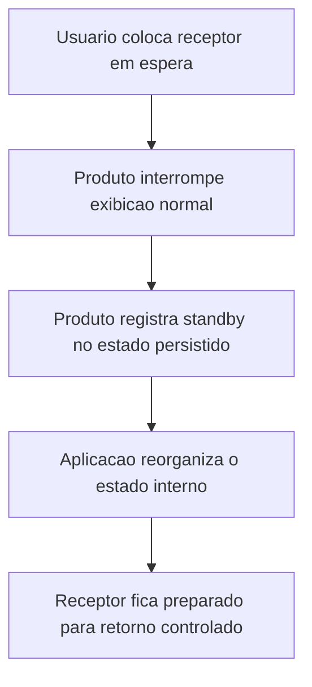
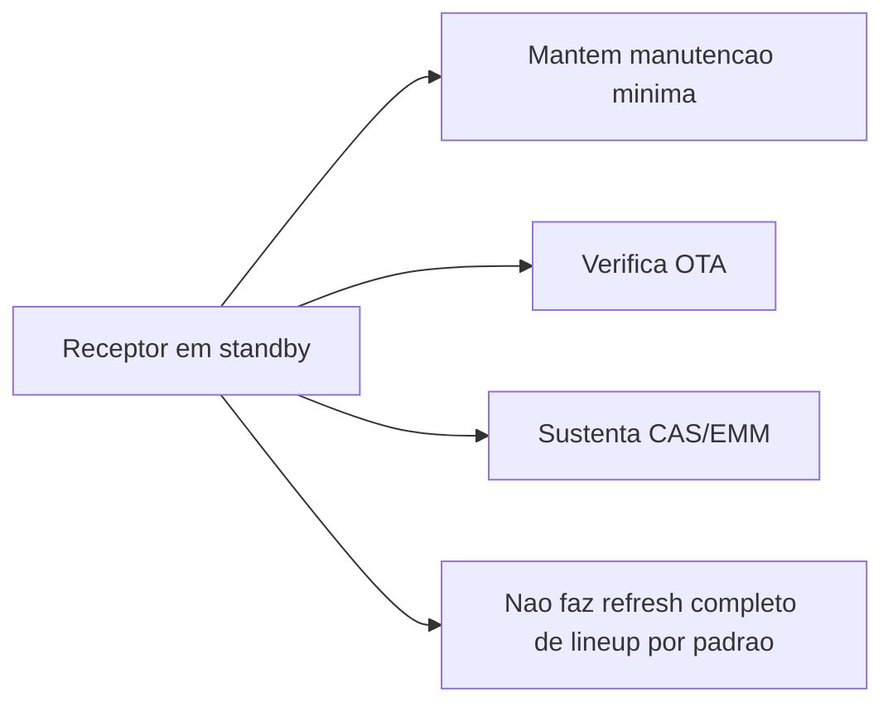

# Standby - Visao Executiva

## Resumo

No fluxo principal do produto, standby nao significa desligamento completo do receptor. Para o usuario, o receptor aparenta estar em repouso. Para a arquitetura, ele entra em um modo de espera controlada, preservando condicoes internas para retornar com previsibilidade.

Esse desenho prioriza:

- continuidade operacional
- retomada consistente
- menor risco de estado interno inconsistente
- manutencao minima de servicos de bastidor

## O que acontece ao entrar em standby

Do ponto de vista de produto, o receptor:

- apaga as saidas de video para a TV
- altera a sinalizacao visual de estado
- grava que o ultimo estado era standby
- encerra e reinicia a aplicacao principal de forma controlada

## O que acontece durante standby

O receptor nao fica totalmente inativo. A leitura do codigo indica manutencao seletiva de backend, principalmente:

- verificacao de atualizacao de software OTA
- tentativa de manter ou restabelecer lock tecnico minimo
- sustentacao de rotinas CAS/EMM

Por outro lado, o standby nao aparece como um modo completo de manutencao de canais em segundo plano.

## O que acontece ao retornar

O retorno nao e um simples resume de memoria. O produto faz uma nova subida controlada da aplicacao e consulta o estado salvo anteriormente.

Na pratica, o receptor:

- reconhece que estava em standby
- restaura contexto basico, como volume, mute e ultimo canal
- tenta restabelecer sintonia minima quando necessario
- retoma rotinas de backend como EMM/CAS e verificacoes de OTA

## Beneficios do desenho atual

- Reduz dependencia de estado vivo em memoria.
- Permite retorno com estado conhecido e rastreavel.
- Ajuda a manter processos de atualizacao e autorizacao do servico.
- Favorece previsibilidade em campo, suporte tecnico e homologacao.

## Limites e implicacoes

- Nao equivale a desligamento energetico completo.
- Mantem atividade residual de software.
- Depende de persistencia correta do estado salvo.
- A retomada depende da reexecucao organizada da aplicacao principal.
- A diferenca entre standby visual, fake standby, PMU standby e poweroff real precisa estar clara entre produto, QA e suporte.

## Resposta direta sobre atividades em standby

Durante standby, ha evidencia de que o receptor:

- verifica atualizacao de software OTA
- mantem ou restabelece lock tecnico em transponder
- sustenta filtragem CAS/EMM

Sobre lista de canais:

- pode haver atualizacao em gatilhos especificos do produto
- nao ha evidencia de atualizacao completa e periodica da lista apenas por estar em standby

Sobre EPG:

- existe infraestrutura de EIT/EPG
- nao ha evidencia de refresh amplo de EPG como objetivo principal do standby

