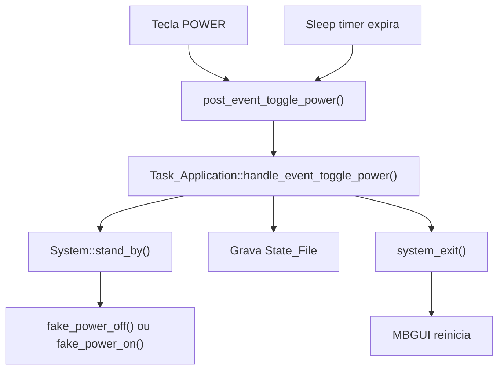
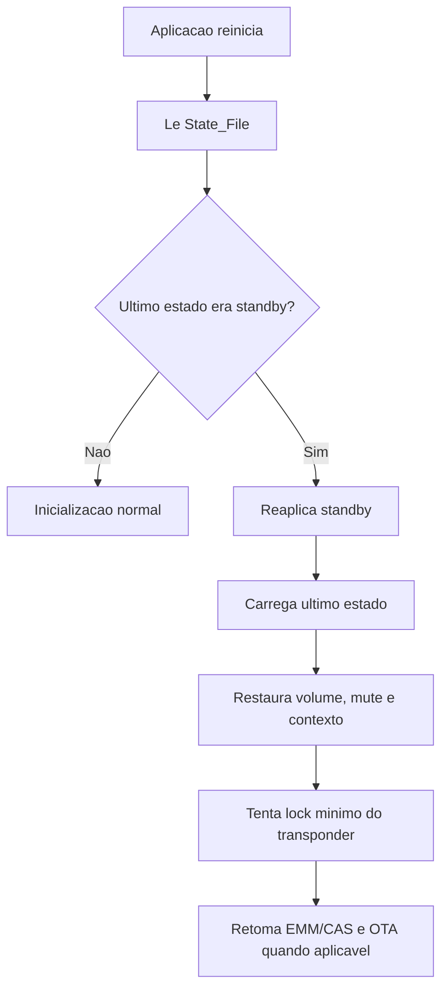

# Standby - Fluxo Tecnico

## Componentes envolvidos

Orquestracao:

- `src/tasks/mb_task_remote_control.cpp`
- `src/tasks/mb_task_application.cpp`
- `src/tasks/mb_task_database.cpp`
- `src/tasks/mb_task_demux.cpp`

Hardware/HAL:

- `src/hal/ALi/mb_system.cpp`
- `src/hal/ALi/mb_remote_control.cpp`
- `src/hal/Montage/mb_remote_control.cpp`

UI/OSD:

- `ui/lvgl/mb_osd_menu_plus_sleep.cpp`
- `ui/lvgl/mb_osd_sleep_timer.cpp`
- `src/tasks/mb_task_osd.cpp`

Persistencia:

- `src/common/mb_state_file.h`

Fluxos alternativos de energia:

- `src/tpm/tpm_api.c`
- `src/tpm/mb_tpm.cpp`

## Entrada em standby

Ha dois gatilhos principais:

1. tecla `POWER`
2. expiracao do sleep timer

Os dois convergem para o mesmo caminho:

1. `Task::post_event_toggle_power()`
2. `Task_Application::handle_event_toggle_power()`
3. `System::stand_by(...)`
4. gravacao de flag no `State_File`
5. `Task_Application::system_exit()`
6. reinicio do app

## Efeito fisico do standby

No HAL ALi, o standby de app usa fake power:

- `System::fake_power_off()`
- `HDMI::hdmi_output_off()`
- `Display::set_cvbs_off()`

No caminho complementar:

- `System::fake_power_on()`
- `HDMI::hdmi_output_on()`
- `Display::set_cvbs_on()`

Isso reforca que o fluxo principal nao e poweroff real do sistema operacional.

## Persistencia de estado

O estado salvo inclui:

- `stand_by`
- `stand_by_in_production_mode`
- `current_channel`
- `volume`
- `mute`
- `channel_list_type`
- `current_satellite_id`

Esse estado fica em `State_File::App_State_File`.

## Durante standby

O comportamento observado e de manutencao seletiva de backend, nao de operacao completa.

Ha evidencia de:

- verificacao periodica de OTA
- manutencao ou reativacao de lock tecnico minimo
- sustentacao de fluxo CAS/EMM

Nao apareceu como rotina ampla automatica apenas por estar em standby:

- atualizacao completa e periodica da lista de canais
- refresh amplo de EPG como objetivo principal

## Retorno do standby

O retorno ocorre por novo ciclo da aplicacao:

1. o sistema sobe
2. `Task_Application` verifica o arquivo de estado
3. se o estado salvo indica standby, muda para `ST_STAND_BY_MODE`
4. `System::check_standby_mode()` reaplica fake standby no inicio
5. o app carrega estado e lineup suficientes para restaurar contexto minimo
6. `Task_Demux` pode manter EMM/CAS e checagens OTA

## Diferenca entre standby e poweroff

O repositorio tem dois mundos de energia:

- fake standby do MBGUI
- standby/poweroff de baixo nivel via TPM/AUI

O fluxo normal do usuario usa fake standby orquestrado pelo MBGUI. Ja `system_power_off(connection_context *)`, em `src/tpm/mb_tpm.cpp`, executa um poweroff do sistema operacional e nao representa o mesmo processo.

