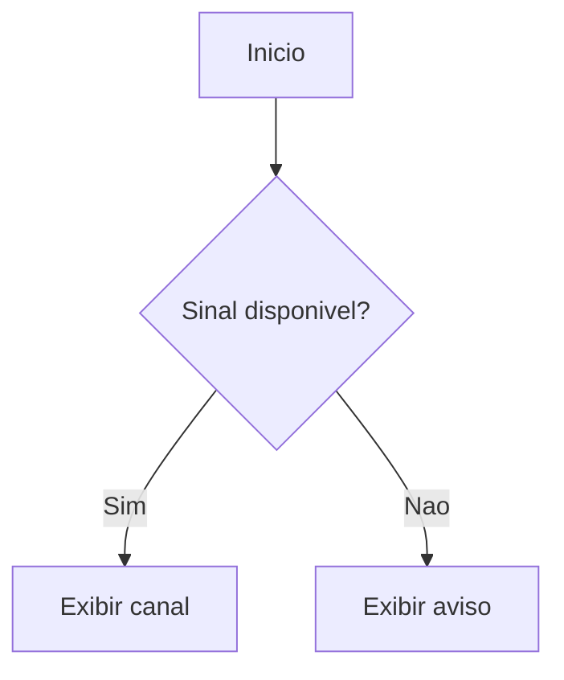

# Guia de Markdown para MkDocs

## Objetivo

Padronizar a escrita dos arquivos Markdown em `docs/plano/` para gerar um portal MkDocs profissional, navegavel, pesquisavel e facil de manter.

Este guia cobre:

- estrutura minima de cada pagina;
- metadados e tags recomendadas;
- recursos Markdown suportados pela configuracao atual;
- recursos avancados que podem ser ativados no `mkdocs.yml`;
- boas praticas para evitar problemas na geracao do portal.

## Regra principal

Cada arquivo Markdown deve ser escrito pensando em dois usos:

- leitura direta no repositorio;
- renderizacao no portal MkDocs Material.

Evite depender de HTML bruto quando existir sintaxe Markdown ou extensao MkDocs equivalente. O portal fica mais consistente, pesquisavel e facil de manter.

## Cabecalho recomendado

Use metadados YAML no inicio de paginas importantes. Mesmo quando algum plugin ainda nao estiver ativo, isso prepara o portal para busca, tags, cards, indice e governanca documental.

```yaml
---
title: Nome claro da pagina
description: Resumo curto do conteudo e da finalidade da pagina.
tags:
  - arquitetura
  - mbgui
  - dvb
status: rascunho
owner: Engenharia de Software
updated: 2026-06-25
---
```

Campos recomendados:

| Campo | Uso | Exemplo |
| --- | --- | --- |
| `title` | Titulo exibivel em listagens e metadados. | `Arquitetura do OSD` |
| `description` | Resumo para busca, cards e SEO interno. | `Fluxo tecnico da camada LVGL.` |
| `tags` | Taxonomia para agrupamento e descoberta. | `ui`, `lvgl`, `processo` |
| `status` | Estado do documento. | `rascunho`, `revisao`, `aprovado`, `obsoleto` |
| `owner` | Area responsavel pela manutencao. | `Firmware`, `QA`, `Produto` |
| `updated` | Ultima revisao relevante. | `2026-06-25` |

## Taxonomia de tags

Use tags curtas, estaveis e em minusculas. Evite sinonimos para a mesma coisa.

Tags por tipo de conteudo:

- `tutorial`
- `guia`
- `referencia`
- `explicacao`
- `runbook`
- `adr`
- `processo`
- `template`

Tags por area tecnica:

- `arquitetura`
- `build`
- `cmake`
- `doxygen`
- `mkdocs`
- `ui`
- `lvgl`
- `hal`
- `dvb`
- `cas`
- `nagra`
- `ota`
- `tpm`
- `banco-de-dados`
- `release`
- `qa`

Tags por produto ou modulo:

- `b8`
- `mbgui`
- `osd`
- `player`
- `demux`
- `tuner`
- `remote-control`
- `closed-caption`

Estados recomendados:

- `rascunho`: conteudo inicial, ainda incompleto.
- `revisao`: pronto para leitura tecnica, mas pendente de validacao.
- `aprovado`: referencia oficial.
- `obsoleto`: mantido por historico, nao usar como referencia atual.

## Estrutura minima de uma pagina

Toda pagina tecnica deve ter um titulo H1 unico e secoes previsiveis.

```markdown
# Nome da pagina

## Objetivo

Explique por que a pagina existe.

## Contexto

Descreva o cenario, modulo, processo ou problema.

## Procedimento ou explicacao

Desenvolva o conteudo principal.

## Verificacao

Mostre como confirmar que a informacao foi aplicada corretamente.

## Cuidados

Liste riscos, excecoes e pontos de atencao.

## Referencias

- [Documento relacionado](../caminho/arquivo.md)
```

Boas praticas:

- Use apenas um `#` por arquivo.
- Nao pule niveis de titulo: depois de `##`, use `###`.
- Prefira titulos objetivos: `Fluxo de standby`, nao `Algumas observacoes`.
- Mantenha secoes curtas; se uma pagina ficar grande demais, divida em paginas menores.

## Links internos

Use links relativos para outros arquivos Markdown.

```markdown
[Plano de documentacao](../documentation-strategy.md)
[Guia Doxygen](doxygen-mkdocs.md)
```

Boas praticas:

- Aponte para o arquivo `.md`, nao para `.html`.
- Evite caminhos absolutos do sistema operacional.
- Rode `mkdocs build --strict` para detectar links quebrados.

## Imagens e assets

Use imagens somente quando elas explicam algo melhor que texto.

```markdown

```

Boas praticas:

- Sempre escreva texto alternativo util.
- Use nomes de arquivo descritivos e em minusculas.
- Evite imagens com texto pequeno demais.
- Guarde assets compartilhados em uma pasta previsivel, como `docs/plano/assets/`.

## Tabelas

Use tabelas para comparacao, inventarios e parametros.

```markdown
| Campo | Tipo | Obrigatorio | Descricao |
| --- | --- | --- | --- |
| `service_id` | inteiro | Sim | Identifica o servico DVB. |
| `name` | texto | Sim | Nome exibido na UI. |
```

Boas praticas:

- Mantenha tabelas pequenas.
- Para tabelas grandes, considere quebrar por categoria.
- Use codigo inline para nomes de campos, funcoes, arquivos e comandos.

## Blocos de codigo

Sempre informe a linguagem do bloco.

````markdown
```cpp
bool update_channel_list(const ChannelTable& table);
```

```bash
mkdocs build --strict
```

```yaml
plugins:
  - search
```
````

Boas praticas:

- Use blocos pequenos e focados.
- Prefira exemplos executaveis ou proximos do codigo real.
- Para trechos longos, referencie o arquivo fonte quando possivel.

## Destaques e avisos

A configuracao atual ja suporta `admonition`. Use para chamar atencao sem poluir o texto.

```markdown
!!! note "Contexto"
    Use para observacoes importantes, mas nao criticas.

!!! warning "Cuidado"
    Use quando a acao pode causar erro, regressao ou perda de tempo.

!!! danger "Risco"
    Use para riscos altos, como atualizar firmware, apagar dados ou alterar CAS.
```

Tipos recomendados:

- `note`: observacao geral.
- `tip`: dica pratica.
- `info`: contexto adicional.
- `warning`: risco moderado.
- `danger`: risco alto.
- `example`: exemplo de uso.
- `abstract`: resumo executivo.

## Secoes recolhaveis

Ative `pymdownx.details` no `mkdocs.yml` do portal para usar blocos recolhaveis. O projeto `doc/documentacao-mbgui` ja usa esse recurso.

```markdown
??? info "Detalhes tecnicos"
    Conteudo complementar que nao precisa ficar sempre aberto.

???+ warning "Checklist obrigatorio"
    Conteudo aberto por padrao.
```

Use para:

- logs longos;
- explicacoes opcionais;
- checklists detalhados;
- alternativas tecnicas.

## Abas

A configuracao atual de `docs/ppt-plano/mkdocs.yml` ja suporta `pymdownx.tabbed`.

````markdown
=== "Windows"

    ```powershell
    .\script.cmd
    ```

=== "Linux"

    ```bash
    mkdocs build
    ```
````

Use abas para comparar:

- Windows e Linux;
- debug e release;
- ALi e Montage;
- QA e desenvolvedor;
- Redmine e GitLab.

## Listas de tarefas

Ative `pymdownx.tasklist` para checklists renderizados com checkbox.

```markdown
- [ ] Validar build local.
- [ ] Revisar links internos.
- [ ] Atualizar Redmine.
- [x] Registrar decisao tecnica.
```

Use em runbooks, releases, QA e templates operacionais.

## Diagramas Mermaid

Ative `pymdownx.superfences` com `custom_fences` para Mermaid e carregue `mermaid.min.js` localmente quando o portal precisar funcionar offline.

````markdown

````

Use Mermaid para:

- fluxos de processo;
- sequencias entre tasks;
- estados de UI;
- dependencias entre modulos;
- pipelines de build e release.

Boas praticas:

- Mantenha diagramas pequenos.
- Use nomes iguais aos do codigo quando representar modulos reais.
- Se o diagrama ficar complexo, divida por camada.

## Referencias externas e notas

Para um portal profissional, prefira links com contexto:

```markdown
Consulte a [politica de documentacao](../process/lightweight-documentation-policy.md)
antes de criar novas paginas extensas.
```

Evite:

```markdown
Clique aqui.
Veja esse link.
Mais detalhes abaixo.
```

## Snippets e inclusao de trechos

A configuracao atual usa `pymdownx.snippets`. Esse recurso permite reaproveitar trechos padronizados.

```markdown
--8&lt;-- "docs/plano/document-templates/process/documentation-impact-check.md"
```

Use com cuidado:

- bom para avisos, checklists e blocos repetidos;
- ruim quando esconde informacao essencial do autor;
- valide sempre o build depois de mover arquivos usados por snippets.

## Codigo com anotacoes

O Material suporta anotacoes em codigo quando `content.code.annotate` esta ativo no tema.

````markdown
```cpp
if (!signal_locked) { // (1)
    show_no_signal_message();
}
```

1. O receptor deve informar a UI antes de iniciar nova tentativa de lock.
````

Use para explicar trechos curtos e relevantes. Nao transforme documentacao em comentario linha a linha.

## Atributos em Markdown

A configuracao atual inclui `attr_list` e `md_in_html`, permitindo atributos em elementos.

```markdown
{ width="240" }

| Campo | Descricao |
| --- | --- |
| `id` | Identificador interno. |
{ .compact-table }
```

Use atributos para ajustes pontuais. Se o ajuste aparecer em muitas paginas, crie classe CSS em `stylesheets/extra.css`.

## HTML dentro do Markdown

Use HTML apenas quando necessario.

Aceitavel:

```html
<br>
```

Evite:

```html
<div style="color: red; font-size: 30px">
  Texto importante
</div>
```

Preferencias:

- destaque semantico com admonitions;
- tabelas Markdown;
- classes CSS reutilizaveis;
- componentes do Material for MkDocs.

## Emojis e icones

A configuracao atual inclui `pymdownx.emoji` com icones do Material.

```markdown
:material-check-circle: Validado
:material-alert: Atencao
:material-source-branch: Branch Git
```

Use pouco e com padrao. Icones ajudam em dashboards, status e listas executivas, mas podem reduzir seriedade se usados em excesso.

## Paginas de processo

Modelo recomendado:

```markdown
# Nome do processo

## Objetivo

## Quando usar

## Entradas

## Saidas

## Responsaveis

## Fluxo

## Checklist

## Riscos

## Evidencias

## Referencias
```

## Paginas tecnicas

Modelo recomendado:

```markdown
# Nome do modulo ou funcionalidade

## Objetivo

## Arquivos principais

## Responsabilidades

## Fluxo tecnico

## Interfaces

## Estados e erros

## Como testar

## Cuidados

## Referencias
```

## ADRs

Use ADR para decisoes que precisam sobreviver ao tempo.

Campos essenciais:

- contexto;
- decisao;
- alternativas consideradas;
- consequencias;
- status;
- data;
- responsaveis.

Use o template existente em `docs/plano/document-templates/adr.md`.

## Configuracao atual do portal

O portal em `docs/ppt-plano/mkdocs.yml` ja suporta:

- `attr_list`;
- `md_in_html`;
- `admonition`;
- `toc` com permalink;
- `pymdownx.emoji`;
- `pymdownx.highlight`;
- `pymdownx.inlinehilite`;
- `pymdownx.snippets`;
- `pymdownx.superfences`;
- `pymdownx.tabbed`;
- `search`;
- copia de codigo pelo Material.

Recursos ja usados em outro portal do repositorio e recomendados para este portal:

- `offline`;
- `pymdownx.details`;
- `pymdownx.tasklist`;
- Mermaid local com `extra_javascript`.

## Plugins recomendados para evolucao

Para explorar melhor o MkDocs e criar um portal profissional, considere adicionar gradualmente:

| Plugin | Finalidade | Prioridade |
| --- | --- | --- |
| `search` | Busca interna. | Ja ativo |
| `offline` | Uso local por `file://` e ambientes sem internet. | Alta |
| `tags` | Paginas agrupadas por tags. | Alta |
| `awesome-pages` | Navegacao automatica por pastas. | Media |
| `git-revision-date-localized` | Data de ultima alteracao por Git. | Media |
| `minify` | HTML/CSS/JS menores. | Baixa |
| `macros` | Variaveis reutilizaveis. | Media |
| `redirects` | Redirecionar paginas renomeadas. | Media |
| `glightbox` | Visualizacao melhor de imagens. | Baixa |
| `mkdocstrings` | Referencia a partir de docstrings quando houver codigo suportado. | Baixa para C/C++ |

Ative um plugin por vez e valide com:

```bash
mkdocs build --strict
```

## Extensoes recomendadas para evolucao

```yaml
markdown_extensions:
  - admonition
  - attr_list
  - md_in_html
  - tables
  - toc:
      permalink: true
  - pymdownx.details
  - pymdownx.emoji:
      emoji_index: !!python/name:material.extensions.emoji.twemoji
      emoji_generator: !!python/name:material.extensions.emoji.to_svg
  - pymdownx.highlight:
      anchor_linenums: true
      line_spans: __span
      pygments_lang_class: true
  - pymdownx.inlinehilite
  - pymdownx.snippets
  - pymdownx.superfences:
      custom_fences:
        - name: mermaid
          class: mermaid
          format: !!python/name:pymdownx.superfences.fence_div_format
  - pymdownx.tabbed:
      alternate_style: true
  - pymdownx.tasklist:
      custom_checkbox: true
```

## Recursos do tema Material recomendados

```yaml
theme:
  name: material
  language: pt-BR
  features:
    - navigation.tabs
    - navigation.tabs.sticky
    - navigation.sections
    - navigation.expand
    - navigation.indexes
    - navigation.path
    - navigation.top
    - search.suggest
    - search.highlight
    - content.code.copy
    - content.code.annotate
    - content.tabs.link
    - toc.follow
```

Para documentacao tecnica, os recursos mais importantes sao:

- navegacao clara por secoes;
- busca com sugestao e destaque;
- copia de blocos de codigo;
- anotacoes em codigo;
- links permanentes nos titulos;
- suporte a modo claro e escuro.

## Checklist antes de publicar uma pagina

- [ ] O arquivo tem um H1 unico.
- [ ] O objetivo da pagina esta claro nos primeiros paragrafos.
- [ ] Links internos apontam para `.md`.
- [ ] Blocos de codigo informam a linguagem.
- [ ] Imagens possuem texto alternativo.
- [ ] Tags seguem a taxonomia do projeto.
- [ ] Admonitions foram usadas apenas para informacao realmente importante.
- [ ] A pagina nao depende de caminho absoluto local.
- [ ] O conteudo esta no lugar correto da taxonomia Diataxis.
- [ ] `mkdocs build --strict` foi executado sem erro.

## Padroes de nome de arquivo

Use nomes em minusculas, separados por hifen:

```text
processo-atualizacao-software.md
arquitetura-osd-lvgl.md
runbook-release-b8.md
```

Evite:

```text
Documento Final Novo.md
teste2.md
Coisas importantes.md
```

## Definicao de pronto

Uma pagina esta pronta para entrar no portal quando:

- resolve uma necessidade real de consulta, execucao ou decisao;
- possui dono claro;
- tem links para documentos relacionados;
- foi validada por alguem que conhece o assunto;
- passa no build do MkDocs;
- nao duplica conteudo ja existente sem necessidade.


